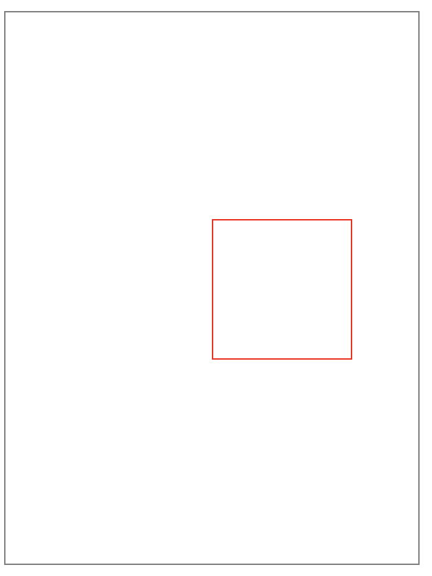

## HTML

### 如何理解HTML语义化
* 让人更容易读懂（增加代码可读性）。
* 让搜索引擎更容易读懂，有助于爬虫抓取更多的有效信息，爬虫依赖于标签来确定上下文和各个关键字的权重（SEO）。
* 在没有 CSS 样式下，页面也能呈现出很好地内容结构、代码结构。

### HTML5常见语义化标签
* header：定义文档的页眉（头部）
* nav：定义导航链接的容器
* section：定义文档中的节（段落）
* footer：定义文档的页脚（脚部）
* aside：定义页面内容之外的内容（侧边栏）,通常包含导航、广告、文章引用等信息
### script标签中defer和async的区别？
* script ：会阻碍 HTML 解析，只有下载好并执行完脚本才会继续解析 HTML。
* async script ：解析 HTML 过程中进行脚本的异步下载，下载成功立马执行，有可能会阻断 HTML 的解析。
* defer script：完全不会阻碍 HTML 的解析，解析完成之后再按照顺序执行脚本。


### prefetch 和 preload 的区别
* prefetch：告诉浏览器未来可能会用到的资源，浏览器会在空闲的时候加载。
* preload：告诉浏览器当前页面一定会用到的资源，浏览器会在解析 HTML 的时候加载。
> 注意：preload link必须设置as属性来声明资源的类型（font/image/style/script等)，否则浏览器可能无法正确加载资源。
```html
<!-- prefetch -->
<link rel="prefetch" href="static/img/ticket_bg.a5bb7c33.png">
<!-- preload -->
<link rel="preload" href="static/img/ticket_bg.a5bb7c33.png">
```
* 在实际项目中，可使用webpack插件preload-webpack-plugin
* 通用最佳实践
  * 大部分场景下无需特意使用preload
  * 类似字体文件这种隐藏在脚本、样式中的首屏关键资源，建议使用preload
  * 异步加载的模块（典型的如单页系统中的非首页）建议使用prefetch
  * 大概率即将被访问到的资源可以使用prefetch提升性能和体验

* script 中 defer 和 async 的区别
  * defer 和 async 在网络读取（下载）这块儿是一样的，都是异步的（相较于 HTML 解析）
  * defer：脚本会在 HTML 解析完成后执行，如果有多个脚本，会按照**加载顺序**执行。
  * async：脚本会在下载完成后立即执行，如果有多个脚本，会按照**下载完成的顺**序执行。


### 从浏览器地址栏输入url到请求返回发生了什么

参考：
* https://juejin.cn/post/6844903784229896199
* https://juejin.cn/post/6935232082482298911

简易流程：
1. 输入 URL 后解析出协议、主机、端口、路径等信息，并构造一个 HTTP 请求
   * 强缓存、协商缓存
2. DNS域名解析
3. TCP连接
4. http请求
5. 服务器处理并返回http报文
6. 浏览器渲染页面

7. 断开TCP连接


### HTML5新特性
**新增：**
1. 拖拽释放(Drag and drop) API
2. 语义化更好的内容标签（header,nav,footer,aside,article,section）
3. 音频、视频API(audio,video)
4. 画布(Canvas) API
5. 地理(Geolocation) API
6. 本地离线存储 localStorage 长期存储数据，浏览器关闭后数据不丢失；
7. sessionStorage 的数据在浏览器关闭后自动删除
8. 表单控件，calendar、date、time、email、url、search
9. 新的技术webworker, websocket, Geolocation

**移除的元素：**
1. 纯表现的元素：basefont，big，center，font, s，strike，tt，u；
2. 对可用性产生负面影响的元素：frame，frameset，noframes；

#### 本地存储（Local Storage）和cookies（储存在用户本地终端上的数据）之间的区别
- Cookies:服务器和客户端都可以访问；大小只有4KB左右；有有效期，过期后将会删除；
- 本地存储：只有本地浏览器端可访问数据，服务器不能访问本地存储直到故意通过POST或者GET的通道发送到服务器；每个域5MB；没有过期数据，它将保留直到用户从浏览器清除或者使用Javascript代码移除
## CSS

[参考](https://juejin.cn/post/6905539198107942919#heading-0)

### 水平垂直居中
参考：https://juejin.cn/post/6844903982960214029
#### 文本垂直居中

```html
<!-- css 样式 -->
<style rel="stylesheet" type="text/css">
.text{
    width: 200px;
    height: 200px;
    text-align: center;
    line-height: 200px;
    background: skyblue;
}
</style>
<!-- html 结构 -->
<div class="text">文本垂直居中</div>
```
### 盒模型
分类： 标准盒模型和IE盒模型
相同点：
* 两种盒子模型都是由 `content + padding + border + margin`构成，其大小都是由 `content + padding + border` 决定的

不同点：
* 盒子`内容宽/高度`（即` width/height`）的计算范围根据盒模型的不同会有所不同
  * 标准盒模型：只包含 content
  * IE盒模型：content + padding + border

通过box-sizing属性改变元素的盒模型：
* `box-sizing: border-box`，IE盒模型
* `box-sizing: content-box`，标准盒模型

### css选择器和优先级
[选择器参考表](https://developer.mozilla.org/zh-CN/docs/Learn/CSS/Building_blocks/Selectors#%E9%80%89%E6%8B%A9%E5%99%A8%E5%8F%82%E8%80%83%E8%A1%A8)
选择器分类：
* 类型选择器
* 类选择器
* ID选择器
* 标签属性选择器
* 伪类

### 重排（reflow）和重绘（repaint）
参考：https://juejin.cn/post/6844903779700047885
**概念：**
* 重排：无论通过什么方式影响了元素的几何信息(元素在视口内的位置和尺寸大小)，浏览器需要**重新计算**元素在视口内的几何属性，这个过程叫做重排。(更新几何属性)
* 重绘：通过构造渲染树和重排（回流）阶段，我们知道了哪些节点是可见的，以及可见节点的样式和具体的几何信息(元素在视口内的位置和尺寸大小)，接下来就可以将渲染树的每个节点都转换为屏幕上的实际像素，这个阶段就叫做重绘。（更新绘制属性）

**如何减少重排和重绘**
* 最小化重绘和重排：如样式集中改变
* 批量操作DOM，
* 使用 **absolute** 或 **fixed** 使元素脱离文档流，这在制作复杂的动画时对性能的影响比较明显。
* 开启 GPU 加速，利用 css 属性 transform 、will-change 等，比如改变元素位置，我们使用 translate 会比使用绝对定位改变其 left 、top 等来的高效，因为它不会触发重排或重绘，transform 使浏览器为元素创建⼀个 GPU 图层，这使得动画元素在一个独立的层中进行渲染。当元素的内容没有发生改变，就没有必要进行重绘。

### BFC
参考：
* https://juejin.cn/post/6960866014384881671
* https://developer.mozilla.org/zh-CN/docs/Web/Guide/CSS/Block_formatting_context
> BFC（Block Formatting Context） 即块级格式上下文，根据盒模型可知，每个元素都被定义为一个矩形盒子，然而盒子的布局会受到尺寸，定位，盒子的子元素或兄弟元素，视口的尺寸等因素决定，所以这里有一个浏览器计算的过程，计算的规则就是由一个叫做视觉格式化模型的东西所定义的，BFC 就是来自这个概念，它是 CSS 视觉渲染的一部分，用于决定块级盒的布局及浮动相互影响范围的一个区域。

BFC的特性：
* 块级元素会在垂直方向一个接一个的排列，和文档流的排列方式一致。
* 在 BFC 中上下相邻的两个容器的 margin  会重叠，创建新的 BFC 可以避免外边距重叠。
* 计算 BFC 的高度时，需要计算浮动元素的高度。
* BFC 区域不会与浮动的容器发生重叠。
* BFC 是独立的容器，容器内部元素不会影响外部元素。
* 每个元素的左 margin  值和容器的左 border  相接触。

创建BFC方式：
* 绝对定位元素（position 为 absolute 或 fixed ）。
* 行内块元素，即 display 为 inline-block 。
* overflow 的值不为 visible 。

####  BFC、IFC、GFC 和 FFC
- BFC：块级格式上下文，指的是一个独立的布局环境，BFC 内部的元素布局与外部互不影响。
- IFC：行内格式化上下文，将一块区域以行内元素的形式来格式化。
- GFC：网格布局格式化上下文，将一块区域以 grid 网格的形式来格式化
- FFC：弹性格式化上下文，将一块区域以弹性盒的形式来格式化


### 清除浮动
- clear 清除浮动（添加空div法）在浮动元素下方添加空div，并给该元素写css样式： `{clear:both;height:0;overflow:hidden;}`
- 给浮动元素父级设置高度
- 父级同时浮动（需要给父级同级元素添加浮动）
- 父级设置成`inline-block`，其`margin: 0 auto`居中方式失效
- 给父级添加`overflow:hidden` 清除浮动方法
- 万能清除法 `::after` 伪元素清浮动（现在主流方法，推荐使用）

### 两栏布局
1. 利用浮动，左边元素宽度固定 ，设置向左浮动。将右边元素的 margin-left 设为固定宽度 。注意，因为右边元素的 width 默认为 auto ，所以会自动撑满父元素。

2. 同样利用浮动，左边元素宽度固定 ，设置向左浮动。右侧元素设置 overflow: hidden; 这样右边就触发了 BFC ，BFC 的区域不会与浮动元素发生重叠，所以两侧就不会发生重叠。

3. 利用 flex 布局，左边元素固定宽度，右边的元素设置 flex: 1 。

4. 利用绝对定位，父级元素设为相对定位。左边元素 absolute  定位，宽度固定。右边元素的 margin-left  的值设为左边元素的宽度值。
5. 利用绝对定位，父级元素设为相对定位。左边元素宽度固定，右边元素 absolute  定位， left  为宽度大小，其余方向定位为 0 


### 圣杯布局和双飞翼布局（经典三栏布局）
目的：
* 三栏布局，中间一栏最先加载和渲染（内容最重要，这就是为什么还需要了解这种布局的原因）。
* 两侧内容固定，中间内容随着宽度自适应。
* 一般用于 PC 网页。

技术总结：

* 使用 float  布局。
* 两侧使用 margin 负值，以便和中间内容横向重叠。
* 防止中间内容被两侧覆盖，圣杯布局用 padding ，双飞翼布局用 margin 。

### margin设置百分比
> margin设置为百分比，按照父元素宽度来进行计算。
示例代码如下：
```html
  <!-- css部分 -->
    <style>
        .outer {
            width: 300px;
            height: 400px;
            border: 1px solid gray;
        }
        .innner {
            width: 100px;
            height: 100px;
            border: 1px solid red;
            margin-left: 50%;
            margin-top: 50%;
        }
    </style>
    <!-- html部分 -->
    <div class="outer">
        <div class="innner"></div>
    </div>
```
效果如下：



### flex布局
[阮一峰flex布局文档](https://www.ruanyifeng.com/blog/2015/07/flex-grammar.html)

### grid布局
[阮一峰grid布局文档](https://www.ruanyifeng.com/blog/2019/03/grid-layout-tutorial.html)

### 粘性布局（sticky）
- position 中的 sticky 值是 CSS3 新增
- 设置了 sticky 值后，在屏幕范围（viewport）时该元素的位置并不受到定位影响（设置是top、left等属性无效）
- 当该元素的位置将要移出偏移范围时，定位又会变成fixed，根据设置的left、top等属性成固定位置的效果。

sticky 属性值有以下几个特点：
- 该元素并不脱离文档流，仍然保留元素原本在文档流中的位置。
- 当元素在容器中被滚动超过指定的偏移值时，元素在容器内固定在指定位置。亦即如果你设置了top: 50px，那么在sticky元素到达距离相对定的元素顶部50px的位置时固定，不再向上移动。
- 元素固定的相对偏移是相对于离它最近的具有滚动框的祖先元素，如果祖先元素都不可以滚动，那么是相对于viewport来计算元素的偏移量
### CSS3新特性
1. CSS3实现圆角（border-radius），阴影（box-shadow），
2. 对文字加特效（text-shadow、），文字渲染 （Text-decoration），线性渐变（gradient），旋转（transform）
3.transform:rotate(9deg) scale(0.85,0.90) translate(0px,-30px) skew(-9deg,0deg);// 旋转,缩放,定位,倾斜
4. 增加了更多的CSS选择器 多背景 rgba
5. 在CSS3中唯一引入的伪元素是 ::selection.
6. 媒体查询，多栏布局
7. border-image
8. 多列布局 （multi-column layout）


#### CSS3 中 transition 和 animation 的属性分别有哪些
transition 过渡动画：
- transition-property：指定过渡的 CSS 属性
- transition-duration：指定过渡所需的完成时间
- transition-timing-function：指定过渡函数
- transition-delay：指定过渡的延迟时间

animation 关键帧动画：
- animation-name：指定要绑定到选择器的关键帧的名称
- animation-duration：动画指定需要多少秒或毫秒完成
- animation-timing-function：设置动画将如何完成一个周期
- animation-delay：设置动画在启动前的延迟间隔
- animation-iteration-count：定义动画的播放次数
- animation-direction：指定是否应该轮流反向播放动画
- animation-fill-mode：规定当动画不播放时（当动画完成时，或当动画有一个延迟未开始播放时），要应用到元素的样式
- animation-play-state：指定动画是否正在运行或已暂停

#### 为什么有时候⽤translate来改变位置⽽不是定位？
- translate 是 transform 属性的⼀个值。改变transform或opacity不会触发浏览器重新布局（reflow）或重绘（repaint），只会触发复合（compositions）。
- 改变绝对定位会触发重新布局，进⽽触发重绘和复合。
- transform使浏览器为元素创建⼀个 GPU 图层，但改变绝对定位会使⽤到 CPU。 因此translate()更⾼效，可以缩短平滑动画的绘制时间。 
- translate改变位置时，元素依然会占据其原始空间，绝对定位就不会发⽣这种情况

### 隐藏元素的方法
- `display:none`
  - 渲染树不会包含该渲染对象，因此该元素不会在页面中占据位置，也不会响应绑定的监听事件。
- `visibility:hidden`
  - 元素在页面中仍占据空间，但是不会响应绑定的监听事件。
- `opacity: 0`
  - 将元素的透明度设置为 0，以此来实现元素的隐藏。元素在页面中仍然占据空间，并且能够响应元素绑定的监听事件。
- `position: absolute`,通过使用绝对定位将元素移到可视区域外
- `z-index: -99`，使其他元素遮盖住该元素
- `clip/clip-path`
  - 使用元素裁剪的方法来实现元素的隐藏，这种方法下，元素仍在页面中占据位置，但是不会响应绑定的监听事件。
- `transform: scale(0,0)`
  - 将元素缩放为 0，来实现元素的隐藏。这种方法下，元素仍在页面中占据位置，但是不会响应绑定的监听事件。

#### display:none与visibility:hidden的区别
> 设置这两种属性的节点，就不会从dom树上消失（和vue中v-if区别，v-if设为false，dom树中不会存在该节点）
1. 在渲染树中
   - display:none会让元素完全从渲染树中消失，渲染时不会占据任何空间；
   - visibility:hidden不会让元素从渲染树中消失，渲染的元素还会占据相应的空间，只是内容不可见。
2. 是否是继承属性
   - display:none是非继承属性，子孙节点会随着父节点从渲染树消失，通过修改子孙节点的属性也无法显示；
   - visibility:hidden是继承属性，子孙节点消失是由于继承了hidden，通过设置visibility:visible可以让子孙节点显示；
3. 修改常规文档流中元素的 display 通常会造成文档的重排和重绘，但是修改visibility属性只会造成本元素的重绘；
4. 如果使用读屏器，设置为display:none的内容不会被读取，设置为visibility:hidden的内容会被读取。
5. CSS3的transition支持visibility属性，但是并不支持display
6. visibility：hidden不会影响计数器的运算，比如ol标签中的li标签，隐藏其中的第二个标签，后续标签的序号不变，而如果使用display：none后续标签的序号会衔接上去上一个。


### CSS单位
#### px 和 em 的区别
- `px`全称pixel像素，是相对于屏幕分辨率而言的，它是一个绝对单位，但同时具有一定的相对性。因为在同一个设备上每个像素代表的物理长度是固定不变的，这点表现的是绝对性。但是在不同的设备之间每个设备像素所代表的物理长度是可以变化的，这点表现的是相对性
- `em`是一个相对长度单位，具体的大小需要相对于父元素计算，比如父元素的字体大小为80px，那么子元素1em就表示大小和父元素一样为80px，0.5em就表示字体大小是父元素的一半为40px
#### vw、vh 是什么？
- vw 和 vh 是 CSS3 新单位，即 view width 可视窗口宽度 和 view height 可视窗口高度。
- 1vw 就等于可视窗口宽度的百分之一，1vh 就等于可视窗口高度的百分之一。


### png8、png16、png32的区别，以及 png 的压缩原理
**PNG图片主要有三个类型，分别为 PNG 8/ PNG 24 / PNG 32:**
- PNG 8：PNG 8中的8，其实指的是8bits，相当于用2^8（2的8次方）大小来存储一张图片的颜色种类，2^8等于256，也就是说PNG 8能存储256种颜色，一张图片如果颜色种类很少，将它设置成PNG 8得图片类型是非常适合的。
- PNG 24：PNG 24中的24，相当于3乘以8 等于 24，就是用三个8bits分别去表示 R（红）、G（绿）、B（蓝）。R(0-255),G(0-255),B(0-255)，可以表达256乘以256乘以256=16777216种颜色的图片，这样PNG 24就能比PNG 8表示色彩更丰富的图片。但是所占用的空间相对就更大了。
- PNG 32：PNG 32中的32，相当于PNG 24 加上 8bits的透明颜色通道，就相当于R（红）、G（绿）、B（蓝）、A（透明）。R(0255),G(0255),B(0255),A(0255)。比PNG 24多了一个A（透明），也就是说PNG 32能表示跟PNG 24一样多的色彩，并且还支持256种透明的颜色，能表示更加丰富的图片颜色类型。

**PNG图片的压缩，分两个阶段：**
- 预解析（Prediction）：这个阶段就是对png图片进行一个预处理，处理后让它更方便后续的压缩。
- 压缩（Compression）：执行Deflate压缩，该算法结合了 LZ77 算法和 Huffman 算法对图片进行编码。

