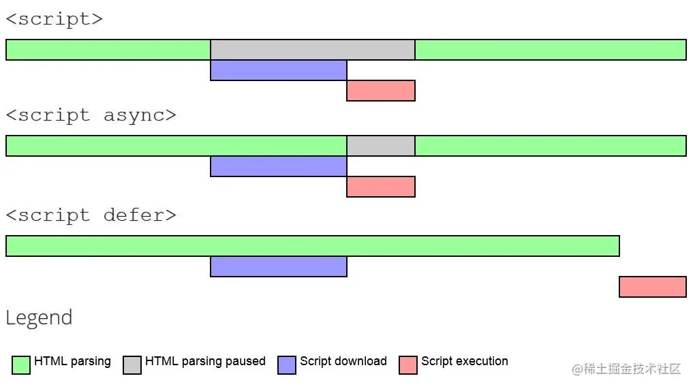
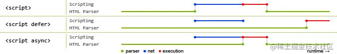
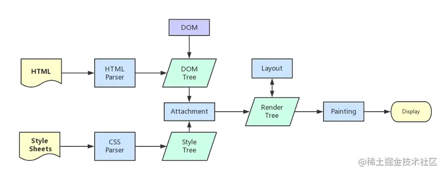

## HTML

### 如何理解HTML语义化
* 让人更容易读懂（增加代码可读性）。
* 让搜索引擎更容易读懂，有助于爬虫抓取更多的有效信息，爬虫依赖于标签来确定上下文和各个关键字的权重（SEO）。
* 在没有 CSS 样式下，页面也能呈现出很好地内容结构、代码结构。

### HTML5常见语义化标签
* header：定义文档的页眉（头部）
* nav：定义导航链接的容器
* section：定义文档中的节（段落）
* footer：定义文档的页脚（脚部）
* aside：定义页面内容之外的内容（侧边栏）,通常包含导航、广告、文章引用等信息
### script标签中defer和async的区别？
* script ：会阻碍 HTML 解析，只有下载好并执行完脚本才会继续解析 HTML。
* async script ：解析 HTML 过程中进行脚本的异步下载，下载成功立马执行，有可能会阻断 HTML 的解析。
* defer script：完全不会阻碍 HTML 的解析，解析完成之后再按照顺序执行脚本。


### prefetch 和 preload 的区别
* prefetch：告诉浏览器未来可能会用到的资源，浏览器会在空闲的时候加载。
* preload：告诉浏览器当前页面一定会用到的资源，浏览器会在解析 HTML 的时候加载。
> 注意：preload link必须设置as属性来声明资源的类型（font/image/style/script等)，否则浏览器可能无法正确加载资源。
```html
<!-- prefetch -->
<link rel="prefetch" href="static/img/ticket_bg.a5bb7c33.png">
<!-- preload -->
<link rel="preload" href="static/img/ticket_bg.a5bb7c33.png">
```
* 在实际项目中，可使用webpack插件preload-webpack-plugin
* 通用最佳实践
  * 大部分场景下无需特意使用preload
  * 类似字体文件这种隐藏在脚本、样式中的首屏关键资源，建议使用preload
  * 异步加载的模块（典型的如单页系统中的非首页）建议使用prefetch
  * 大概率即将被访问到的资源可以使用prefetch提升性能和体验

* script 中 defer 和 async 的区别
  * defer 和 async 在网络读取（下载）这块儿是一样的，都是异步的（相较于 HTML 解析）
  * defer：脚本会在 HTML 解析完成后执行，如果有多个脚本，会按照**加载顺序**执行。
  * async：脚本会在下载完成后立即执行，如果有多个脚本，会按照**下载完成的顺**序执行。


### 从浏览器地址栏输入url到请求返回发生了什么

参考：
* https://juejin.cn/post/6844903784229896199
* https://juejin.cn/post/6935232082482298911

简易流程：
1. 输入 URL 后解析出协议、主机、端口、路径等信息，并构造一个 HTTP 请求
   * 强缓存、协商缓存
2. DNS域名解析
3. TCP连接
4. http请求
5. 服务器处理并返回http报文
6. 浏览器渲染页面

7. 断开TCP连接


### HTML5新特性
**新增：**
1. 拖拽释放(Drag and drop) API
2. 语义化更好的内容标签（header,nav,footer,aside,article,section）
3. 音频、视频API(audio,video)
4. 画布(Canvas) API
5. 地理(Geolocation) API
6. 本地离线存储 localStorage 长期存储数据，浏览器关闭后数据不丢失；
7. sessionStorage 的数据在浏览器关闭后自动删除
8. 表单控件，calendar、date、time、email、url、search
9. 新的技术webworker, websocket, Geolocation

**移除的元素：**
1. 纯表现的元素：basefont，big，center，font, s，strike，tt，u；
2. 对可用性产生负面影响的元素：frame，frameset，noframes；

#### 本地存储（Local Storage）和cookies（储存在用户本地终端上的数据）之间的区别
- Cookies:服务器和客户端都可以访问；大小只有4KB左右；有有效期，过期后将会删除；
- 本地存储：只有本地浏览器端可访问数据，服务器不能访问本地存储直到故意通过POST或者GET的通道发送到服务器；每个域5MB；没有过期数据，它将保留直到用户从浏览器清除或者使用Javascript代码移除

#### 页面生命周期：DOMContentLoaded，load，beforeunload，unload
HTML 页面的生命周期包含三个重要事件：

DOMContentLoaded —— 浏览器已完全加载 HTML，并构建了 DOM 树，但像  和样式表之类的外部资源可能尚未加载完成。
load —— 浏览器不仅加载完成了 HTML，还加载完成了所有外部资源：图片，样式等。
beforeunload/unload —— 当用户正在离开页面时。
每个事件都是有用的：

DOMContentLoaded 事件 —— DOM 已经就绪，因此处理程序可以查找 DOM 节点，并初始化接口。
load 事件 —— 外部资源已加载完成，样式已被应用，图片大小也已知了。
beforeunload 事件 —— 用户正在离开：我们可以检查用户是否保存了更改，并询问他是否真的要离开。
unload 事件 —— 用户几乎已经离开了，但是我们仍然可以启动一些操作，例如发送统计数据。