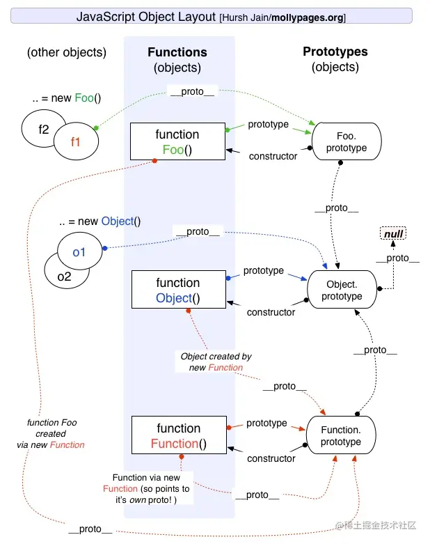

## JS

参考：
* https://juejin.cn/post/7194400984490049573
* https://juejin.cn/post/6940945178899251230
* https://juejin.cn/post/6941194115392634888


### 数据类型
分类： Undefined、Null、Number、String、Boolean、BigInt、Symbol、Object
* Symbol表示独一无二的值，场用于定义对象的唯一属性名。
* BigInt可以表示任意大小的整数，用于安全地存储和操作大整数，即使这个数已经超出了 Number 能够表示的安全整数范围
* 原始数据类型：Undefined、Null、Boolean、Number、String，存储在栈中，占据空间小、大小固定，属于被频繁使用数据
* 引用数据类型：对象、数组和函数，存储在堆中，占据空间大、大小不固定。如果存储在栈中，将会影响程序运行的性能；引用数据类型在栈中存储了指针，该指针指向堆中该实体的起始地址。当解释器寻找引用值时，会首先检索其在栈中的地址，取得地址后从堆中获得实体

#### 数据类型判断
1. typeof：能判断所有值类型，函数。不可对 null、对象、数组进行精确判断，因为都返回 object 。

```js
console.log(typeof undefined); // undefined
console.log(typeof 2); // number
console.log(typeof true); // boolean
console.log(typeof "str"); // string
console.log(typeof Symbol("foo")); // symbol
console.log(typeof 2172141653n); // bigint
console.log(typeof function () {}); // function
// 不能判别
console.log(typeof []); // object
console.log(typeof {}); // object
console.log(typeof null); // object
```
2. instanceof: 能判断对象类型，不能判断基本数据类型，其内部运行机制是判断在其原型链中能否找到该类型的原型

```js
console.log(2 instanceof Number);               // false
console.log(true instanceof Boolean);           // false 
console.log('str' instanceof String);           // false 
console.log([] instanceof Array);               // true
console.log(function(){} instanceof Function);  // true
console.log({} instanceof Object);              // true
```

3. Object.prototype.toString.call(): 所有原始数据类型都是能判断的，还有 Error 对象，Date 对象等。

```js
Object.prototype.toString.call(2); // "[object Number]"
Object.prototype.toString.call(""); // "[object String]"
Object.prototype.toString.call(true); // "[object Boolean]"
Object.prototype.toString.call(undefined); // "[object Undefined]"
Object.prototype.toString.call(null); // "[object Null]"
Object.prototype.toString.call(Math); // "[object Math]"
Object.prototype.toString.call({}); // "[object Object]"
Object.prototype.toString.call([]); // "[object Array]"
Object.prototype.toString.call(function () {}); // "[object Function]"
```

!!! info 同样是检测对象obj调用toString方法，obj.toString()的结果和Object.prototype.toString.call(obj)的结果不一样，这是为什么？
    因为toString是Object的原型方法，而Array、function等类型作为Object的实例，都重写了toString方法。不同的对象类型调用toString方法时，根据原型链的知识，调用的是对应的重写之后的toString方法（function类型返回内容为函数体的字符串，Array类型返回元素组成的字符串…），而不会去调用Object上原型toString方法（返回对象的具体类型），所以采用obj.toString()不能得到其对象类型，只能将obj转换为字符串类型；因此，在想要得到对象的具体类型时，应该调用Object原型上的toString方法。
4. constructor: constructor有两个作用，一是判断数据的类型，二是对象实例通过 constrcutor 对象访问它的构造函数

```js
console.log((2).constructor === Number); // true
console.log((true).constructor === Boolean); // true
console.log(('str').constructor === String); // true
console.log(([]).constructor === Array); // true
console.log((function() {}).constructor === Function); // true
console.log(({}).constructor === Object); // true
```
**需要注意**，如果创建一个对象来改变它的原型，constructor就不能用来判断数据类型了：
```js
function Fn(){};
Fn.prototype = new Array();
var f = new Fn();
console.log(f.constructor===Fn);    // false
console.log(f.constructor===Array); // true
```


5. 判断是否为数组的方法

```js
Array.isArray(arr); // true
arr.__proto__ === Array.prototype; // true
arr instanceof Array; // true
Object.prototype.toString.call(arr); // "[object Array]"
Array.prototype.isPrototypeOf(arr); // true
```


#### null 和undefined 区别
* null 表示一个空对象指针，使用 typeof 操作符检测 null 返回 object 。null用于赋值给一些可能会返回对象的变量，作为初始化
* undefined 表示一个变量未定义，使用 typeof 操作符检测 undefined 返回 undefined 。用于初始化一些不知道未来是什么类型的变量

#### typeof null 为什么回事Object
在 JavaScript 第一个版本中，所有值都存储在 32 位的单元中，每个单元包含一个小的 类型标签(1-3 bits) 以及当前要存储值的真实数据。类型标签存储在每个单元的低位中，共有五种数据类型：
```js
000: object   - 当前存储的数据指向一个对象。
  1: int      - 当前存储的数据是一个 31 位的有符号整数。
010: double   - 当前存储的数据指向一个双精度的浮点数。
100: string   - 当前存储的数据指向一个字符串。
110: boolean  - 当前存储的数据是布尔值。
```
如果最低位是 1，则类型标签标志位的长度只有一位；如果最低位是 0，则类型标签标志位的长度占三位，为存储其他四种数据类型提供了额外两个 bit 的长度。
有两种特殊数据类型：

undefined的值是 (-2)30(一个超出整数范围的数字)；
null 的值是机器码 NULL 指针(null 指针的值全是 0)

那也就是说null的类型标签也是000，和Object的类型标签一样，所以会被判定为Object

#### 为什么0.1+0.2 ! == 0.3，如何让其相等
计算机是通过二进制的方式存储数据的，所以计算机计算0.1+0.2的时候，实际上是计算的两个数的二进制的和。0.1的二进制是0.0001100110011001100...（1100循环），0.2的二进制是：0.00110011001100...（1100循环），这两个数的二进制都是无限循环的数
 JavaScript 中只有一种数字类型：Number，它的实现遵循IEEE 754标准，使用64位固定长度来表示，也就是标准的double双精度浮点数。在二进制科学表示法中，双精度浮点数的小数部分最多只能保留52位，再加上前面的1，其实就是保留53位有效数字，剩余的需要舍去，遵从“0舍1入”的原则。
 根据这个原则，0.1和0.2的二进制数相加，再转化为十进制数就是：0.30000000000000004

 如何实现0.1+0.2=0.3呢？
 对于这个问题，一个直接的解决方法就是设置一个误差范围，通常称为“机器精度”。对JavaScript来说，这个值通常为2-52，在ES6中，提供了Number.EPSILON属性，而它的值就是2-52，只要判断0.1+0.2-0.3是否小于Number.EPSILON，如果小于，就可以判断为0.1+0.2 ===0.3
```js
function numberepsilon(arg1,arg2){                   
  return Math.abs(arg1 - arg2) < Number.EPSILON;        
}        

console.log(numberepsilon(0.1 + 0.2, 0.3)); // true
```


#### 如何获取安全的 undefined 值？
因为 undefined 是一个标识符，所以可以被当作变量来使用和赋值，但是这样会影响 undefined 的正常判断。表达式 void ___ 没有返回值，因此返回结果是 undefined。void 并不改变表达式的结果，只是让表达式不返回值。因此可以用 void 0 来获得 undefined。

#### typeof NaN 的结果是什么？
NaN 指“不是一个数字”（not a number），NaN 是一个“警戒值”（sentinel value，有特殊用途的常规值），用于指出数字类型中的错误情况，即“执行数学运算没有成功，这是失败后返回的结果”.
```js
typeof NaN; // "number"
```
NaN 是一个特殊值，它和自身不相等，是唯一一个非自反（自反，reflexive，即 x === x 不成立）的值。而 NaN !== NaN 为 true。

#### || 和 && 操作符的返回值？
|| 和 && 首先会对第一个操作数执行条件判断，如果其不是布尔值就先强制转换为布尔类型，然后再执行条件判断。

- 对于 || 来说，如果条件判断结果为 true 就返回第一个操作数的值，如果为 false 就返回第二个操作数的值。
&& 则相反，如果条件判断结果为 true 就返回第二个操作数的值，如果为 false 就返回第一个操作数的值。

- || 和 && 返回它们其中一个操作数的值，而非条件判断的结果

####  `Object.is()` 与比较操作符 `===` `==` 的区别？
- 使用双等号（==）进行相等判断时，如果两边的类型不一致，则会进行强制类型转化后再进行比较。
- 使用三等号（===）进行相等判断时，如果两边的类型不一致时，不会做强制类型准换，直接返回 false。
- 使用 Object.is 来进行相等判断时，一般情况下和三等号的判断相同，它处理了一些特殊的情况，比如 -0 和 +0 不再相等，两个 NaN 是相等的。

#### 什么是 JavaScript 中的包装类型？
在 JavaScript 中，基本类型是没有属性和方法的，但是为了便于操作基本类型的值，在调用基本类型的属性或方法时 JavaScript 会在后台隐式地将基本类型的值转换为对象，如：
```js
const a = "abc";
a.length; // 3
a.toUpperCase(); // "ABC"
```
在访问'abc'.length时，JavaScript 将'abc'在后台转换成String('abc')，然后再访问其length属性。

JavaScript也可以使用Object函数显式地将基本类型转换为包装类型:
```js
var a = 'abc'
Object(a) // String {"abc"}
```
也可以使用valueOf方法将包装类型倒转成基本类型：
```js
var a = 'abc'
var b = Object(a)
var c = b.valueOf() // 'abc'
```

下列代码打印结果：
```js
var a = new Boolean( false ); // 虽然包裹的基本类型是false，但是false被包裹成包装类型后就成了对象，所以其非值为false
if (!a) {
	console.log( "Oops" ); // 不会打印
}
if(!a.valueOf()) {
  console.log('no Oops') // 打印 no Oops
}
```

#### 为什么会有BigInt的提案
JavaScript中Number.MAX_SAFE_INTEGER表示最⼤安全数字，计算结果是9007199254740991，即在这个数范围内不会出现精度丢失（⼩数除外）。但是⼀旦超过这个范围，js就会出现计算不准确的情况，这在⼤数计算的时候不得不依靠⼀些第三⽅库进⾏解决，因此官⽅提出了BigInt来解决此问题。


#### object.assign和扩展运算法是深拷贝还是浅拷贝，两者区别
- 两者都是浅拷贝
- Object.assign()方法接收的第一个参数作为目标对象，后面的所有参数作为源对象。然后把所有的源对象合并到目标对象中。它会修改了一个对象，因此会触发 ES6 setter
- 扩展操作符（…）使用它时，数组或对象中的每一个值都会被拷贝到一个新的数组或对象中。它不复制继承的属性或类的属性，但是它会复制ES6的 symbols 属性


#### 隐式类型转换
[参考](https://juejin.cn/post/6844903565350141960)


### ES6
[阮一峰ES6文档](https://es6.ruanyifeng.com/#docs/intro)
[文章参考](https://juejin.cn/post/6844903959283367950)

* let声明变量和const声明常量，都具有块级作用域。
* 箭头函数
* 解构赋值
* ...扩展运算符
* 模板字符串，在其中加入${}，其中可加入任意js表达式
* Object.values(obj)获取obj对象中所有属性值
* Array.prototype.flat(),[扁平化数组](https://developer.mozilla.org/zh-CN/docs/Web/JavaScript/Reference/Global_Objects/Array/flat)
* 可选链操作符（?.）:允许读取位于连接对象链深处的属性的值，而不必明确验证链中的每个引用是否有效。?. 运算符的功能类似于 . 链式运算符，不同之处在于，在引用为空 (nullish ) (null 或者 undefined) 的情况下不会引起错误，该表达式短路返回值是 undefined。与函数调用一起使用时，如果给定的函数不存在，则返回 undefined。
* 空值合并运算符（??）:当左侧的操作数为 null 或者 undefined 时，返回其右侧操作数，否则返回左侧操作数。与逻辑或运算符（||）不同，逻辑或运算符会在左侧操作数为假值时返回右侧操作数，而不管右侧操作数是什么。
* for of循环，可遍历数组、Set、Map、arguments对象、类似数组的对象([TypeArray](https://developer.mozilla.org/zh-CN/docs/Web/JavaScript/Reference/Global_Objects/TypedArray))、字符串等[可迭代对象](https://developer.mozilla.org/zh-CN/docs/Web/JavaScript/Reference/Iteration_protocols)。[参考文档](https://developer.mozilla.org/zh-CN/docs/Web/JavaScript/Reference/Statements/for...of)
* [Set](https://developer.mozilla.org/zh-CN/docs/Web/JavaScript/Reference/Global_Objects/Set)、[Map](https://developer.mozilla.org/zh-CN/docs/Web/JavaScript/Reference/Global_Objects/Map)
* class、extends、super
* Symbol
* Proxy、Reflect
* 剩余参数、默认参数
* promise、async/await

#### const、let、var的区别
const、let和var是JavaScript中用于声明变量的关键字，它们之间有一些区别。

var：在ES5及之前的版本中使用的关键字。它声明的变量具有函数作用域或全局作用域，而不是块级作用域。这意味着在函数内部声明的变量在整个函数范围内都是可见的，而在块级作用域（如if语句或for循环）内部声明的变量在块级作用域外是可见的。此外，var声明的变量可以被重复声明，而后面的声明会覆盖前面的声明。

let：在ES6中引入的关键字。它声明的变量具有块级作用域，这意味着在块级作用域内部声明的变量只在该块级作用域内可见。与var不同，let声明的变量不能被重复声明，而是会引发错误。

const：也是在ES6中引入的关键字。它声明的变量也具有块级作用域，与let类似。但是，const声明的变量是常量，一旦被赋值后就不能再被修改。尝试修改const声明的变量会引发错误。const保证的并不是变量的值不能改动，而是变量指向的那个内存地址不能改动。对于基本类型的数据（数值、字符串、布尔值），其值就保存在变量指向的那个内存地址，因此等同于常量。但对于引用类型的数据（主要是对象和数组）来说，变量指向数据的内存地址，保存的只是一个指针，const只能保证这个指针是固定不变的，至于它指向的数据结构是不是可变的，就完全不能控制了

总结：

使用var声明的变量具有函数作用域或全局作用域，可以被重复声明。
使用let声明的变量具有块级作用域，不可以被重复声明。
使用const声明的变量也具有块级作用域，且为常量，不可以被修改。
请注意，使用const声明的对象或数组是可以修改其属性或元素的，因为const只保证变量引用的地址不变，而不保证其内容不变。

#### 箭头函数和普通函数的区别
[参考](https://juejin.cn/post/7069943937577779214)
1. 声明方式不同，普通函数使用function关键字，箭头函数则使用箭头
2. this指向不同：普通函数this指向运行时所在的对象，即可理解为谁调用函数this就指向谁。箭头函数没有自己的执行上下文，this指向是在定义函数时就被确定下来的，箭头函数中的this，永远指向外层作用域中最接近自己的普通函数的this

```js
    let obj = {
        fn2:function(){
            console.log('fn2', this);
        },
        fn3: ()=> {
            console.log('fn3', this);
        },
        fn5: function () {
            console.log('fn5',this);
            const test = ()=> {
                console.log('test', this);
            }
            test()
        }
    }
    obj.fn2(); // fn2 obj
    obj.fn3();// fn3 Window
    obj.fn5();// fn5 obj, test obj
```
使用Babel来理解箭头函数的this指向
```js
// ES6 
const obj = { 
  getArrow() { 
    return () => { 
      console.log(this === obj); 
    }; 
  } 
}
// ES5，由 Babel 转译
var obj = { 
   getArrow: function getArrow() { 
     var _this = this; 
     return function () { 
        console.log(_this === obj); 
     }; 
   } 
};
```
3. 箭头函数会忽略任何形式的this指向的改变，箭头函数的this指向是静态的,bind、call、apply等方法无法改变箭头函数的this指向。
```js
    let fn4 = () => {
        console.log('fn4', this);
    }
    const fn6 = fn4.bind(obj)
    fn4();// fn4 Window
    fn6();// fn4 Window
```

4. 普通函数能使用new关键字作为构造函数创建实例对象,this指向被创建出来的对象实例。 箭头函数不能作为构造函数使用
5. 普通函数有arguments对象，箭头函数没有.
6. 箭头函数没有原型prototype,这也解释了箭头函数不能作为构造函数的原因。从下面new内部实现的步骤可以看出，箭头函数没有原型prototype，没法让他的实例的__proto__属性指向，所以箭头函数也就无法作为构造函数.
```js
function myNew() {
    // 1.新建一个空对象
    let obj = {}
    // 2.获得构造函数
    let con = arguments.__proto__.constructor
    // 3.链接原型
    obj.__proto__ = con.prototype
    // 4.绑定this，执行构造函数
    let res = con.apply(obj, arguments)
    // 5.返回新对象
    return typeof res === 'object' ? res : obj
}
```
7. 箭头函数没有new.target。
8. 不能当做Generator函数,不能使用yied关键字


参考：
* https://juejin.cn/post/6844903805960585224
* https://juejin.cn/post/7069943937577779214


#### map和Object的区别
|        |Map|Object|
|-|-|-|
|意外的键|Map默认情况不包含任何键，只包含显式插入的键。|Object 有一个原型, 原型链上的键名有可能和自己在对象上的设置的键名产生冲突。|
|键的类型|Map的键可以是任意值，包括函数、对象或任意基本类型。|Object 的键必须是 String 或是Symbol。|
|键的顺序|Map 中的 key 是有序的。因此，当迭代的时候， Map 对象以插入的顺序返回键值。|Object 的键是无序的|
|Size|Map 的键值对个数可以轻易地通过size 属性获取|Object 的键值对个数只能手动计算|
|迭代|Map 是 iterable 的，所以可以直接被迭代。|迭代Object需要以某种方式获取它的键然后才能迭代。|
|性能|在频繁增删键值对的场景下表现更好。|在频繁添加和删除键值对的场景下未作出优化。|


#### map和weakMap的区别
**map**本质上就是键值对的集合，但是普通的Object中的键值对中的键只能是字符串。而ES6提供的Map数据结构类似于对象，但是它的键不限制范围，可以是任意类型，是一种更加完善的Hash结构。如果Map的键是一个原始数据类型，只要两个键严格相同，就视为是同一个键。
实际上Map是一个数组，它的每一个数据也都是一个数组，其形式如下：
```js
const map = [
     ["name","张三"],
     ["age",18],
]
```
Map数据结构有以下操作方法：

size： map.size 返回Map结构的成员总数。
set(key,value)：设置键名key对应的键值value，然后返回整个Map结构，如果key已经有值，则键值会被更新，否则就新生成该键。（因为返回的是当前Map对象，所以可以链式调用）
get(key)：该方法读取key对应的键值，如果找不到key，返回undefined。
has(key)：该方法返回一个布尔值，表示某个键是否在当前Map对象中。
delete(key)：该方法删除某个键，返回true，如果删除失败，返回false。
clear()：map.clear()清除所有成员，没有返回值。

Map结构原生提供是三个遍历器生成函数和一个遍历方法

keys()：返回键名的遍历器。
values()：返回键值的遍历器。
entries()：返回所有成员的遍历器。
forEach()：遍历Map的所有成员。
```js
const map = new Map([
     ["foo",1],
     ["bar",2],
])
for(let key of map.keys()){
    console.log(key);  // foo bar
}
for(let value of map.values()){
     console.log(value); // 1 2
}
for(let items of map.entries()){
    console.log(items);  // ["foo",1]  ["bar",2]
}
map.forEach( (value,key,map) => {
     console.log(key,value); // foo 1    bar 2
})
```

**WeakMap** 对象也是一组键值对的集合，其中的键是弱引用的。其键必须是对象，原始数据类型不能作为key值，而值可以是任意的。
该对象也有以下几种方法：

set(key,value)：设置键名key对应的键值value，然后返回整个Map结构，如果key已经有值，则键值会被更新，否则就新生成该键。（因为返回的是当前Map对象，所以可以链式调用）
get(key)：该方法读取key对应的键值，如果找不到key，返回undefined。
has(key)：该方法返回一个布尔值，表示某个键是否在当前Map对象中。
delete(key)：该方法删除某个键，返回true，如果删除失败，返回false。

其clear()方法已经被弃用，所以可以通过创建一个空的WeakMap并替换原对象来实现清除。
WeakMap的设计目的在于，有时想在某个对象上面存放一些数据，但是这会形成对于这个对象的引用。一旦不再需要这两个对象，就必须手动删除这个引用，否则垃圾回收机制就不会释放对象占用的内存。
例如在dom上注册事件，使用weakmap实现，当dom消失，绑定的监听函数也自动消失,如下：
```js
// 代码1
ele1.addEventListener('click', handler1, false);
ele2.addEventListener('click', handler2, false);
 
// 代码2
const listener = new WeakMap();
 
listener.set(ele1, handler1);
listener.set(ele2, handler2);
 
ele1.addEventListener('click', listener.get(ele1), false);
ele2.addEventListener('click', listener.get(ele2), false);
```
代码2比起代码1的好处是：由于监听函数是放在 WeakMap 里面，
则一旦dom对象ele1,ele2消失，与它绑定的监听函数handler1和handler2 也会自动消失

而WeakMap的键名所引用的对象都是弱引用，即垃圾回收机制不将该引用考虑在内。因此，只要所引用的对象的其他引用都被清除，垃圾回收机制就会释放该对象所占用的内存。也就是说，一旦不再需要，WeakMap 里面的键名对象和所对应的键值对会自动消失，不用手动删除引用。


**总结**：
Map 数据结构。它类似于对象，也是键值对的集合，但是“键”的范围不限于字符串，各种类型的值（包括对象）都可以当作键。
WeakMap 结构与 Map 结构类似，也是用于生成键值对的集合。但是 WeakMap 只接受对象作为键名（ null 除外），不接受其他类型的值作为键名。而且 WeakMap 的键名所指向的对象，不计入垃圾回收机制。

### iterator
[参考](https://developer.mozilla.org/zh-CN/docs/Web/JavaScript/Reference/Global_Objects/Symbol/iterator)
* iterator是一种接口，为各种不同的数据结构提供统一的访问机制，任何数据结构只要部署了iterator接口，就可以完成遍历操作。
* Symbol.iterator 为每一个对象定义了默认的迭代器。该迭代器可以被 for...of 循环使用。


### 原型和原型链
在JavaScript中是使用构造函数来新建一个对象的，每一个构造函数的内部都有一个 prototype 属性，它的属性值是一个对象，这个对象包含了可以由该构造函数的所有实例共享的属性和方法。当使用构造函数新建一个对象后，在这个对象的内部将包含一个指针，这个指针指向构造函数的 prototype 属性对应的值，在 ES5 中这个指针被称为对象的原型。一般来说不应该能够获取到这个值的，但是现在浏览器中都实现了 proto 属性来访问这个属性，但是最好不要使用这个属性，因为它不是规范中规定的。ES5 中新增了一个 Object.getPrototypeOf() 方法，可以通过这个方法来获取对象的原型。
当访问一个对象的属性时，如果这个对象内部不存在这个属性，那么它就会去它的原型对象里找这个属性，这个原型对象又会有自己的原型，于是就这样一直找下去，也就是原型链的概念。原型链的尽头一般来说都是 Object.prototype 所以这就是新建的对象为什么能够使用 toString() 等方法的原因。
特点： JavaScript 对象是通过引用来传递的，创建的每个新对象实体中并没有一份属于自己的原型副本。当修改原型时，与之相关的对象也会继承这一改变。


####  原型链的终点是什么？如何打印出原型链的终点？
由于Object是构造函数，原型链终点是`Object.prototype.__proto__`，而`Object.prototype.__proto__=== null // true`，所以，原型链的终点是null。原型链上的所有原型都是对象，所有的对象最终都是由Object构造的，而Object.prototype的下一级是`Object.prototype.__proto__`。

####  如何获得对象非原型链上的属性
使用后hasOwnProperty()方法来判断属性是否属于原型链的属性：
```js
function iterate(obj){
   var res=[];
   for(var key in obj){
        if(obj.hasOwnProperty(key))
           res.push(key+': '+obj[key]);
   }
   return res;
} 
```

### Promise
参考：
* https://es6.ruanyifeng.com/#docs/promise
* https://juejin.cn/post/6844904077537574919
* https://juejin.cn/post/6945319439772434469#heading-0

* Promise的状态一经改变就不能再改变。
* .then和.catch都会返回一个新的Promise。
* catch不管被连接到哪里，都能捕获上层未捕捉过的错误。
* 在Promise中，返回任意一个非 promise 的值都会被包裹成 promise 对象，例如return 2会被包装为return Promise.resolve(2)。
* Promise 的 .then 或者 .catch 可以被调用多次, 但如果Promise内部的状态一经改变，并且有了一个值，那么后续每次调用.then或者.catch的时候都会直接拿到该值。
* .then 或者 .catch 中 return 一个 error 对象并不会抛出错误，所以不会被后续的 .catch 捕获。
* .then 或 .catch 返回的值不能是 promise 本身，否则会造成死循环。
* .then 或者 .catch 的参数期望是函数，传入非函数则会发生值透传。
* .then方法是能接收两个参数的，第一个是处理成功的函数，第二个是处理失败的函数，再某些时候你可以认为catch是.then第二个参数的简便写法。
* .finally方法也是返回一个Promise，他在Promise结束的时候，无论结果为resolved还是rejected，都会执行里面的回调函数。

#### Promise.all() 和 Promise.race()
* `.all()`的作用是接收一组异步任务，然后并行执行异步任务，并且在所有异步操作执行完后才执行回调。
* `.race()`的作用也是接收一组异步任务，然后并行执行异步任务，只保留取第一个执行完成的异步操作的结果，其他的方法仍在执行，不过执行结果会被抛弃。

总结
* Promise.all()的作用是接收一组异步任务，然后并行执行异步任务，并且在所有异步操作执行完后才执行回调。
* .race()的作用也是接收一组异步任务，然后并行执行异步任务，只保留取第一个执行完成的异步操作的结果，其他的方法仍在执行，不过执行结果会被抛弃。
* Promise.all().then()结果中数组的顺序和Promise.all()接收到的数组顺序一致。
* all和race传入的数组中如果有会抛出异常的异步任务，那么只有最先抛出的错误会被捕获，并且是被then的第二个参数或者后面的catch捕获；但并不会影响数组中其它的异步任务的执行。


### async/await


### 事件捕获与冒泡
参考：
* https://www.w3.org/TR/DOM-Level-3-Events/#event-flow
* https://juejin.cn/post/6844904190280466440

```js
element.addEventListener(type, listener, useCapture)
```
* type:监听事件类型的字符串
* listener:事件监听回调函数，即事件触发后要处理的函数
* useCapture:默认值false，表示事件冒泡；设为true时，表示事件捕获

#### 事件代理（事件委托）
> 事件代理就是利用事件冒泡或事件捕获的机制把一系列的内层元素事件绑定到外层元素。


### JS运行机制
[参考1](https://juejin.cn/post/6844904050543034376#heading-0)

#### 进程与线程
- `CPU` 是计算机的核心，承担计算任务
- `进程`是`CPU`资源分配的最小单位,可以看做一个可以独立运行且拥有自己的资源空间的任务程序
- `线程`是`CPU`调度的最小单位。线程是建立在进程的基础上的一次程序运行单位，可以理解为程序中的一个执行流，一个进程可以有多个线程
- 一个进程中只有一个执行流称作`单线程`，即程序执行时，所走的程序路径按照连续顺序排下来，前面的必须处理好，后面的才会执行
- 一个进程中有多个执行流称作`多线程`，即在一个程序中可以同时运行多个不同的线程来执行不同的任务， 也就是说允许单个程序创建多个并行执行的线程来完成各自的任务

**区别：**
- 进程是操作系统分配资源的最小单位，线程是程序执行的最小单位
- 一个进程由一个或多个线程组成，线程可以理解为是一个进程中代码的不同执行路线
- 进程之间相互独立，但同一进程下的各个线程间共享程序的内存空间(包括代码段、数据集、堆等)及一些进程级的资源(如打开文件和信号)
- 调度和切换：线程上下文切换比进程上下文切换要快得多

#### JS 是单线程
- JS的单线程，与它的用途有关。
- 作为浏览器脚本语言，JavaScript的主要用途是与用户互动，以及操作DOM。这决定了它只能是单线程，否则会带来很复杂的同步问题。
- 比如，假定JavaScript同时有两个线程，一个线程在某个DOM节点上添加内容，另一个线程删除了这个节点，这时浏览器应该以哪个线程为准？
- 为了利用多核CPU的计算能力，HTML5提出Web Worker标准，允许JavaScript脚本创建多个线程，但是子线程是完 全受主线程控制的，而且不得操作DOM。所以，这个标准并没有改变JavaScript是单线程的本质

#### 事件循环

执行顺序：
1. 执行栈开始顺序执行
2. 判断是否为同步，异步则进入异步线程，最终事件回调给事件触发线程的任务队列等待执行，同步继续执行
3. 执行栈空，询问任务队列中是否有事件回调
4. 任务队列中有事件回调则把回调加入执行栈末尾继续从第一步开始执行
5. 任务队列中没有事件回调则不停发起询问

##### 宏任务和微任务
- 宏任务（macrotask），在ECMAScript中也被称作task
  - 可以将每次执行栈执行的代码当做是一个宏任务(包括每次从事件队列中获取一个事件回调并放到执行栈中执行)， 每一个宏任务会从头到尾执行完毕，不会执行其他
  - 常见的宏任务: 主代码块、setTimeout、setInterval、setImmediate()-Node、requestAnimationFrame()-浏览器、IO、UI交互事件、postMessage、MessageChannel


- 微任务（microtask），在ECMAScript中也被称为jobs，是在ES6新引入了Promise标准后产生的概念。
  - 微任务可以理解成在当前宏任务执行后立即执行的任务
  - 当一个宏任务执行完，会在渲染前，将执行期间所产生的所有微任务都执行完
  - 常见微任务：process.nextTick ()-Node、Promise.then()、catch、finally、Object.observe、MutationObserver

!!! note JS引擎线程和GUI渲染线程是互斥的关系，浏览器为了能够使宏任务和DOM任务有序的进行，会在一个宏任务以及当前执行在产生微任务执行结束后，在下一个宏任务执行前，GUI渲染线程开始工作，对页面进行渲染
    ```mermaid
    graph LR
    宏任务1 --> 微任务--> GUI渲染--> 宏任务2 -->  ...;
    ```

**宏任务微任务执行流程：**


##### 事件循环完整流程

- 首先，整体的script(作为第一个宏任务)开始执行的时候，会把所有代码分为同步任务、异步任务两部分
- 同步任务会直接进入主线程依次执行
- 异步任务会再分为宏任务和微任务
- 宏任务进入到Event Table中，并在里面注册回调函数，每当指定的事件完成时，Event Table会将这个函数移到Event Queue中
- 微任务也会进入到另一个Event Table中，并在里面注册回调函数，每当指定的事件完成时，Event Table会将这个函数移到Event Queue中
- 当主线程内的任务执行完毕，主线程为空时，会检查微任务的Event Queue，如果有任务，就全部执行，如果没有就执行下一个宏任务
- 上述过程会不断重复，这就是Event Loop，比较完整的事件循环


!!! tip Promise和async/await中的微任务
     -  `new Promise(() => {}).then()`中, `new Promise()` 这一部分是一个构造函数，这是一个同步任务, `.then()` 才是一个异步微任务
     -  使用`await`关键字与`Promise.then`效果类似
[简单示例代码](./08_%E4%BA%8B%E4%BB%B6%E5%BE%AA%E7%8E%AF.html)


### 数组Array
[方法参考](https://www.runoob.com/jsref/jsref-obj-array.html)
- concat, 连接两个或更多的数组，并返回结果
- includes, 判断一个数组是否包含一个指定的值
- entries, 返回数组的可迭代对象, [参考](https://developer.mozilla.org/en-US/docs/Web/JavaScript/Reference/Global_Objects/Array/entries)
- fill,使用一个固定值来填充数组
- sort,可以传入一个函数来进行比较，传入前后两个值，如果返回值为正数，则交换两个参数的位置。
- reverse,反转数组
- 数组截取办法 slice()，用于截取数组中的一部分返回，不影响原数组。
- 数组插入方法 splice()，影响原数组查找特定项的索引的方法，indexOf() 和 lastIndexOf() 迭代方法 every()、some()、filter()、map() 和 forEach() 方法
- 数组归并方法 reduce() 和 reduceRight() 方法


遍历方法：
- every, 检测数值元素的每个元素是否都符合条件
- filter
- forEach
- map
- reduce
- reduceRight

#### splice 和 slice 的区别
* splice, 向数组中添加或删除元素,返回删除元素组成的数组,原数组改变
```js
const months = ['Jan', 'March', 'April', 'June'];
months.splice(1, 0, 'Feb');
// Inserts at index 1
console.log(months);
// Expected output: Array ["Jan", "Feb", "March", "April", "June"]

months.splice(4, 1, 'May');
// Replaces 1 element at index 4
console.log(months);
// Expected output: Array ["Jan", "Feb", "March", "April", "May"]
```
* slice, 截取数组中的一段,返回截取的新数组,原数组不变
```js
const animals = ['ant', 'bison', 'camel', 'duck', 'elephant'];

console.log(animals.slice(2));
// Expected output: Array ["camel", "duck", "elephant"]

console.log(animals.slice(2, 4));
// Expected output: Array ["camel", "duck"]

console.log(animals.slice(1, 5));
// Expected output: Array ["bison", "camel", "duck", "elephant"]

console.log(animals.slice(-2));
// Expected output: Array ["duck", "elephant"]

console.log(animals.slice(2, -1));
// Expected output: Array ["camel", "duck"]

console.log(animals.slice());
// Expected output: Array ["ant", "bison", "camel", "duck", "elephant"]

```


#### 类数组
一个拥有 length 属性和若干索引属性的对象就可以被称为类数组对象，类数组对象和数组类似，但是不能调用数组的方法。常见的类数组对象有 arguments 和 DOM 方法的返回结果，还有一个函数也可以被看作是类数组对象，因为它含有 length 属性值，代表可接收的参数个数。
常见的类数组转换为数组的方法有这样几种：

（1）通过 call 调用数组的 slice 方法来实现转换
```js
Array.prototype.slice.call(arrayLike);
```
（2）通过 call 调用数组的 splice 方法来实现转换
```js
Array.prototype.splice.call(arrayLike, 0);
```
（3）通过 apply 调用数组的 concat 方法来实现转换
```js
Array.prototype.concat.apply([], arrayLike);
```
（4）通过 Array.from 方法来实现转换
```js
Array.from(arrayLike);
```


### map 和 forEach 的区别
相同点：都是遍历数组，对数组中的每一项进行操作
不同点：
* map会返回一个新的数组，forEach不会返回新的数组

注意：map中元素若为引用类型，通过遍历的方式修改元素的属性，原数组也会改变
```js
let arr = [{name: 'a'}, {name: 'b'}]
let res = arr.map(item => {
    item.name = 'c'
    return item
})
console.log(arr) // [{name: 'c'}, {name: 'c'}]
console.log(res) // [{name: 'c'}, {name: 'c'}]
```

#### 判断元素是否进入视口
[参考](https://developer.mozilla.org/en-US/docs/Web/API/Intersection_Observer_API)
* Intersection Observer API


```js
let options = {
  root: document.querySelector("#scrollArea"),
  rootMargin: "0px",
  threshold: 1.0,
};

let observer = new IntersectionObserver(callback, options);
```


### 字符串String
[方法参考](https://www.runoob.com/jsref/jsref-obj-string.html)

- concat,用于链接两个或大于两个的字符串，`string.concat(string1, string2, ..., stringX)`
- indexOf, 返回某个指定的字符串值在字符串中首次出现的位置, `string.indexOf(searchvalue,start)`,其中`searchvalue`为检索的字符串，必填；`start`为在字符串中开始检索的位置,可选。
- lastIndexOf,同上，顺序为冲字符串尾部开始查询。
- includes, 查找字符串中是否包含指定的子字符串. `string.includes(searchvalue, start)`,参数同indexOf
- slice,提取字符串的片断，并在新的字符串中返回被提取的部分,不改变原字符串，`string.slice(start,end)`
- split, 把字符串分割为字符串数组, `string.split(separator,limit)`,`separator`字符串或正则表达式;`limit`可选，指定返回的数组的最大长度
- repeat, 复制字符串指定次数，并将它们连接在一起返回,`string.repeat(count)`
- trim, 去除字符串两边的空白, `string.trim()`
- endsWith, 判断当前字符串是否是以指定的子字符串结尾的（区分大小写, 参数不能使用正则
- startsWith, 查看字符串是否以指定的子字符串开头, 参数不能使用正则


- match, 查找找到一个或多个正则表达式的匹配,以数组形式返回。`string.match(regexp)`
- replace, 在字符串中查找匹配的子串，并替换与正则表达式匹配的子串
- replaceAll, 在字符串中查找匹配的子串，并替换与正则表达式匹配的**所有**子串
- search, 查找与正则表达式相匹配的值


### 函数提升（函数表达式与函数声明）
- 函数声明会在代码执行前被加载进内存（添加到执行上下文，也就是声明提升），而函数表达式只有在代码执行到它那一行时才会被加载进内存。
- 函数表达式则需要等到代码运行到它所在行，才会创建函数对象
- `function foo() {}`是函数声明，`var foo = function() {}`是函数表达式

```js
    var foo = function () {
      console.log("foo1");
    };
    foo();

    var foo = function () {
      console.log("foo2");
    };
    foo();

    function foo() {
      console.log("foo3");
    }
    foo();

    function foo() {
      console.log("foo4");
    }
    foo();
    // 执行结果为：foo1 foo1 foo2 foo2
```


### Map 和 WeakMap
Map: https://developer.mozilla.org/zh-CN/docs/Web/JavaScript/Reference/Global_Objects/Map
WeakMap: https://developer.mozilla.org/zh-CN/docs/Web/JavaScript/Reference/Global_Objects/WeakMap
- Map, 键值对的集合，可以使用任何类型的值作为键或者值
- WeakMap, 键只能是对象，值可以是任意的

#### WeakMap
- WeakMap 是 JavaScript 中的一种内置对象，它提供了一种键-值对的存储方式。与普通的 Map 对象不同，WeakMap 的键只能是对象，并且对于不再被引用的键，其对应的值会被自动回收，不会造成内存泄漏。
- WeakMap 的主要应用场景是在需要存储一些临时数据或私有数据，并且不希望影响垃圾回收的情况下使用。
- WeakMap 的特点和原理：
  - 只接受对象作为键：WeakMap 的键**只能是对象**，不能是基本数据类型（如字符串、数值等）。这是因为 WeakMap 使用对象的引用作为键，当对象不再被引用时，垃圾回收机制可以自动清理与之相关的键值对。
  - 弱引用特性：WeakMap 中的键是弱引用的，这意味着当键对象不再被引用时，垃圾回收机制可以自动清理与之相关的键值对。在没有其他引用的情况下，键对象会被垃圾回收，并从 WeakMap 中删除对应的键值对。
  - **不可迭代**：由于 WeakMap 的键是弱引用的，垃圾回收机制可以在任何时候删除键值对，因此 WeakMap 不支持迭代操作，也没有相关的迭代器方法（如 keys()、values()、entries() 和 forEach()）。
  - 没有公开的方法和属性：WeakMap 没有提供直接访问和操作键值对的方法和属性。只能通过 set()、get() 和 delete() 方法来操作键值对。


### 闭包
[参考](https://developer.mozilla.org/zh-CN/docs/Web/JavaScript/Closures)
#### 闭包的概念
闭包是指有权访问另一个函数作用域中变量的函数，创建闭包的最常见的方式就是在一个函数内创建另一个函数，创建的函数可以访问到当前函数的局部变量。
闭包有两个常用的用途；

闭包的第一个用途是使我们在函数外部能够访问到函数内部的变量。通过使用闭包，可以通过在外部调用闭包函数，从而在外部访问到函数内部的变量，可以使用这种方法来创建私有变量。
闭包的另一个用途是使已经运行结束的函数上下文中的变量对象继续留在内存中，因为闭包函数保留了这个变量对象的引用，所以这个变量对象不会被回收。

比如，函数 A 内部有一个函数 B，函数 B 可以访问到函数 A 中的变量，那么函数 B 就是闭包。
```js
function A() {
  let a = 1
  window.B = function () {
      console.log(a)
  }
}
A()
B() // 1
```
在 JS 中，闭包存在的意义就是让我们可以间接访问函数内部的变量。经典面试题：循环中使用闭包解决 var 定义函数的问题：
> var 声明的变量存在**变量提升**，即在其作用域内，无论在何处声明，都会被提升到作用域的顶部，并且在整个作用域内都是共享的。所以在 for 循环中使用 var 声明 i 时，setTimeout 回调函数中引用的 i 始终是同一个共享的变量，当循环结束后，i 的值已经变为 6 ，所以最终都会输出 6 。
```js
for (var i = 1; i <= 5; i++) {
  setTimeout(function timer() {
    console.log(i)
  }, i * 1000)
}
```
首先因为 setTimeout 是个异步函数，所以会先把循环全部执行完毕，这时候 i 就是 6 了，所以会输出一堆 6。解决办法有三种：

- 第一种是使用闭包的方式:首先使用了立即执行函数将 i 传入函数内部，这个时候值就被固定在了参数 j 上面不会改变，当下次执行 timer 这个闭包的时候，就可以使用外部函数的变量 j，从而达到目的。
```js
for (var i = 1; i <= 5; i++) {
    (function(j) {
          setTimeout(function timer() {console.log(j);}, j * 1000)
    })(i)
}
```

- 第二种就是使用 setTimeout 的第三个参数，这个参数会被当成 timer 函数的参数传入。
```js
for (var i = 1; i <= 5; i++) {
  setTimeout(
    function timer(j) {
      console.log(j)
    },
    i * 1000,
    i
  )
}
```
第三种就是使用 let 定义 i 了来解决问题了，这个也是最为推荐的方式:let声明的变量具有块级作用域，在每次循环中，i都会被重新绑定到当前循环的迭代中，确保每个定时器回调函数使用的是对应的i值
```js
for (let i = 1; i <= 5; i++) {
  setTimeout(function timer() {
    console.log(i)
  }, i * 1000)
}
```
### 作用域、作用域链
#### 全局作用域和函数作用域
1. 全局作用域
- 最外层函数和最外层函数外面定义的变量拥有全局作用域
- 所有未定义直接赋值的变量自动声明为全局作用域
- 所有window对象的属性拥有全局作用域
- 全局作用域有很大的弊端，过多的全局作用域变量会污染全局命名空间，容易引起命名冲突。
2. 函数作用域
- 函数作用域声明在函数内部的变量，一般只有固定的代码片段可以访问到
- 作用域是分层的，内层作用域可以访问外层作用域，反之不行

#### 块级作用域
- 使用ES6中新增的let和const指令可以声明块级作用域，块级作用域可以在函数中创建也可以在一个代码块中的创建（由{ }包裹的代码片段）
- let和const声明的变量不可以重复声明
> 实际上let和const和var、function一样存在变量提升。var 会给变量初始值undefined。而let等定义方式是未初始化，也就是什么值都没有。这就意味着当你尝试去读取值的时候会报错。所以会有一个暂时性死区的感念。这个区间就是在未进行初始化前，进行值得访问。
- 在循环中比较适合绑定块级作用域，这样就可以把声明的计数器变量限制在循环内部

#### 作用域链：
在当前作用域中查找所需变量，但是该作用域没有这个变量，那这个变量就是自由变量。如果在自己作用域找不到该变量就去父级作用域查找，依次向上级作用域查找，直到访问到window对象就被终止，这一层层的关系就是作用域链。
作用域链的作用是保证对执行环境有权访问的所有变量和函数的有序访问，通过作用域链，可以访问到外层环境的变量和函数。
作用域链的本质上是一个指向变量对象的指针列表。变量对象是一个包含了执行环境中所有变量和函数的对象。作用域链的前端始终都是当前执行上下文的变量对象。全局执行上下文的变量对象（也就是全局对象）始终是作用域链的最后一个对象。
当查找一个变量时，如果当前执行环境中没有找到，可以沿着作用域链向后查找。


### 常见的位运算符
现代计算机中数据都是以二进制的形式存储的，即0、1两种状态，计算机对二进制数据进行的运算加减乘除等都是叫位运算，即将符号位共同参与运算的运算。常见的位运算有以下几种：
|运算符	|描述|	运算规则|
|-|-|-|
|`&`|与|两个位都为1时，结果才为1|
|`\|`|或|两个位都为0时，结果才为0|
|`^`|异或|两个位相同为0，相异为1|
|`~`|取反|0变1，1变0|
|`<<`|左移|各二进制位全部左移若干位，高位丢弃，低位补0|
|`>>`|右移|各二进制位全部右移若干位，正数左补0，负数左补1，右边丢弃|

#### 与运算符 （&）
```js
0 & 0 = 0  
0 & 1 = 0  
1 & 0 = 0  
1 & 1 = 1
0000 0011 & 0000 0101 = 0000 0001
```
用途：
- 判断奇偶：只要根据最未位是0还是1来决定，为0就是偶数，为1就是奇数。因此可以用`if ((i & 1) == 0)`代替if `(i % 2 == 0)`来判断i是不是偶数。
- 清零: 如果想将一个单元清零，即使其全部二进制位为0，只要与一个各位都为零的数值相与，结果为零。

#### 或运算符（|）
```js
0 | 0 = 0
0 | 1 = 1  
1 | 0 = 1  
1 | 1 = 1
0000 0011 | 0000 0101 = 0000 0111
```

#### 异或运算符（^）
```js
0 ^ 0 = 0  
0 ^ 1 = 1  
1 ^ 0 = 1  
1 ^ 1 = 0
0000 0011 ^ 0000 0101 = 0000 0110
```
异或运算的性质:
交换律：(a^b)^c == a^(b^c)
结合律：(a + b)^c == a^b + b^c
对于任何数x，都有 x^x=0，x^0=x
自反性: a^b^b=a^0=a;

#### 取反运算符 (~)
```js
~ 1 = 0
~ 0 = 1
~ 0000 0110= 1111 1001
```

#### 左移运算符（<<）
定义： 将一个运算对象的各二进制位全部左移若干位，左边的二进制位丢弃，右边补0。 设 a=1010 1110，a = a<< 2 将a的二进制位左移2位、右补0，即得a=1011 1000。 若左移时舍弃的高位不包含1，则每左移一位，相当于该数乘以2。

#### 右移运算符（>>）
定义： 将一个数的各二进制位全部右移若干位，正数左补0，负数左补1，右边丢弃。 例如：a=a>>2 将a的二进制位右移2位，左补0 或者 左补1得看被移数是正还是负。 操作数每右移一位，相当于该数除以2。


### 循环
####  for...in和for...of的区别
for…of 是ES6新增的遍历方式，允许遍历一个含有***iterator接口**的数据结构（数组、对象等）并且返回各项的值，和ES3中的for…in的区别如下：
> 普通对象并没有iterator接口，所以使用for...of便利会报错:`Uncaught TypeError: obj is not iterable`
- for…of 遍历获取的是对象的键值，for…in 获取的是对象的键名；
- for… in 会遍历对象的整个原型链，性能非常差不推荐使用，而 for … of 只遍历当前对象不会遍历原型链；
- 对于数组的遍历，for…in 会返回数组中所有可枚举的属性(包括原型链上可枚举的属性)，for…of 只返回数组的下标对应的属性值；
总结： for...in 循环主要是为了遍历对象而生，不适用于遍历数组；for...of 循环可以用来遍历数组、类数组对象，字符串、Set、Map 以及 Generator 对象。

#### 如何使用for...of遍历对象
for…of是作为ES6新增的遍历方式，允许遍历一个含有iterator接口的数据结构（数组、对象等）并且返回各项的值，普通的对象用for..of遍历是会报错
如果需要遍历的对象是类数组对象，用Array.from转成数组即可。
```js
var obj = {
    0:'one',
    1:'two',
    length: 2
};
obj = Array.from(obj);
for(var k of obj){
    console.log(k)
}
```
如果不是类数组对象，就给对象添加一个[Symbol.iterator]属性，并指向一个迭代器即可
```js
//方法一：
var obj = {
    a:1,
    b:2,
    c:3
};

obj[Symbol.iterator] = function(){
	var keys = Object.keys(this);
	var count = 0;
	return {
		next(){
			if(count<keys.length){
				return {value: obj[keys[count++]],done:false};
			}else{
				return {value:undefined,done:true};
			}
		}
	}
};

for(var k of obj){
	console.log(k);
} // 1 2 3


// 方法二
var obj = {
    a:1,
    b:2,
    c:3
};
obj[Symbol.iterator] = function*(){
    var keys = Object.keys(obj);
    for(var k of keys){
        yield [k,obj[k]]
    }
};

for(var [k,v] of obj){
    console.log(k,v);
}
//a 1
//b 2
//c 3

```

### this/call/apply/bind
#### this
this 是执行上下文中的一个属性，它指向最后一次调用这个方法的对象。在实际开发中，this 的指向可以通过四种调用模式来判断。

- 第一种是函数调用模式，当一个函数不是一个对象的属性时，直接作为函数来调用时，this 指向全局对象。
- 第二种是方法调用模式，如果一个函数作为一个对象的方法来调用时，this 指向这个对象。
- 第三种是构造器调用模式，如果一个函数用 new 调用时，函数执行前会新创建一个对象，this 指向这个新创建的对象。
- 第四种是 apply 、 call 和 bind 调用模式，这三个方法都可以显示的指定调用函数的 this 指向。其中 apply 方法接收两个参数：一个是 this 绑定的对象，一个是参数数组。call 方法接收的参数，第一个是 this 绑定的对象，后面的其余参数是传入函数执行的参数。也就是说，在使用 call() 方法时，传递给函数的参数必须逐个列举出来。bind 方法通过传入一个对象，返回一个 this 绑定了传入对象的新函数。这个函数的 this 指向除了使用 new 时会被改变，其他情况下都不会改变。
这四种方式，使用构造器调用模式的优先级最高，然后是 apply、call 和 bind 调用模式，然后是方法调用模式，然后是函数调用模式。

#### call() 和 apply() 的区别
它们的作用一模一样，区别仅在于传入参数的形式的不同。

- apply 接受两个参数，第一个参数指定了函数体内 this 对象的指向，第二个参数为一个带下标的集合，这个集合可以为数组，也可以为类数组，apply 方法把这个集合中的元素作为参数传递给被调用的函数。
- call 传入的参数数量不固定，跟 apply 相同的是，第一个参数也是代表函数体内的 this 指向，从第二个参数开始往后，每个参数被依次传入函数。

#### 实现call、apply 及 bind 函数
1. call 函数的实现步骤
- 判断调用对象是否为函数，即使是定义在函数的原型上的，但是可能出现使用 call 等方式调用的情况。
- 判断传入上下文对象是否存在，如果不存在，则设置为 window 。
- 处理传入的参数，截取第一个参数后的所有参数。
- 将函数作为上下文对象的一个属性。
- 使用上下文对象来调用这个方法，并保存返回结果。
- 删除刚才新增的属性。
- 返回结果。
2. apply 函数的实现步骤
- 判断调用对象是否为函数，即使是定义在函数的原型上的，但是可能出现使用 call 等方式调用的情况。
- 判断传入上下文对象是否存在，如果不存在，则设置为 window 。
- 将函数作为上下文对象的一个属性。
- 判断参数值是否传入
- 使用上下文对象来调用这个方法，并保存返回结果。
- 删除刚才新增的属性
- 返回结果
3. bind 函数的实现步骤
- 判断调用对象是否为函数，即使是定义在函数的原型上的，但是可能出现使用 call 等方式调用的情况。
- 保存当前函数的引用，获取其余传入参数值。
- 创建一个函数返回
- 函数内部使用 apply 来绑定函数调用，需要判断函数作为**构造函数**的情况，这个时候需要传入当前函数的 this 给 apply 调用，其余情况都传入指定的上下文对象。


[实现代码](./22_自定应call-bind-apply.html)

### 垃圾回收
#### 概念
垃圾回收：JavaScript代码运行时，需要分配内存空间来储存变量和值。当变量不在参与运行时，就需要系统收回被占用的内存空间，这就是垃圾回收。
**回收机制**：
Javascript 具有自动垃圾回收机制，会定期对那些不再使用的变量、对象所占用的内存进行释放，原理就是找到不再使用的变量，然后释放掉其占用的内存。
JavaScript中存在两种变量：**局部变量**和**全局变量**。全局变量的生命周期会持续要页面卸载；而局部变量声明在函数中，它的生命周期从函数执行开始，直到函数执行结束，在这个过程中，局部变量会在堆或栈中存储它们的值，当函数执行结束后，这些局部变量不再被使用，它们所占有的空间就会被释放。
不过，当局部变量被外部函数使用时，其中一种情况就是闭包，在函数执行结束后，函数外部的变量依然指向函数内部的局部变量，此时局部变量依然在被使用，所以不会回收。

#### 垃圾回收的方式
浏览器通常使用的垃圾回收方法有两种：标记清除，引用计数：
1. **标记清除**
- 标记清除是浏览器常见的垃圾回收方式，当变量进入执行环境时，就标记这个变量“进入环境”，被标记为“进入环境”的变量是不能被回收的，因为他们正在被使用。当变量离开环境时，就会被标记为“离开环境”，被标记为“离开环境”的变量会被内存释放。
- 垃圾收集器在运行的时候会给存储在内存中的所有变量都加上标记。然后，它会去掉环境中的变量以及被环境中的变量引用的标记。而在此之后再被加上标记的变量将被视为准备删除的变量，原因是环境中的变量已经无法访问到这些变量了。最后。垃圾收集器完成内存清除工作，销毁那些带标记的值，并回收他们所占用的内存空间。

2. **引用计数**
- 另外一种垃圾回收机制就是引用计数，这个用的相对较少。引用计数就是跟踪记录每个值被引用的次数。当声明了一个变量并将一个引用类型赋值给该变量时，则这个值的引用次数就是1。相反，如果包含对这个值引用的变量又取得了另外一个值，则这个值的引用次数就减1。当这个引用次数变为0时，说明这个变量已经没有价值，因此，在在机回收期下次再运行时，这个变量所占有的内存空间就会被释放出来。
- 这种方法会引起循环引用的问题：例如： obj1和obj2通过属性进行相互引用，两个对象的引用次数都是2。当使用循环计数时，由于函数执行完后，两个对象都离开作用域，函数执行结束，obj1和obj2还将会继续存在，因此它们的引用次数永远不会是0，就会引起循环引用。


### 内存泄漏
以下四种情况会造成内存的泄漏：

- 意外的全局变量： 由于使用未声明的变量，而意外的创建了一个全局变量，而使这个变量一直留在内存中无法被回收。
- 被遗忘的计时器或回调函数： 设置了 setInterval 定时器，而忘记取消它，如果循环函数有对外部变量的引用的话，那么这个变量会被一直留在内存中，而无法被回收。
- 脱离 DOM 的引用： 获取一个 DOM 元素的引用，而后面这个元素被删除，由于一直保留了对这个元素的引用，所以它也无法被回收。
- 闭包： 不合理的使用闭包，从而导致某些变量一直被留在内存当中。
