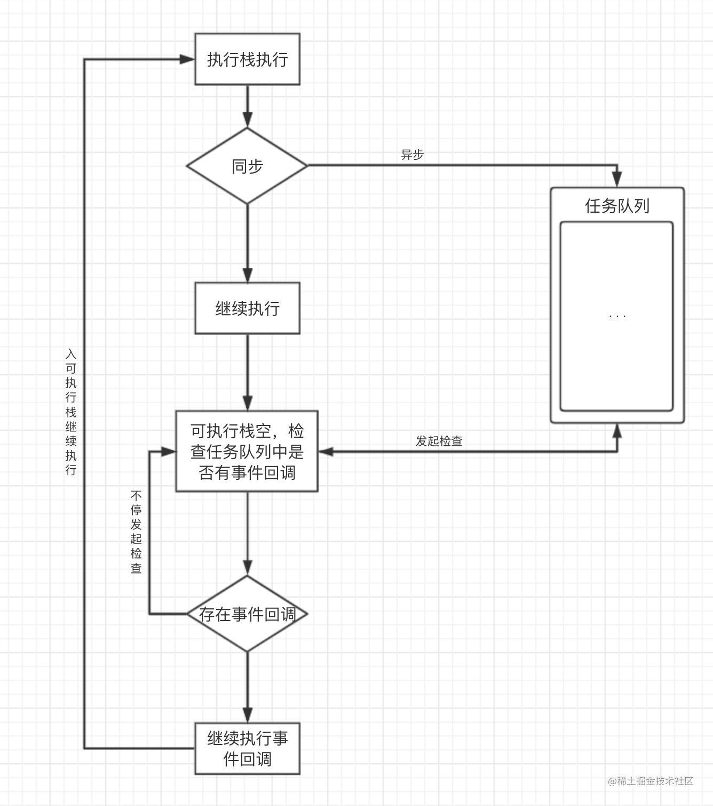

## JS

参考：
* https://juejin.cn/post/7194400984490049573
* https://juejin.cn/post/6940945178899251230
* https://juejin.cn/post/6941194115392634888


### 数据类型
分类： Undefined、Null、Number、String、Boolean、BigInt、Symbol、Object
* Symbol表示独一无二的值，场用于定义对象的唯一属性名。
* BigInt可以表示任意大小的整数。

#### 数据类型判断
1. typeof：能判断所有值类型，函数。不可对 null、对象、数组进行精确判断，因为都返回 object 。

```js
console.log(typeof undefined); // undefined
console.log(typeof 2); // number
console.log(typeof true); // boolean
console.log(typeof "str"); // string
console.log(typeof Symbol("foo")); // symbol
console.log(typeof 2172141653n); // bigint
console.log(typeof function () {}); // function
// 不能判别
console.log(typeof []); // object
console.log(typeof {}); // object
console.log(typeof null); // object
```
2. instanceof: 能判断对象类型，不能判断基本数据类型，其内部运行机制是判断在其原型链中能否找到该类型的原型

```js
console.log(2 instanceof Number);               // false
console.log(true instanceof Boolean);           // false 
console.log('str' instanceof String);           // false 
console.log([] instanceof Array);               // true
console.log(function(){} instanceof Function);  // true
console.log({} instanceof Object);              // true
```

3. Object.prototype.toString.call(): 所有原始数据类型都是能判断的，还有 Error 对象，Date 对象等。

```js
Object.prototype.toString.call(2); // "[object Number]"
Object.prototype.toString.call(""); // "[object String]"
Object.prototype.toString.call(true); // "[object Boolean]"
Object.prototype.toString.call(undefined); // "[object Undefined]"
Object.prototype.toString.call(null); // "[object Null]"
Object.prototype.toString.call(Math); // "[object Math]"
Object.prototype.toString.call({}); // "[object Object]"
Object.prototype.toString.call([]); // "[object Array]"
Object.prototype.toString.call(function () {}); // "[object Function]"
```

!!! info 同样是检测对象obj调用toString方法，obj.toString()的结果和Object.prototype.toString.call(obj)的结果不一样，这是为什么？
    因为toString是Object的原型方法，而Array、function等类型作为Object的实例，都重写了toString方法。不同的对象类型调用toString方法时，根据原型链的知识，调用的是对应的重写之后的toString方法（function类型返回内容为函数体的字符串，Array类型返回元素组成的字符串…），而不会去调用Object上原型toString方法（返回对象的具体类型），所以采用obj.toString()不能得到其对象类型，只能将obj转换为字符串类型；因此，在想要得到对象的具体类型时，应该调用Object原型上的toString方法。
1. constructor: constructor有两个作用，一是判断数据的类型，二是对象实例通过 constrcutor 对象访问它的构造函数

```js
console.log((2).constructor === Number); // true
console.log((true).constructor === Boolean); // true
console.log(('str').constructor === String); // true
console.log(([]).constructor === Array); // true
console.log((function() {}).constructor === Function); // true
console.log(({}).constructor === Object); // true
```
**需要注意**，如果创建一个对象来改变它的原型，constructor就不能用来判断数据类型了：
```js
function Fn(){};
Fn.prototype = new Array();
var f = new Fn();
console.log(f.constructor===Fn);    // false
console.log(f.constructor===Array); // true
```


5. 判断是否为数组的方法

```js
Array.isArray(arr); // true
arr.__proto__ === Array.prototype; // true
arr instanceof Array; // true
Object.prototype.toString.call(arr); // "[object Array]"
Array.prototype.isPrototypeOf(arr); // true
```


#### null 和undefined 区别
* null 表示一个空对象指针，使用 typeof 操作符检测 null 返回 object 。
* undefined 表示一个变量未定义，使用 typeof 操作符检测 undefined 返回 undefined 。

### ES6
[阮一峰ES6文档](https://es6.ruanyifeng.com/#docs/intro)
[文章参考](https://juejin.cn/post/6844903959283367950)

* let声明变量和const声明常量，都具有块级作用域。
* 箭头函数
* 解构赋值
* ...扩展运算符
* 模板字符串，在其中加入${}，其中可加入任意js表达式
* Object.values(obj)获取obj对象中所有属性值
* Array.prototype.flat(),[扁平化数组](https://developer.mozilla.org/zh-CN/docs/Web/JavaScript/Reference/Global_Objects/Array/flat)
* 可选链操作符（?.）:允许读取位于连接对象链深处的属性的值，而不必明确验证链中的每个引用是否有效。?. 运算符的功能类似于 . 链式运算符，不同之处在于，在引用为空 (nullish ) (null 或者 undefined) 的情况下不会引起错误，该表达式短路返回值是 undefined。与函数调用一起使用时，如果给定的函数不存在，则返回 undefined。
* 空值合并运算符（??）:当左侧的操作数为 null 或者 undefined 时，返回其右侧操作数，否则返回左侧操作数。
* for of循环，可遍历数组、Set、Map、arguments对象、类似数组的对象([TypeArray](https://developer.mozilla.org/zh-CN/docs/Web/JavaScript/Reference/Global_Objects/TypedArray))、字符串等[可迭代对象](https://developer.mozilla.org/zh-CN/docs/Web/JavaScript/Reference/Iteration_protocols)。[参考文档](https://developer.mozilla.org/zh-CN/docs/Web/JavaScript/Reference/Statements/for...of)
* [Set](https://developer.mozilla.org/zh-CN/docs/Web/JavaScript/Reference/Global_Objects/Set)、[Map](https://developer.mozilla.org/zh-CN/docs/Web/JavaScript/Reference/Global_Objects/Map)
* class、extends、super
* Symbol
* Proxy、Reflect
* 剩余参数、默认参数
* promise、async/await

#### const、let、var的区别
const、let和var是JavaScript中用于声明变量的关键字，它们之间有一些区别。

var：在ES5及之前的版本中使用的关键字。它声明的变量具有函数作用域或全局作用域，而不是块级作用域。这意味着在函数内部声明的变量在整个函数范围内都是可见的，而在块级作用域（如if语句或for循环）内部声明的变量在块级作用域外是可见的。此外，var声明的变量可以被重复声明，而后面的声明会覆盖前面的声明。

let：在ES6中引入的关键字。它声明的变量具有块级作用域，这意味着在块级作用域内部声明的变量只在该块级作用域内可见。与var不同，let声明的变量不能被重复声明，而是会引发错误。

const：也是在ES6中引入的关键字。它声明的变量也具有块级作用域，与let类似。但是，const声明的变量是常量，一旦被赋值后就不能再被修改。尝试修改const声明的变量会引发错误。

总结：

使用var声明的变量具有函数作用域或全局作用域，可以被重复声明。
使用let声明的变量具有块级作用域，不可以被重复声明。
使用const声明的变量也具有块级作用域，且为常量，不可以被修改。
请注意，使用const声明的对象或数组是可以修改其属性或元素的，因为const只保证变量引用的地址不变，而不保证其内容不变。

#### 箭头函数和普通函数的区别
[参考](https://juejin.cn/post/7069943937577779214)
1. 声明方式不同，普通函数使用function关键字，箭头函数则使用箭头
2. this指向不同：普通函数this指向运行时所在的对象，即可理解为谁调用函数this就指向谁。箭头函数没有自己的执行上下文，this指向是在定义函数时就被确定下来的，箭头函数中的this，永远指向外层作用域中最接近自己的普通函数的this

```js
    let obj = {
        fn2:function(){
            console.log('fn2', this);
        },
        fn3: ()=> {
            console.log('fn3', this);
        },
        fn5: function () {
            console.log('fn5',this);
            const test = ()=> {
                console.log('test', this);
            }
            test()
        }
    }
    obj.fn2(); // fn2 obj
    obj.fn3();// fn3 Window
    obj.fn5();// fn5 obj, test obj
```
3. 箭头函数会忽略任何形式的this指向的改变，箭头函数的this指向是静态的,bind、call、apply等方法无法改变箭头函数的this指向。
```js
    let fn4 = () => {
        console.log('fn4', this);
    }
    const fn6 = fn4.bind(obj)
    fn4();// fn4 Window
    fn6();// fn4 Window
```
4. 普通函数能使用new关键字作为构造函数创建实例对象,this指向被创建出来的对象实例。 箭头函数不能作为构造函数使用
5. 普通函数有arguments对象，箭头函数没有.
6. 箭头函数没有原型prototype,这也解释了箭头函数不能作为构造函数的原因。从下面new内部实现的步骤可以看出，箭头函数没有原型prototype，没法让他的实例的__proto__属性指向，所以箭头函数也就无法作为构造函数.
```js
function myNew() {
    // 1.新建一个空对象
    let obj = {}
    // 2.获得构造函数
    let con = arguments.__proto__.constructor
    // 3.链接原型
    obj.__proto__ = con.prototype
    // 4.绑定this，执行构造函数
    let res = con.apply(obj, arguments)
    // 5.返回新对象
    return typeof res === 'object' ? res : obj
}
```
7. 箭头函数没有new.target。
8. 不能当做Generator函数,不能使用yied关键字


### iterator
[参考](https://developer.mozilla.org/zh-CN/docs/Web/JavaScript/Reference/Global_Objects/Symbol/iterator)
* iterator是一种接口，为各种不同的数据结构提供统一的访问机制，任何数据结构只要部署了iterator接口，就可以完成遍历操作。
* Symbol.iterator 为每一个对象定义了默认的迭代器。该迭代器可以被 for...of 循环使用。


### 原型和原型链


### Promise
参考：
* https://es6.ruanyifeng.com/#docs/promise
* https://juejin.cn/post/6844904077537574919
* https://juejin.cn/post/6945319439772434469#heading-0

* Promise的状态一经改变就不能再改变。
* .then和.catch都会返回一个新的Promise。
* catch不管被连接到哪里，都能捕获上层未捕捉过的错误。
* 在Promise中，返回任意一个非 promise 的值都会被包裹成 promise 对象，例如return 2会被包装为return Promise.resolve(2)。
* Promise 的 .then 或者 .catch 可以被调用多次, 但如果Promise内部的状态一经改变，并且有了一个值，那么后续每次调用.then或者.catch的时候都会直接拿到该值。
* .then 或者 .catch 中 return 一个 error 对象并不会抛出错误，所以不会被后续的 .catch 捕获。
* .then 或 .catch 返回的值不能是 promise 本身，否则会造成死循环。
* .then 或者 .catch 的参数期望是函数，传入非函数则会发生值透传。
* .then方法是能接收两个参数的，第一个是处理成功的函数，第二个是处理失败的函数，再某些时候你可以认为catch是.then第二个参数的简便写法。
* .finally方法也是返回一个Promise，他在Promise结束的时候，无论结果为resolved还是rejected，都会执行里面的回调函数。

#### Promise.all() 和 Promise.race()
* `.all()`的作用是接收一组异步任务，然后并行执行异步任务，并且在所有异步操作执行完后才执行回调。
* `.race()`的作用也是接收一组异步任务，然后并行执行异步任务，只保留取第一个执行完成的异步操作的结果，其他的方法仍在执行，不过执行结果会被抛弃。

总结
* Promise.all()的作用是接收一组异步任务，然后并行执行异步任务，并且在所有异步操作执行完后才执行回调。
* .race()的作用也是接收一组异步任务，然后并行执行异步任务，只保留取第一个执行完成的异步操作的结果，其他的方法仍在执行，不过执行结果会被抛弃。
* Promise.all().then()结果中数组的顺序和Promise.all()接收到的数组顺序一致。
* all和race传入的数组中如果有会抛出异常的异步任务，那么只有最先抛出的错误会被捕获，并且是被then的第二个参数或者后面的catch捕获；但并不会影响数组中其它的异步任务的执行。


### async/await


### 事件捕获与冒泡
参考：
* https://www.w3.org/TR/DOM-Level-3-Events/#event-flow
* https://juejin.cn/post/6844904190280466440

```js
element.addEventListener(type, listener, useCapture)
```
* type:监听事件类型的字符串
* listener:事件监听回调函数，即事件触发后要处理的函数
* useCapture:默认值false，表示事件冒泡；设为true时，表示事件捕获

#### 事件代理（事件委托）
> 事件代理就是利用事件冒泡或事件捕获的机制把一系列的内层元素事件绑定到外层元素。


### 箭头函数和普通函数
参考：
* https://juejin.cn/post/6844903805960585224
* https://juejin.cn/post/7069943937577779214


### JS运行机制
[参考1](https://juejin.cn/post/6844904050543034376#heading-0)

#### 进程与线程
- `CPU` 是计算机的核心，承担计算任务
- `进程`是`CPU`资源分配的最小单位,可以看做一个可以独立运行且拥有自己的资源空间的任务程序
- `线程`是`CPU`调度的最小单位。线程是建立在进程的基础上的一次程序运行单位，可以理解为程序中的一个执行流，一个进程可以有多个线程
- 一个进程中只有一个执行流称作`单线程`，即程序执行时，所走的程序路径按照连续顺序排下来，前面的必须处理好，后面的才会执行
- 一个进程中有多个执行流称作`多线程`，即在一个程序中可以同时运行多个不同的线程来执行不同的任务， 也就是说允许单个程序创建多个并行执行的线程来完成各自的任务

**区别：**
- 进程是操作系统分配资源的最小单位，线程是程序执行的最小单位
- 一个进程由一个或多个线程组成，线程可以理解为是一个进程中代码的不同执行路线
- 进程之间相互独立，但同一进程下的各个线程间共享程序的内存空间(包括代码段、数据集、堆等)及一些进程级的资源(如打开文件和信号)
调度和切换：线程上下文切换比进程上下文切换要快得多

#### JS 是单线程
- JS的单线程，与它的用途有关。
- 作为浏览器脚本语言，JavaScript的主要用途是与用户互动，以及操作DOM。这决定了它只能是单线程，否则会带来很复杂的同步问题。
- 比如，假定JavaScript同时有两个线程，一个线程在某个DOM节点上添加内容，另一个线程删除了这个节点，这时浏览器应该以哪个线程为准？
- 为了利用多核CPU的计算能力，HTML5提出Web Worker标准，允许JavaScript脚本创建多个线程，但是子线程是完 全受主线程控制的，而且不得操作DOM。所以，这个标准并没有改变JavaScript是单线程的本质

#### 事件循环

执行顺序：
1. 执行栈开始顺序执行
2. 判断是否为同步，异步则进入异步线程，最终事件回调给事件触发线程的任务队列等待执行，同步继续执行
3. 执行栈空，询问任务队列中是否有事件回调
4. 任务队列中有事件回调则把回调加入执行栈末尾继续从第一步开始执行
5. 任务队列中没有事件回调则不停发起询问

##### 宏任务和微任务
- 宏任务（macrotask），在ECMAScript中也被称作task
  - 可以将每次执行栈执行的代码当做是一个宏任务(包括每次从事件队列中获取一个事件回调并放到执行栈中执行)， 每一个宏任务会从头到尾执行完毕，不会执行其他
  - 常见的宏任务: 主代码块、setTimeout、setInterval、setImmediate()-Node、requestAnimationFrame()-浏览器


- 微任务（microtask），在ECMAScript中也被称为jobs，是在ES6新引入了Promise标准后产生的概念。
  - 微任务可以理解成在当前宏任务执行后立即执行的任务
  - 当一个宏任务执行完，会在渲染前，将执行期间所产生的所有微任务都执行完
  - 常见微任务：process.nextTick ()-Node、Promise.then()、catch、finally、Object.observe、MutationObserver

!!! note JS引擎线程和GUI渲染线程是互斥的关系，浏览器为了能够使宏任务和DOM任务有序的进行，会在一个宏任务以及当前执行在产生微任务执行结束后，在下一个宏任务执行前，GUI渲染线程开始工作，对页面进行渲染
    ```mermaid
    graph LR
    宏任务1 --> 微任务--> GUI渲染--> 宏任务2 -->  ...;
    ```

**宏任务微任务执行流程：**


##### 事件循环完整流程

- 首先，整体的script(作为第一个宏任务)开始执行的时候，会把所有代码分为同步任务、异步任务两部分
- 同步任务会直接进入主线程依次执行
- 异步任务会再分为宏任务和微任务
- 宏任务进入到Event Table中，并在里面注册回调函数，每当指定的事件完成时，Event Table会将这个函数移到Event Queue中
- 微任务也会进入到另一个Event Table中，并在里面注册回调函数，每当指定的事件完成时，Event Table会将这个函数移到Event Queue中
- 当主线程内的任务执行完毕，主线程为空时，会检查微任务的Event Queue，如果有任务，就全部执行，如果没有就执行下一个宏任务
- 上述过程会不断重复，这就是Event Loop，比较完整的事件循环


!!! tip Promise和async/await中的微任务
     -  `new Promise(() => {}).then()`中, `new Promise()` 这一部分是一个构造函数，这是一个同步任务, `.then()` 才是一个异步微任务
     -  使用`await`关键字与`Promise.then`效果类似
[简单示例代码](./08_%E4%BA%8B%E4%BB%B6%E5%BE%AA%E7%8E%AF.html)


### 数组Array
[方法参考](https://www.runoob.com/jsref/jsref-obj-array.html)
- concat, 连接两个或更多的数组，并返回结果
- includes, 判断一个数组是否包含一个指定的值
- entries, 返回数组的可迭代对象, [参考](https://developer.mozilla.org/en-US/docs/Web/JavaScript/Reference/Global_Objects/Array/entries)
- fill,使用一个固定值来填充数组
- 


遍历方法：
- every, 检测数值元素的每个元素是否都符合条件
- filter
- forEach
- map
- reduce
- reduceRight

#### splice 和 slice 的区别
* splice, 向数组中添加或删除元素,返回删除元素组成的数组,原数组改变
```js
const months = ['Jan', 'March', 'April', 'June'];
months.splice(1, 0, 'Feb');
// Inserts at index 1
console.log(months);
// Expected output: Array ["Jan", "Feb", "March", "April", "June"]

months.splice(4, 1, 'May');
// Replaces 1 element at index 4
console.log(months);
// Expected output: Array ["Jan", "Feb", "March", "April", "May"]
```
* slice, 截取数组中的一段,返回截取的新数组,原数组不变
```js
const animals = ['ant', 'bison', 'camel', 'duck', 'elephant'];

console.log(animals.slice(2));
// Expected output: Array ["camel", "duck", "elephant"]

console.log(animals.slice(2, 4));
// Expected output: Array ["camel", "duck"]

console.log(animals.slice(1, 5));
// Expected output: Array ["bison", "camel", "duck", "elephant"]

console.log(animals.slice(-2));
// Expected output: Array ["duck", "elephant"]

console.log(animals.slice(2, -1));
// Expected output: Array ["camel", "duck"]

console.log(animals.slice());
// Expected output: Array ["ant", "bison", "camel", "duck", "elephant"]

```

#### map 和 forEach 的区别
相同点：都是遍历数组，对数组中的每一项进行操作
不同点：
* map会返回一个新的数组，forEach不会返回新的数组

注意：map中元素若为引用类型，通过遍历的方式修改元素的属性，原数组也会改变
```js
let arr = [{name: 'a'}, {name: 'b'}]
let res = arr.map(item => {
    item.name = 'c'
    return item
})
console.log(arr) // [{name: 'c'}, {name: 'c'}]
console.log(res) // [{name: 'c'}, {name: 'c'}]
```

#### 判断元素是否进入视口
[参考](https://developer.mozilla.org/en-US/docs/Web/API/Intersection_Observer_API)
* Intersection Observer API


```js
let options = {
  root: document.querySelector("#scrollArea"),
  rootMargin: "0px",
  threshold: 1.0,
};

let observer = new IntersectionObserver(callback, options);
```


### 字符串String
[方法参考](https://www.runoob.com/jsref/jsref-obj-string.html)

- concat,用于链接两个或大于两个的字符串，`string.concat(string1, string2, ..., stringX)`
- indexOf, 返回某个指定的字符串值在字符串中首次出现的位置, `string.indexOf(searchvalue,start)`,其中`searchvalue`为检索的字符串，必填；`start`为在字符串中开始检索的位置,可选。
- lastIndexOf,同上，顺序为冲字符串尾部开始查询。
- includes, 查找字符串中是否包含指定的子字符串. `string.includes(searchvalue, start)`,参数同indexOf
- slice,提取字符串的片断，并在新的字符串中返回被提取的部分,不改变原字符串，`string.slice(start,end)`
- split, 把字符串分割为字符串数组, `string.split(separator,limit)`,`separator`字符串或正则表达式;`limit`可选，指定返回的数组的最大长度
- repeat, 复制字符串指定次数，并将它们连接在一起返回,`string.repeat(count)`
- trim, 去除字符串两边的空白, `string.trim()`
- endsWith, 判断当前字符串是否是以指定的子字符串结尾的（区分大小写, 参数不能使用正则
- startsWith, 查看字符串是否以指定的子字符串开头, 参数不能使用正则


- match, 查找找到一个或多个正则表达式的匹配,以数组形式返回。`string.match(regexp)`
- replace, 在字符串中查找匹配的子串，并替换与正则表达式匹配的子串
- replaceAll, 在字符串中查找匹配的子串，并替换与正则表达式匹配的**所有**子串
- search, 查找与正则表达式相匹配的值


### 函数提升（函数表达式与函数声明）
- 函数声明会在代码执行前被加载进内存（添加到执行上下文，也就是声明提升），而函数表达式只有在代码执行到它那一行时才会被加载进内存。
- 函数表达式则需要等到代码运行到它所在行，才会创建函数对象
- `function foo() {}`是函数声明，`var foo = function() {}`是函数表达式

```js
    var foo = function () {
      console.log("foo1");
    };
    foo();

    var foo = function () {
      console.log("foo2");
    };
    foo();

    function foo() {
      console.log("foo3");
    }
    foo();

    function foo() {
      console.log("foo4");
    }
    foo();
    // 执行结果为：foo1 foo1 foo2 foo2
```


### Map 和 WeakMap
Map: https://developer.mozilla.org/zh-CN/docs/Web/JavaScript/Reference/Global_Objects/Map
WeakMap: https://developer.mozilla.org/zh-CN/docs/Web/JavaScript/Reference/Global_Objects/WeakMap
- Map, 键值对的集合，可以使用任何类型的值作为键或者值
- WeakMap, 键只能是对象，值可以是任意的

#### WeakMap
- WeakMap 是 JavaScript 中的一种内置对象，它提供了一种键-值对的存储方式。与普通的 Map 对象不同，WeakMap 的键只能是对象，并且对于不再被引用的键，其对应的值会被自动回收，不会造成内存泄漏。
- WeakMap 的主要应用场景是在需要存储一些临时数据或私有数据，并且不希望影响垃圾回收的情况下使用。
- WeakMap 的特点和原理：
  - 只接受对象作为键：WeakMap 的键**只能是对象**，不能是基本数据类型（如字符串、数值等）。这是因为 WeakMap 使用对象的引用作为键，当对象不再被引用时，垃圾回收机制可以自动清理与之相关的键值对。
  - 弱引用特性：WeakMap 中的键是弱引用的，这意味着当键对象不再被引用时，垃圾回收机制可以自动清理与之相关的键值对。在没有其他引用的情况下，键对象会被垃圾回收，并从 WeakMap 中删除对应的键值对。
  - **不可迭代**：由于 WeakMap 的键是弱引用的，垃圾回收机制可以在任何时候删除键值对，因此 WeakMap 不支持迭代操作，也没有相关的迭代器方法（如 keys()、values()、entries() 和 forEach()）。
  - 没有公开的方法和属性：WeakMap 没有提供直接访问和操作键值对的方法和属性。只能通过 set()、get() 和 delete() 方法来操作键值对。


