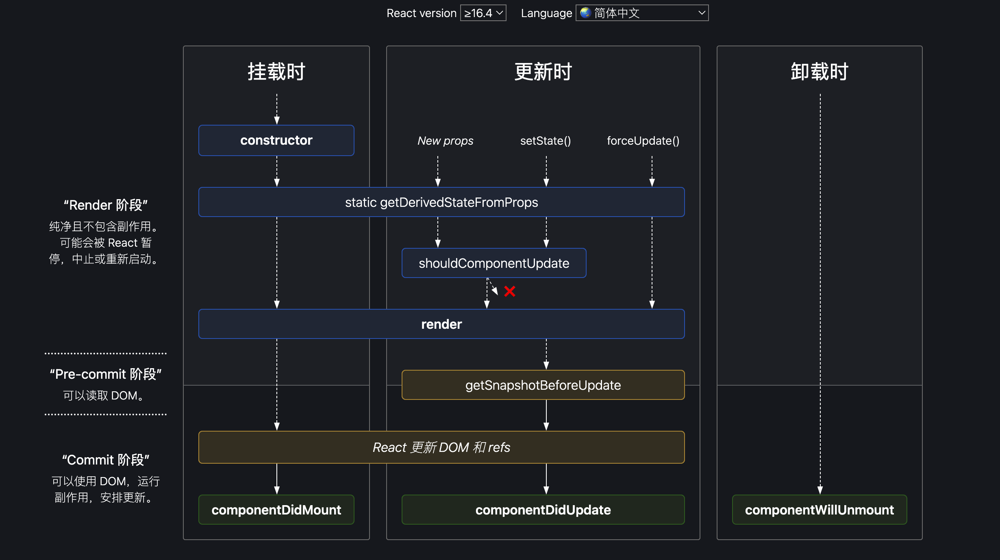

# React
- [官网](https://react.dev/)
- https://juejin.cn/post/6941546135827775525
- https://juejin.cn/post/6940942549305524238


### React设计思想
[react设计模式](https://juejin.cn/post/7007214462813863950)
1. 组件化
每个组件都符合开放-封闭原则:
- 封闭是针对渲染工作流来说的，指的是组件内部的状态都由自身维护，只处理内部的渲染逻辑。
- 开放是针对组件通信来说的，指的是不同组件可以通过props（单项数据流）进行数据交互

2. 数据驱动视图
- 公式： UI=f(data)
- 通过这个公式得出，如果要渲染界面，不应该直接操作DOM，而是通过修改数据(state或prop)，数据驱动视图更新

3. 虚拟DOM
### JSX
> JSX是react的语法糖，它允许在html中写JS，它不能被浏览器直接识别，需要通过webpack、babel之类的编译工具转换为JS执行

JSX与JS的区别：
- js可以被打包工具直接编译，不需要额外转换，jsx需要通过babel编译，它是React.createElement的语法糖，使用jsx等价于React.createElement
- jsx是js的语法扩展，允许在html中写JS；JS是原生写法，需要通过script标签引入

#### 为什么在文件中没有使用react，也要在文件顶部import React from “react”
只要使用了jsx，就需要引用react，因为jsx本质就是React.createElement

#### 为什么React自定义组件首字母要大写
- jsx通过babel转义时，调用了React.createElement函数，它接收三个参数，分别是type元素类型，props元素属性，children子元素。
- 如下代码中，从jsx到真实DOM需要经历`jsx->虚拟DOM->真实DOM`。如果组件首字母为小写，它会被当成字符串进行传递，在创建虚拟DOM的时候，就会把它当成一个html标签，而html没有app这个标签，就会报错。组件首字母为大写，它会当成一个变量进行传递，React知道它是个自定义组件就不会报错了

```jsx
<app>app content</app>
// 转义后
React.createElement("app",null,"app content")

<App>app content</App>
// 转义后
React.createElement(App,null,lyllovelemon)
```

#### React组件为什么不能返回多个元素 或者 React组件为什么只能有一个根元素
1. React组件最后会编译为render函数，函数的返回值只能是1个，如果不用单独的根节点包裹，就会并列返回多个值，这在js中是不允许的
```jsx
class App extends React.Component{
  render(){ 
    return(
    <div>
     <h1 className="title">内容1</h1>
      <span>内容2</span>	
    </div>	
  )
}

//编译后
class App extends React.Component{
  render(){
    return React.createElement('div',null,[
        React.createElement('h1',{className:'title'},'内容1'),
        React.createElement('span'),null,'内容2'
      ])
  }
}
```

2. react的虚拟DOM是一个树状结构，树的根节点只能是1个，如果有多个根节点，无法确认是在哪棵树上进行更新(vue的根节点为什么只有一个也是同样的原因)

#### React组件怎样可以返回多个组件
- 使用HOC（高阶函数）
- 使用React.Fragment,可以让你将元素列表加到一个分组中，而且不会创建额外的节点（类似vue的template)
```jsx
renderList(){
  this.state.list.map((item,key)=>{
    return (<React.Fragment>
      <tr key={item.id}>
        <td>{item.name}</td>
        <td>{item.age}</td>
        <td>{item.address}</td>
      </tr>	
    </React.Fragment>)
  })
}
```
- 使用数组返回
```jsx
renderList(){
  this.state.list.map((item,key)=>{
    return [
      <tr key={item.id}>
        <td>{item.name}</td>
        <td>{item.age}</td>
        <td>{item.address}</td>
      </tr>
    ]
  })
}
```


### setState

执行机制： 
* 不会立即更新，多个setState会进行合并，当所有组件及父组件Didmoount后，执行更行
* 每个组件只会更新一次，即对该组件的状态多次setState，进行合并后触发一次更新的生命周期。

和微任务、宏任务的区别：
* 执行顺序：setState操作执行时机先于微任务和宏任务。
* setState的异步特性的主要原因：在React的声明周期及绑定的事件流中，所有的setState的操作会先缓存到一个队列中，等整个事件结束或者mount流程结束后，才会去除之前缓存的setState队列进行一次计算，触发state更新
```js
handleClick = () => {
    const fans = Math.floor(Math.random() * 10); // 8
    this.setState({
        count: this.state.count + fans // 0 + 8
    }, () => {
        console.log('state:', this.state.count)
    })
    setTimeout(() => {
        console.log('宏任务')
    })
    Promise.resolve().then(() => {
        console.log('微任务')
    })

}
// 打印结果：
//    微任务 state:8 宏任务
```
* 跳出React的事件流或生命周期，就可打破React对setState的掌控，即把setState放入setTimeout的匿名函数即可

```js
handleClick = () => {
    const fans = Math.floor(Math.random() * 10); // 8
    setTimeout(() => {
        console.log('开始')
        this.setState({
            count: this.state.count + fans // 0 + 8
        }, () => {
            console.log('state:', count)
        })
        console.log('结束')
    },0)


}
// 打印结果：
// 开始 state:8  结束
```


### 生命周期
> 参考：https://zh-hans.reactjs.org/docs/react-component.html




* 挂载阶段: 当组件实例被创建并插入 DOM 中时，其生命周期调用顺序如下
  * constructor() ：进行state、props初始化。该阶段修改state，不会执行更新阶段声明周期，可直接对state赋值
  * static getDerivedStateFromProps()
  * render()
  * componentDidMount() ： 发生在 render 函数之后，已经挂载 Dom
> 注意：
> UNSAFE_componentWillMount() ：发生在 render 函数之前，还没有挂载 Dom. 即将过时，在新代码中应该避免使用它们.


* 更新阶段: 当组件的 props 或 state 发生变化时会触发更新。组件更新的生命周期调用顺序如下
  * static getDerivedStateFromProps()
  * shouldComponentUpdate()
  * render()
  * getSnapshotBeforeUpdate()
  * componentDidUpdate()

> 注意：
> UNSAFE_componentWillUpdate()
> UNSAFE_componentWillReceiveProps()
> 这两个方法即将过时，在新代码中应该避免使用它们

* 卸载阶段：当组件从 DOM 中移除时会调用如下方法
  * componentWillUnmount()

* 错误处理: 当渲染过程，生命周期，或子组件的构造函数中抛出错误时，会调用如下方法
  * static getDerivedStateFromError()
  * componentDidCatch()


### 虚拟dom

### react事件机制
#### 合成事件
> React基于浏览器的事件机制实现了一套自身的事件机制，它符合W3C规范，包括事件触发、事件冒泡、事件捕获、事件合成和事件派发等

设计动机（作用）：
- 在底层磨平不同浏览器的差异，React实现了统一的事件机制，我们不再需要处理浏览器事件机制方面的兼容问题，在上层面向开发者暴露稳定、统一的、与原生事件相同的事件接口
- React把握了事件机制的主动权，实现了对所有事件的中心化管控
- React引入事件池避免垃圾回收，在事件池中获取或释放事件对象，避免频繁的创建和销毁

**React事件机制和原生DOM事件流有什么区别:**
- 合成事件不是原生DOM事件，但它包含了原生DOM事件的引用，可以通过e.nativeEvent访问

**DOM事件流工作流程**
> 一个页面往往会绑定多个事件，页面接收事件的顺序叫事件流

1. W3C标准事件的传播过程:
   1. 事件捕获
   2. 处于目标
   3. 事件冒泡

2. 常用事件处理性能优化手段：**事件委托**
   1. 把多个子元素同一类型的监听函数合并到父元素上，通过一个函数监听的行为叫事件委托
   2. React事件中， React16的事件绑定在document上， React17以后事件绑定在container上(`ReactDOM.render(app,container)`)

#### React事件机制总结
- React所有的事件绑定在container上(react17以后),而不是绑定在DOM元素上（作用：减少内存开销，所有的事件处理都在container上，其他节点没有绑定事件）
- React自身实现了一套冒泡机制，不能通过return false阻止冒泡
- React通过SytheticEvent实现了事件合成

[react event](../00_images/react-event.png)


### React组件通信
1. 父组件向子组件通信(props)
2. 子组件向父组件通信(回调函数、事件冒泡、ref)
3. 兄弟组件通信(父组件作为中转)
4. 父组件向后代组件通信（context、redux）
5. 无关组件通信
### react16+
#### react16
* jsx 中绑定的事件,根本就没有注册到真实的dom上。是绑定在document上统一管理的(react16)
* 真实的dom上的click事件被单独处理,已经被react底层替换成空函数
* 在react绑定的事件,比如onChange，在document上，可能有多个事件与之对应
* react并不是一开始，把所有的事件都绑定在document上，而是采取了一种按需绑定，比如发现了onClick事件,再去绑定document click事件。

合成事件：在react中，绑定的事件onClick等，并不是原生事件，而是由原生事件合成的React事件，比如 click事件合成为onClick事件。比如blur , change , input , keydown , keyup等 , 合成为onChange。

采取合成事件的原因：
* 将事件绑定在document统一管理，防止很多事件直接绑定在原生的dom元素上。造成一些不可控的情况
* React 想实现一个全浏览器的框架， 为了实现这种目标就需要提供全浏览器一致性的事件系统，以此抹平不同浏览器的差异。

事件绑定总结：
* 在React，diff DOM元素类型的fiber的props的时候， 如果发现是React合成事件，比如onClick，会按照事件系统逻辑单独处理。
* 根据React合成事件类型，找到对应的原生事件的类型，然后调用判断原生事件类型，大部分事件都按照冒泡逻辑处理，少数事件会按照捕获逻辑处理（比如scroll事件）。
* 调用 addTrappedEventListener 进行真正的事件绑定，绑定在document上，dispatchEvent 为统一的事件处理函数。
* 有一点值得注意: 只有上述那几个特殊事件比如 scorll,focus,blur等是在事件捕获阶段发生的，其他的都是在事件冒泡阶段发生的，无论是onClick还是onClickCapture都是发生在冒泡阶段，


事件池：
```js
handerClick = (e) => {
    console.log(e.target) // button 
    setTimeout(()=>{
        console.log(e.target) // null
    },0)
}
```

* 对于一次点击事件的处理函数，在正常的函数执行上下文中打印e.target就指向了dom元素，但是在setTimeout中打印却是null，如果这不是React事件系统，两次打印的应该是一样的，但是为什么两次打印不一样呢?
* 因为在React采取了一个事件池的概念，每次我们用的事件源对象，在事件函数执行之后，可以通过releaseTopLevelCallbackBookKeeping等方法将事件源对象释放到事件池中，这样的好处每次我们不必再创建事件源对象，可以从事件池中取出一个事件源对象进行复用，在事件处理函数执行完毕后,会释放事件源到事件池中，清空属性，这就是setTimeout中打印为什么是null的原因了。


#### react17
react17相较于16，事件系统有部分改动
1. 事件统一绑定container上，ReactDOM.render(app， container);而不是document上，这样好处是有利于微前端的，微前端一个前端系统中可能有多个应用，如果继续采取全部绑定在document上，那么可能多应用下会出现问题。

2. 对齐原生浏览器事件,React 17 中终于支持了原生捕获事件的支持， 对齐了浏览器原生标准。同时 onScroll 事件不再进行事件冒泡。onFocus 和 onBlur 使用原生 focusin， focusout 合成。
3. 取消事件池 React 17 取消事件池复用，也就解决了上述在setTimeout打印，找不到e.target的问题。


#### react 18
[参考1](https://juejin.cn/post/7094037148088664078)
[参考2](https://juejin.cn/post/7182382408807743548)

1. 新的 `root API`, 该API支持 new concurrent renderer（并发模式的渲染），它允许你进入concurrent mode（并发模式）。

```js
// React 17
import React from 'react';
import ReactDOM from 'react-dom';
import App from './App';

const root = document.getElementById('root')!;

ReactDOM.render(<App />, root);
// 卸载
ReactDOM.unmountComponentAtNode(root)  

// React 18
import React from 'react';
import ReactDOM from 'react-dom/client';
import App from './App';

const root = document.getElementById('root')!;

ReactDOM.createRoot(root).render(<App />);

// 卸载
root.unmount()  
```

2. setState自动批处理
- 在react18之前，只有react事件会进行批处理，原生js事件、promise，setTimeout、setInterval不会
  - react事件，每次点击只会更新一次
```tsx
import React, { useState } from 'react';

// React 18 之前
const App: React.FC = () => {
  console.log('App组件渲染了！');
  const [count1, setCount1] = useState(0);
  const [count2, setCount2] = useState(0);
  return (
    <button
      onClick={() => {
        setCount1(count => count + 1);
        setCount2(count => count + 1);
        // 在React事件中被批处理
      }}
    >
      {`count1 is ${count1}, count2 is ${count2}`}
    </button>
  );
};

export default App;
```
  - 把状态的更新放在promise或者setTimeout或者js原生时间里面，不会进行批处理
```tsx
import React, { useState } from 'react';

// React 18 之前
const App: React.FC = () => {
  console.log('App组件渲染了！');
  const [count1, setCount1] = useState(0);
  const [count2, setCount2] = useState(0);

//   useEffect(() => {
//     document.body.addEventListener('click', () => {
//       setCount1(count => count + 1);
//       setCount2(count => count + 1);
//     });
//     // 在原生js事件中不会进行批处理
//   }, []);
    <div
      onClick={() => {
        setTimeout(() => {
          setCount1(count => count + 1);
          setCount2(count => count + 1);
        });
        // 在 setTimeout 中不会进行批处理
      }}
    >
      <div>count1： {count1}</div>
      <div>count2： {count2}</div>
    </div>
  );
};

export default App;
```

- react18，将所有事件都进行批处理，即多次setState会被合并为1次执行，提高了性能，在数据层，将多个状态更新合并成一次处理（在视图层，将多次渲染合并成一次渲染）

3. flushSync

!!! note 批处理是一个破坏性改动，如果你想退出批量更新，你可以使用 flushSync
    注意: flushSync 函数内部的多个 setState 仍然为批量更新，这样可以精准控制哪些不需要的批量更新。

```tsx
import React, { useState } from 'react';
import { flushSync } from 'react-dom';

const App: React.FC = () => {
  const [count1, setCount1] = useState(0);
  const [count2, setCount2] = useState(0);
  return (
    <div
      onClick={() => {
        flushSync(() => {
          setCount1(count => count + 1);
        });
        // 第一次更新
        flushSync(() => {
          setCount2(count => count + 1);
        });
        // 第二次更新
      }}
    >
      <div>count1： {count1}</div>
      <div>count2： {count2}</div>
    </div>
  );
};

export default App;
```

4. react组件返回值
- 在 React 17 中，如果你需要返回一个空组件，React只允许返回null。如果你显式的返回了 undefined，控制台则会在运行时抛出一个错误。
- 在 React 18 中，不再检查因返回 undefined 而导致崩溃。既能返回 null，也能返回 undefined（但是 React 18 的dts文件还是会检查，只允许返回 null，你可以忽略这个类型错误）
- [官方解释](https://github.com/reactwg/react-18/discussions/75)

5. 去掉了对IE浏览器的支持，react18引入的新特性全部基于现代浏览器，如需支持需要退回到react17版本
6. strict mode更新
- 使用严格模式时，React会对每个组件返回两次渲染，以便你观察一些意想不到的结果,在react17中去掉了一次渲染的控制台日志，以便让日志容易阅读。react18取消了这个限制，第二次渲染会以浅灰色出现在控制台日志

7. Suspense不再需要fallback捕获


### Hooks
[参考](https://juejin.cn/post/7118937685653192735)
> Hook 是 React 16.8 的新增特性。它可以让你在不编写 class 的情况下使用 state 以及其他的 React 特性。

#### 函数式组件和类组件
* 在class状态中，通过一个实例化的class，去维护组件中的各种状态；但是在function组件中，没有一个状态去保存这些信息，每一次函数上下文执行，所有变量，常量都重新声明，执行完毕，再被垃圾机制回收。
* 对于class组件，我们只需要实例化一次，实例中保存了组件的state等状态。对于每一次更新只需要调用render方法就可以。但是在function组件中，每一次更新都是一次新的函数执行,为了保存一些状态,执行一些副作用钩子,react-hooks应运而生，去帮助记录组件的状态，处理一些额外的副作用

#### useState

#### useEffect
```js
useEffect(()=>{
    return destory
},dep)
```
- useEffect 第一个参数 callback, 返回的 destory ， destory 作为下一次callback执行之前调用，用于清除上一次 callback 产生的副作用。
- 第二个参数作为依赖项，是一个数组，可以有多个依赖项，依赖项改变，执行上一次callback 返回的 destory ，和执行新的 effect 第一个参数 callback 。
- 对于 useEffect 执行， React 处理逻辑是采用异步调用 ，对于每一个 effect 的 callback， React 会向 setTimeout回调函数一样，放入任务队列，等到主线程任务完成，DOM 更新，js 执行完成，视图绘制完毕，才执行。所以 effect 回调函数不会阻塞浏览器绘制视图。

#### useLayoutEffect
- useLayoutEffect和useEffect不同之处，是采用了同步执行
- useLayoutEffect 是在 DOM 更新之后，浏览器绘制之前，这样可以方便修改 DOM，获取 DOM 信息，这样浏览器只会绘制一次，如果修改 DOM 布局放在 useEffect ，那 useEffect 执行是在浏览器绘制视图之后，接下来又改 DOM ，就可能会导致浏览器再次回流和重绘。而且由于两次绘制，视图上可能会造成闪现突兀的效果。
- useLayoutEffect callback 中代码执行会阻塞浏览器绘制。


#### useMemo
* 只要父组件状态更新，无论有没有对子组件进行操作，子组件都会进行更新。 为了解决该问题，可使用useMemo
* 如下，useMemo只有list变化时才会进行更新渲染，从而减少不必要的开销。
```jsx
useMemo(()=> (<MemoFunc list={list}/>),[list])
```
useMemo优势：
* 减少不必要的循环和渲染
* 可以减少子组件渲染次数
* 通过特定的依赖进行更新，可以避免很多不必要的开销。

#### useCallback
* 和useMemo类似，只不过返回的是函数


#### useRef

#### useReducer
> useReducer 是 react-hooks 提供的能够在无状态组件中运行的类似redux的功能 api
```jsx
const [ ①state , ②dispatch ] = useReducer(③reducer)
```
- ① 更新之后的 state 值。
- ② 派发更新的 dispatchAction 函数, 本质上和 useState 的 dispatchAction 是一样的。
- ③ 一个函数 reducer ，我们可以认为它就是一个 redux 中的 reducer , reducer的参数就是常规reducer里面的state和action, 返回改变后的state, 这里有一个需要注意的点就是：如果返回的 state 和之前的 state ，内存指向相同，那么组件将不会更新。
基础用法：
```jsx
const DemoUseReducer = ()=>{
    /* number为更新后的state值,  dispatchNumbner 为当前的派发函数 */
   const [ number , dispatchNumbner ] = useReducer((state,action)=>{
       const { payload , name  } = action
       /* return的值为新的state */
       switch(name){
           case 'add':
               return state + 1
           case 'sub':
               return state - 1 
           case 'reset':
             return payload       
       }
       return state
   },0)
   return <div>
      当前值：{ number }
      { /* 派发更新 */ }
      <button onClick={()=>dispatchNumbner({ name:'add' })} >增加</button>
      <button onClick={()=>dispatchNumbner({ name:'sub' })} >减少</button>
      <button onClick={()=>dispatchNumbner({ name:'reset' ,payload:666 })} >赋值</button>
   </div>
}
```

### 虚拟DOM
虚拟DOM；简单理解，即用JS按照DOM结构实现的树形结构对象。
