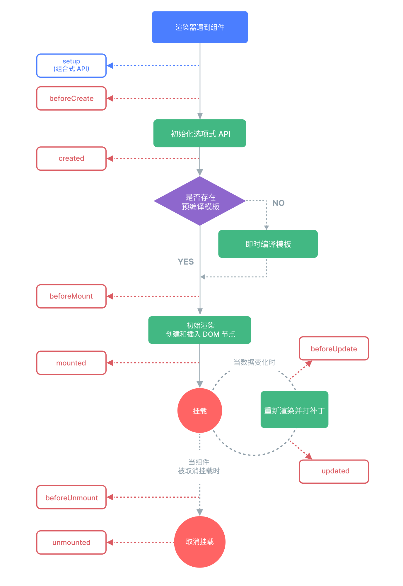
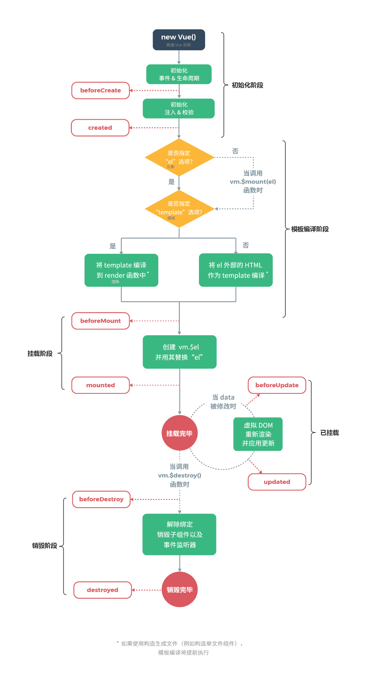

### 虚拟 DOM
* 参考：[虚拟 DOM]()
* 采用虚拟DOM的更新技术在性能这块，理论上是不可能比原生Js操作DOM高的。不过在大部分情况下，开发者很难写出绝对优化的命令式代码。所以虚拟DOM就是用来解决这一问题，让开发者系的代码在性能上得到保障，甚至无限接近命令式代码的性能。
* 通常情况下，纯Js层面的操作远比DOM操作快。虚拟DOM就是用Js来模拟出DOM结构，通过diff算法来计算出最小的变更，通过对应的渲染器，来渲染到页面上。
* 同时虚拟DOM也为跨平台开发提供了极大的便利，开发者写的同一套代码（有些需要针对不同平台做区分），通过不同的渲染规则，就可以生成不同平台的代码。
* 在vue中会通过渲染器来将虚拟DOM转换为对应平台的真实DOM。如renderer(vnode， container)，该方法会根据vnode描述的信息（如tag、props、children）来创建DOM元素，根据规则为对应的元素添加属性和事件，处理vnode下的children。

### Vue3的变化
* 响应式系统的变化
  * Vue3中的响应式系统使用了Proxy，而不是Object.defineProperty。Proxy可以监听对象的任何属性，而Object.defineProperty只能监听对象的属性。
  * Vue3中的响应式系统使用了WeakMap来存储依赖关系，而不是Vue2中的Dep类。
  * Vue3中的响应式系统使用了栈结构来存储依赖关系，而不是Vue2中的递归。

* 编译器的变化
  * Vue3中的编译器使用了静态提升，将静态节点提升到render函数之外，这样可以减少render函数的创建次数，提高渲染性能。
  * Vue3中的编译器使用了Block tree，将模板编译成了一个Block tree，这样可以减少渲染时的递归次数，提高渲染性能。
  * Vue3中的编译器使用了Patch flag，将需要更新的节点标记为Patch flag，这样可以减少不需要更新的节点的更新次数，提高渲染性能。
  * Vue3中的编译器使用了缓存事件处理函数，将事件处理函数缓存起来，这样可以减少事件处理函数的创建次数，提高渲染性能。

* 组件的变化
  * Vue3中的组件使用了Composition API，将组件的逻辑拆分成了多个函数，这样可以提高组件的复用性。
  * Vue3中的组件使用了Teleport，将组件的内容渲染到指定的DOM节点，这样可以提高组件的灵活性。
  * Vue3中的组件使用了Suspense，将组件的异步内容渲染到指定的DOM节点，这样可以提高组件的性能。

* diff算法的变化
  * 在vue2中使用的是双端diff算法：是一种同时比较新旧两组节点的两个端点的算法（比头、比尾、头尾比、尾头比）。一般情况下，先找出变更后的头部，再对剩下的进行双端diff。
  * 在vue3中使用的是快速diff算法：它借鉴了文本diff算法的预处理思路，先处理新旧两组节点中相同的前置节点和后置节点。当前置节点和后置节点全部处理完毕后，如果无法通过简单的挂载新节点或者卸载已经不存在的节点来更新，则需要根据节点间的索引关系，构造出一个最长递增子序列。最长递增子序列所指向的节点即为不需要移动的节点。

### vue2/3 响应式原理
#### 原理
- Vue2在初始化数据时，会使用Object.defineProperty重新定义data中的所有属性，当页面使用对应属性时，首先会进行依赖收集(收集当前组件的watcher)如果属性发生变化会通知相关依赖进行更新操作(发布订阅)

- Vue3改用Proxy替代Object.defineProperty。因为Proxy可以直接监听对象和数组的变化，并且有多达13种拦截方法。并且作为新标准将受到浏览器厂商重点持续的性能优化

#### Proxy只会代理对象的第一层，那么Vue3又是怎样处理这个问题的呢？
判断当前Reflect.get的返回值是否为Object，如果是则再通过reactive方法做代理， 这样就实现了深度观测

#### 监测数组的时候可能触发多次get/set，那么如何防止触发多次呢？
可以判断key是否为当前被代理对象target自身属性，也可以判断旧值与新值是否相等，只有满足以上两个条件之一时，才有可能执行trigger

### Vue3 双向绑定实现

```js
// WeakMap常用于存储只有当key所引用的对象存在时（没有被回收）才有价值的消息，十分贴合双向绑定场景
const bucket = new WeakMap(); // 存储副作用函数

let activeEffect; // 用一个全局变量处理被注册的函数

const tempObj = {}; // 临时对象，用于操作

const data = { text: "hello world" }; // 响应数据源 

// 用于清除依赖
function cleanup(effectFn) {
  for (let i = 0; i < effectFn.deps.length; i++) {
    const deps = effectFn.deps[i];
    deps.delete(effectFn);
  }
  effectFn.deps.length = 0;
}

// 处理依赖函数
function effect(fn) {
  const effectFn = () => {
    cleanup(effectFn);
    activeEffect = effectFn;
    fn();
  };
  effectFn.deps = [];
  effectFn();
}

// 在get时拦截函数调用track函数追踪变化，添加对应的副作用函数
function track(target, key) {
  if (!activeEffect) return; //
  let depsMap = bucket.get(target);
  if (!depsMap) {
    bucket.set(target, (depsMap = new Map()));
  }
  let deps = depsMap.get(key);
  if (!deps) {
    depsMap.set(key, (deps = new Set()));
  }

  deps.add(activeEffect);

  activeEffect.deps.push(deps);
}

// 在set拦截函数内调用trigger来触发变化，即获取当前 target 的副作用函数，然后执行副作用函数
function trigger(target, key) {
  const depsMap = bucket.get(target);
  if (!depsMap) return;
  const effects = depsMap.get(key);
  const effectsToRun = new Set(effects);
  effectsToRun.forEach(effectFn => effectFn());
  // effects && effects.forEach(fn => fn());
}

const obj = new Proxy(data, {
  // 拦截读取操作
  get(target, key) {
    if (!activeEffect) return; //
    console.log("get -> key", key);
    track(target, key);
    return target[key];
  },

  // 拦截设置操作
  set(target, key, newValue) {
    console.log("set -> key: newValue", key, newValue);
    target[key] = newValue;
    trigger(target, key);
  },
});

effect(() => {
  tempObj.text = obj.text;
  console.log("tempObj.text :>> ", tempObj.text);
});

setTimeout(() => {
  obj.text = "hi vue3";
}, 1000);


```

### Vue3官方为什么推荐使用 ref 而不是 reactive
- [参考](https://juejin.cn/post/7270519061208154112)

1. reactive只能监听对象，ref可以监听基本数据类型，也能监听对象
2. reactive在重新进行对象赋值时，会丢失响应式，ref不会
```js
const state = reactive({ count: 0 });
const count = ref(0);
state = { count: 1 }; // 这样会丢失响应式
count.value = 1; // 这样不会丢失响应式
```
原因：
- reactive是基于Proxy实现的，而Proxy只能监听对象，不能监听基本数据类型, reactive返回的对象是原始对象的引用
- re定义的数据（包括对象），返回的是一个包装过的简单值，而不是原始值的引用


### 和react的异同点
- 相同点：
  - 都有虚拟dom
  - 提供响应式和组件化的视图组件 
  - 都有各自的路由及状态管理的库
  - 都支持服务端渲染

- 不同点：
  1. 写法不同：
    - Vue是使用模板语法，开发者在 `<template>` 模板中编写 HTML 标签描述页面结构，并结合 Vue 的指令（如 v-if、v-for）处理交互逻辑。Vue 通过编译将模板转换为渲染函数，最终通过虚拟 DOM 渲染视图。
    - React 使用 JSX 语法，允许在 JS语句 中直接编写 HTML 标签。 JSX 在编译时被转换为 React.createElement调用，从而创建虚拟 DOM 元素，并最终通过虚拟 DOM 渲染到页面 ，开发者可以在 JSX 中插入表达式和逻辑
  2. 组件声明方式不同：
    - Vue 通常通过单文件组件来声明组件。在单文件组件中，HTML 模板、js 逻辑和 CSS 样式都被组织在同一个文件中，方便组件开发和代码管理
    - React 通过创建函数组件或类组件来声明组件,样式通常在 React 中独立管理。类组件继承自 `React.Component`上的属性和方法，并且可以使用生命周期方法，而函数组件通过 Hooks 实现状态管理和类似生命周期功能；
  3. 响应式数据和组件状态管理:
    - Vue 2：在 data 函数中声明响应式数据，Vue 通过 Object.defineProperty 实现数据劫持，自动更新视图
    - Vue 3：通过 Composition API（如 ref 和 reactive）声明响应式数据，基于 Proxy 实现更高效的响应式系统。Vue 支持双向数据绑定（尤其在表单控件中），使得数据与视图的同步非常方便
    - React 使用单向数据流，通过 useState、useReducer 等 API 进行函数组件状态管理。React 没有内置的双向数据绑定，数据修改通常通过事件处理函数更新状态。
  4. 组件通信：
    - 在 Vue 中，子组件可以通过 `$emit` 触发自定义事件向父组件传递数据。对于跨层级的组件通信，Vue 提供了 `provide` 和 `inject` 函数进行跨组件传参
    - 在 React 中，子组件通过回调函数向父组件传递数据。对于跨组件传递数据，React 使用 `Context API` 进行跨组件传参。 在 React 中，子组件通过回调函数向父组件传递数据

### 组件通信方式
- 父子组件：
  - 父 => 子 ： props; 子 => 父： `$emit`触发事件
  - 通过父链/子链也可以通信（`$parent/$children`）；`ref`也可以访问组件实例；`provide/inject`；`$attrs/$listeners`
- 兄弟组件：全局事件总线`EventBus`、`Vuex`
- 跨层级组件：全局事件总线`EventBus`、`Vuex`、`provide/inject`


### v-if 和 v-for 为什么不建议放在一起使用？
- Vue 2 中，v-for的优先级比v-if高，这意味着v-if将分别重复运行于每一个v-for循环中。如果要遍历的数组很大，而真正要展示的数据很少时，将造成很大的性能浪费
- Vue 3 中，则完全相反，v-if的优先级高于v-for，所以v-if执行时，它调用的变量还不存在，会导致异常
- 通常有两种情况导致要这样做：

  - 为了过滤列表中的项目，比如：v-for = "user in users" v-if = "user.active"。这种情况，可以定义一个计算属性，让其返回过滤后的列表即可。
  - 为了避免渲染本该被隐藏的列表，比如v-for = "user in users"  v-if = "showUsersFlag"。这种情况，可以将v-if移至容器元素上或在外面包一层template即可

### 插槽
  slot插槽，一般在组件内部使用，封装组件时，在组件内部不确定该位置是以何种形式的元素展示时，可以通过slot占据这个位置，该位置的元素需要父组件以内容形式传递过来。slot分为：

  - 默认插槽：子组件用`<slot>`标签来确定渲染的位置，标签里面可以放DOM结构作为后备内容，当父组件在使用的时候，可以直接在子组件的标签内写入内容，该部分内容将插入子组件的`<slot>`标签位置。如果父组件使用的时候没有往插槽传入内容，后备内容就会显示在页面。
  - 具名插槽：子组件用name属性来表示插槽的名字，没有指定name的插槽，会有隐含的名称叫做 default。父组件中在使用时在默认插槽的基础上通过v-slot指令指定元素需要放在哪个插槽中，v-slot值为子组件插槽name属性值。使用v-slot指令指定元素放在哪个插槽中，必须配合`<template>`元素，且一个`<template>`元素只能对应一个预留的插槽，即不能多个`<template>` 元素都使用v-slot指令指定相同的插槽。`v-slot`的简写是`#`，例如`v-slot:header`可以简写为`#header`。
  - 作用域插槽：子组件在`<slot>`标签上绑定props数据，以将子组件数据传给父组件使用。父组件获取插槽绑定 props 数据的方法:
    - scope="接收的变量名"：`<template scope="接收的变量名">`
    - slot-scope="接收的变量名"：`<template slot-scope="接收的变量名">`
    - v-slot:插槽名="接收的变量名"：`<template v-slot:插槽名="接收的变量名">`

  ### Vue 的性能优化方法？
  - 路由懒加载。有效拆分应用大小，访问时才异步加载
  - keep-alive缓存页面。避免重复创建组件实例，且能保留缓存组件状态
  - v-for遍历避免同时使用v-if。实际上在 Vue 3 中已经是一个错误用法了
  - 长列表性能优化，可采用虚拟列表
  - 事件销毁。组件销毁后把全局变量和定时器销毁
  - 图片懒加载
  - 第三方插件按需引入
  - 子组件分割。较重的状态组件适合拆分
  - 服务端渲染


### 如何理解MVVM
- MVVM是Model-View-ViewModel缩写，也就是把MVC中的Controller演变成ViewModel。Model层代表数据模型，View代表UI组件，ViewModel是View和Model层的桥梁，数据会绑定到viewModel层并自动将数据渲染到页面中，视图变化的时候会通知viewModel层更新Model中的数据

### Vue3和Vue2区别
- 源码组织方式变化：使用 TS 重写
- 支持 Composition API：基于函数的API，更加灵活组织组件逻辑（vue2用的是options api）
- 响应式系统提升：Vue3中响应式数据原理改成proxy，可监听动态新增删除属性，以及数组变化
- 编译优化：vue2通过标记静态根节点优化diff，Vue3 标记和提升所有静态根节点（不会发生变化的节点），diff的时候只需要对比动态节点内容
- 打包体积优化：移除了一些不常用的api（inline-template、filter）
- 生命周期的变化：使用setup代替了之前的beforeCreate和created
Vue3 的 template 模板支持多个根标签
- Vuex状态管理：创建实例的方式改变,Vue2为new Store , Vue3为createStore
- Route 获取页面实例与路由信息：vue2通过this获取router实例，vue3通过使用 getCurrentInstance/ useRoute和useRouter方法获取当前组件实例
- Props 的使用变化：vue2 通过 this 获取 props 里面的内容，vue3 直接通过 props
- 父子组件传值：vue3 在向父组件传回数据时，如使用的自定义名称，如 backData，则需要在 emits 中定义一下

### 在 Vue2.x 中如何检测数组的变化
使用了函数劫持的方式，重写了数组的方法，Vue将data中的数组进行了原型链重写，指向了自己定义的数组原型方法。这样当调用数组api时，可以通知依赖更新。如果数组中包含着引用类型，会对数组中的引用类型再次递归遍历进行监控。这样就实现了监测数组变化

### vue2.x 和 vuex3.x 渲染器的 diff 算法分别说一下
- 简单来说，diff算法有以下过程
  - 同级比较，再比较子节点
  - 先判断一方有子节点一方没有子节点的情况(如果新的children没有子节点，将旧的子节点移除)
  - 比较都有子节点的情况(核心diff)
  - 递归比较子节点

- 正常Diff两个树的时间复杂度是O(n^3)，但实际情况下我们很少会进行跨层级的移动DOM，所以Vue将Diff进行了优化，从O(n^3) -> O(n)，只有当新旧children都为多个子节点时才需要用核心的Diff算法进行同层级比较。
- Vue2的核心Diff算法采用了双端比较的算法，同时从新旧children的两端开始进行比较，借助key值找到可复用的节点，再进行相关操作。相比React的Diff算法，同样情况下可以减少移动节点次数，减少不必要的性能损耗，更加的优雅。
- Vue3.x借鉴了 ivi算法和 inferno算法
- 在创建VNode时就确定其类型，以及在mount/patch的过程中采用位运算来判断一个VNode的类型，在这个基础之上再配合核心的Diff算法，使得性能上较Vue2.x有了提升。(实际的实现可以结合Vue3.x源码看。)
- 该算法中还运用了动态规划的思想求解最长递归子序列

### keep-alive的常用属性有哪些及实现原理
- keep-alive可以实现组件缓存，当组件切换时不会对当前组件进行卸载
- 常用的两个属性include/exclude，允许组件有条件的进行缓存
- 两个生命周期activated/deactivated，用来得知当前组件是否处于活跃状态
- keep-alive的中还运用了LRU(Least Recently Used)算法

### nextTick 的作用是什么？实现原理是什么？
- 在下次 DOM 更新循环结束之后执行延迟回调。nextTick主要使用了宏任务和微任务。根据执行环境分别尝试采用
  - Promise
  - MutationObserver
  - setImmediate
  - 如果以上都不行则采用setTimeout
定义了一个异步方法，多次调用nextTick会将方法存入队列中，通过这个异步方法清空当前队列

### computed 实现原理
- 当组件实例触发生命周期函数 beforeCreate 后，它会做一系列事情，其中就包括对 computed 的处理
- 它会遍历 computed 配置中的所有属性，为每一个属性创建一个 Watcher 对象，并传入一个函数，该函数的本质其实就是 computed 配置中的 getter，这样一来，getter 运行过程中就会收集依赖
- 但是和渲染函数不同，为计算属性创建的 Watcher 不会立即执行，因为要考虑到该计算属性是否会被渲染函数使用，如果没有使用，就不会得到执行。因此，在创建 Watcher 的时候，它使用了 lazy 配置，lazy 配置可以让 Watcher 不会立即执行
- 收到 lazy 的影响，Watcher 内部会保存两个关键属性来实现缓存，一个是 value，一个是 dirty
- value 属性用于保存 Watcher 运行的结果，受 lazy 的影响，该值在最开始是 undefined
- dirty 属性用于指示当前的 value 是否已经过时了，即是否为脏值，受 lazy 的影响，该值在最开始是 true
- Watcher 创建好后，vue 会使用代理模式，将计算属性挂载到组件实例中
- Watcher 创建好后，vue 会使用代理模式，将计算属性挂载到组件实例中
- 当读取计算属性时，vue 检查其对应的 Watcher 是否是脏值，如果是，则运行函数，计算依赖，并得到对应的值，保存在 Watcher 的 value 中，然后设置 dirty 为 false，然后返回
- 如果 dirty 为 false，则直接返回 watcher 的 value
- 巧妙的是，在依赖收集时，被依赖的数据不仅会收集到计算属性的 Watcher，还会收集到组件的 Watcher
- 当计算属性的依赖变化时，会先触发计算属性的 Watcher 执行，此时，它只需设置 dirty 为 true 即可，不做任何处理
- 由于依赖同时会收集到组件的 Watcher，因此组件会重新渲染，而重新渲染时又读取到了计算属性，由于计算属性目前已为 dirty，因此会重新运行 getter 进行运算
- 而对于计算属性的 setter，则极其简单，当设置计算属性时，直接运行 setter 即可


### computed 和 watch 的区别？
  - computed计算属性，依赖其它属性计算值，内部任一依赖项的变化都会重新执行该函数，计算属性有缓存，多次重复使用计算属性时会从缓存中获取返回值，计算属性必须要有return关键词
  - watch侦听到某一数据的变化从而触发函数。当数据为对象类型时，对象中的属性值变化时需要使用深度侦听deep属性，也可在页面第一次加载时使用立即侦听immdiate属性
  - 计算属性一般用在模板渲染中，某个值是依赖其它响应对象甚至是计算属性而来；而侦听属性适用于观测某个值的变化去完成一段复杂的业务逻辑


### Vue SSR 的实现原理
- SSR也就是服务端渲染，也就是将Vue在客户端把标签渲染成HTML的工作放在服务端完成，然后再把html直接返回给客户端。
- SSR有着更好的SEO、并且首屏加载速度更快等优点。不过它也有一些缺点，比如我们的开发条件会受到限制，服务器端渲染只支持beforeCreate和created两个钩子，当我们需要一些外部扩展库时需要特殊处理，服务端渲染应用程序也需要处于Node.js的运行环境。还有就是服务器会有更大的负载需求


### 如何实现 vue 项目中的性能优化
编码阶段
- 尽量减少 data 中的数据，data 中的数据都会增加 getter 和 - setter，会收集对应的 watcher
- v-if 和 v-for 不能连用
- 如果需要使用 v-for 给每项元素绑定事件时使用事件代理
- SPA 页面采用 keep-alive 缓存组件
- 在更多的情况下，使用 v-if 替代 v-show
- key 保证唯一
- 使用路由懒加载、异步组件
- 防抖、节流
- 第三方模块按需导入
- 长列表滚动到可视区域动态加载
- 图片懒加载
SEO优化
- 预渲染
- 服务端渲染 SSR

打包优化
- 压缩代码
- Tree Shaking/Scope Hoisting
- 使用 cdn 加载第三方模块
- 多线程打包 happypack
- splitChunks 抽离公共文件
- sourceMap 优化

用户体验
- 骨架屏
- PWA（ Progressive Web App， 渐进式 Web APP）

缓存(客户端缓存、服务端缓存)优化、服务端开启 gzip 压缩等

### vue 中的 spa 应用如何优化首屏加载速度
- 请求优化：CDN 将第三方的类库放到 CDN 上，能够大幅度减少生产环境中的项目体积，另外 CDN 能够实时地根据网络流量和各节点的连接、负载状况以及到用户的距离和响应时间等综合信息将用户的请求重新导向离用户最近的服务节点上。
- 缓存：将长时间不会改变的第三方类库或者静态资源设置为强缓存，将 max-age 设置为一个非常长的时间，再将访问路径加上哈希达到哈希值变了以后保证获取到最新资源，好的缓存策略有助于减轻服务器的压力，并且显著的提升用户的体验
- gzip：开启 gzip 压缩，通常开启 gzip 压缩能够有效的缩小传输资源的大小。
- http2：如果系统首屏同一时间需要加载的静态资源非常多，但是浏览器对同域名的 tcp 连接数量是有限制的(chrome 为 6 个)超过规定数量的 tcp 连接，则必须要等到之前的请求收到响应后才能继续发送，而 http2 则可以在多个 tcp 连接中并发多个请求没有限制，在一些网络较差的环境开启 http2 性能提升尤为明显。
- 懒加载：当 url 匹配到相应的路径时，通过 import 动态加载页面组件，这样首屏的代码量会大幅减少，webpack 会把动态加载的页面组件分离成单独的一个 chunk.js 文件
- 预渲染：由于浏览器在渲染出页面之前，需要先加载和解析相应的 html、css 和 js 文件，为此会有一段白屏的时间，可以添加loading，或者骨架屏幕尽可能的减少白屏对用户的影响体积优化
- 合理使用第三方库：对于一些第三方 ui 框架、类库，尽量使用按需加载，减少打包体积
- 使用可视化工具分析打包后的模块体积：webpack-bundle- analyzer 这个插件在每次打包后能够更加直观的分析打包后模块的体积，再对其中比较大的模块进行优化
- 提高代码使用率：利用代码分割，将脚本中无需立即调用的代码在代码构建时转变为异步加载的过程
- 封装：构建良好的项目架构，按照项目需求就行全局组件，插件，过滤器，指令，utils 等做一 些公共封装，可以有效减少我们的代码量，而且更容易维护资源优化
- 图片懒加载：使用图片懒加载可以优化同一时间减少 http 请求开销，避免显示图片导致的画面抖动，提高用户体验
- 使用 svg 图标：相对于用一张图片来表示图标，svg 拥有更好的图片质量，体积更小，并且不需要开启额外的 http 请求
- 压缩图片：可以使用 image-webpack-loader，在用户肉眼分辨不清的情况下一定程度上压缩图片

### Vue 中的 Key 的作用是什么
- key 的作用主要是为了高效的更新虚拟 DOM 。
- 更新虚拟dom就涉及到diff算法，vue 和 react 的虚拟 DOM 的 Diff 算法大致相同，其核心有以下两点：
  - 两个相同的组件产生类似的 DOM 结构，不同的组件产生不同的 DOM 结构
  - 同一层级的一组节点，他们可以通过唯一的 id 进行区分。
- 当页面的数据发生变化时，Diff 算法只会比较同一层级的节点：
  - 如果节点类型不同，直接干掉前面的节点，再创建并插入新的节点，不会再比较这个节点以后的子节点了。
  - 如果节点类型相同，则会重新设置该节点的属性，从而实现节点的更新
- 当某一层有很多相同的节点时，也就是列表节点时，Diff 算法的更新过程默认情况下也是遵循以上原则，若是需要在一系列节点中插入一个节点，其他不变，按照默认的过程，在插入节点更新后，后续的节点同样变化，并未复用，从而效率降低
- 我们需要使用 key 来给每个节点做一个唯一标识，Diff 算法就可以正确的识别此节点，找到正确的位置区插入新的节点


### 生命周期
#### Vue3
1. setup
2. beforeCreate
3. created
4. beforeMount
5. mounted
6. beforeUpdate(数据变化时，重新渲染前)
7. updated
8. beforeUnmount（取消挂载前）
9. unmounted


#### Vue2
1. beforeCreate
2. created
3. beforeMount
4. mounted
5. beforeUpdate(数据变化时，重新渲染前)
6. updated
7. beforeDestroy(组件销毁前)
8. destroyed



### Vue complier 的实现原理
- 在使用 vue 的时候，我们有两种方式来创建我们的 HTML 页面，第一种情况，也是大多情况下，我们会使用模板 template 的方式，因为这更易读易懂也是官方推荐的方法；第二种情况是使用 render 函数来生成 HTML，它比 template 更接近最终结果
- complier 的主要作用是解析模板，生成渲染模板的 render， 而 render 的作用主要是为了生成 VNode
- complier 主要分为 3 大块：
  - parse：接受 template 原始模板，按着模板的节点和数据生成对应的 ast
  - optimize：遍历 ast 的每一个节点，标记静态节点，这样就知道哪部分不会变化，于是在页面需要更新时，通过 diff 减少去对比这部分DOM，提升性能


### Vue 中的修饰符以及作用
vue中修饰符分为以下五种：
  - 表单修饰符
  - 事件修饰符
  - 鼠标按键修饰符
  - 键值修饰符
  - v-bind修饰符
作用：
- 表单修饰符：  表单中使用最多的指令就是 v-model，其修饰符有 lazy、trim、number
  - lazy：填完信息，光标离开标签的时候，才会将值赋予给value，也就是在change事件之后再进行信息同步
  - trim：自动过滤用户输入的首尾空格字符，而中间的空格不会过滤
  - number：自动将用户的输入值转为数值类型，但如果这个值无法被parseFloat解析，则会返回原来的值

- 事件修饰符：事件修饰符是对事件捕获以及目标进行了处理，如stop、prevent、self、once、capture、passive、native
  - stop：阻止了事件冒泡，相当于调用了event.stopPropagation方法
  - prevent：阻止了事件的默认行为，相当于调用了event.preventDefault方法
  - self：只当在 event.target 是当前元素自身时触发处理函数
  - once：绑定了事件以后只能触发一次，第二次就不会触发
  - capture：时间触发阶段是捕获阶段，而不是冒泡阶段
  - passive：在移动端，当我们在监听元素滚动事件的时候，会一直触发onscroll事件会让我们的网页变卡，因此我们使用这个修饰符的时候，相当于给onscroll事件整了一个.lazy修饰符
  - native：让组件变成像html内置标签那样监听根元素的原生事件，否则组件上使用 v-on 只会监听自定义事件。使用.native修饰符来操作普通HTML标签是会令事件失效的

- 鼠标按钮修饰符：鼠标按钮修饰符针对的就是左键、右键、中键点击，如left、right、middle

- 键盘修饰符：用来修饰键盘事件（onkeyup，onkeydown）的，如普通键（enter、tab、delete、space、esc、up...），系统修饰键（ctrl、alt、meta、shift...）

- v-bind修饰符：主要是为属性进行操作，如async、prop、camel
  - async：能对props进行一个双向绑定
```
//父组件
<comp :myMessage.sync="bar"></comp> 
//子组件
this.$emit('update:myMessage',params);

// 等同于
//父亲组件
<comp :myMessage="bar" @update:myMessage="func"></comp>
func(e){
 this.bar = e;
}
//子组件js
func2(){
  this.$emit('update:myMessage',params);
}

```
  - prop：设置自定义标签属性，避免暴露数据，防止污染HTML结构
  - camel：将命名变为驼峰命名法，如将view-Box属性名转换为 viewBox
