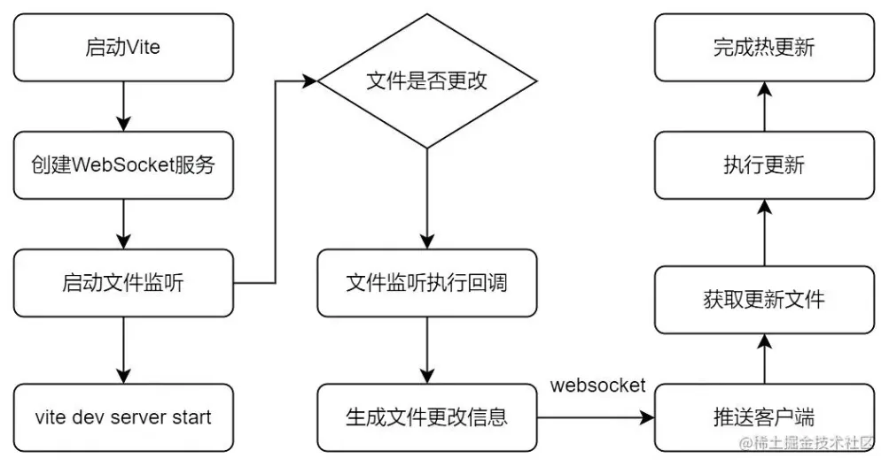
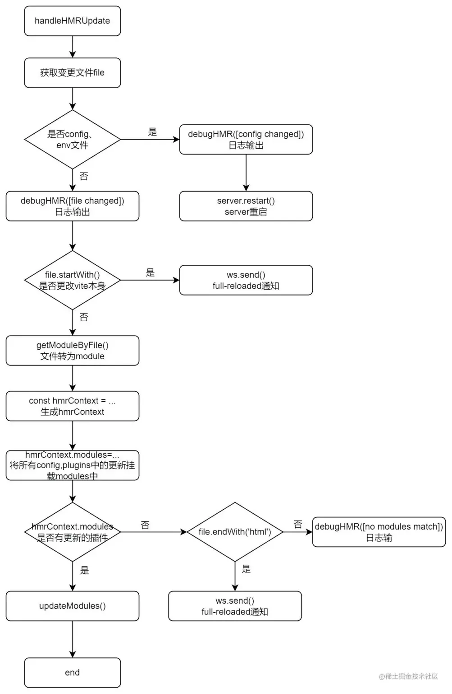
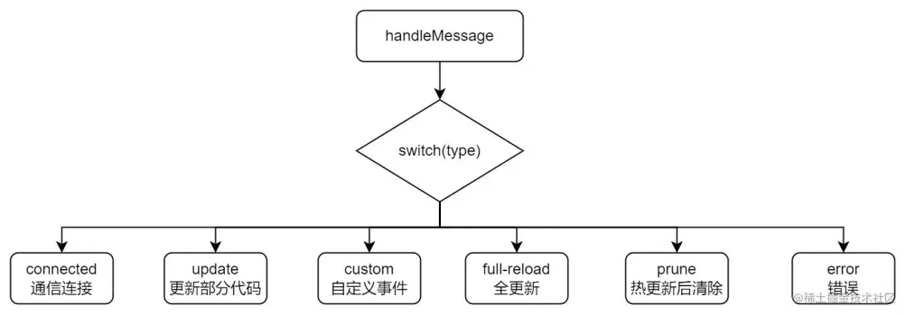

### Vite构建原理
> Vite 其核心原理是利用浏览器现在已经**支持 ES6 的 import**,碰见 import 就会发送一个 HTTP 请求去加载文件，Vite 启动一个 koa 服务器拦截这些请求，并在后端进行相应的处理将项目中使用的文件通过简单的分解与整合，然后再以 **ESM** 格式返回返回给浏览器。Vite 整个过程中没有对文件进行打包编译，做到了真正的**按需加载**，所以其运行速度比原始的 webpack 开发编译速度快出许多！
- 快速的冷启动: No Bundle + esbuild 预构建
- 即时的模块热更新: 基于 ESM 的 HMR，同时利用浏览器缓存策略提升速度
- 真正的按需加载: 利用浏览器ESM支持，实现真正的按需加载

### 基于 ESM 的 Dev Server
- 在Vite出来之前，传统的打包工具如Webpack是先解析依赖、打包构建再启动开发服务器，Dev Server 必须等待所有模块构建完成，当我们修改了 bundle模块中的一个子模块， 整个 bundle 文件都会重新打包然后输出。项目应用越大，启动时间越长。
- 而Vite利用浏览器对ESM的支持，当 import 模块时，浏览器就会下载被导入的模块。先启动开发服务器，当代码执行到模块加载时再请求对应模块的文件,本质上实现了动态加载。灰色部分是暂时没有用到的路由，所有这部分不会参与构建过程。随着项目里的应用越来越多，增加route，也不会影响其构建速度。

### 基于 ESM 的 HMR 热更新
 目前所有的打包工具实现热更新的思路都大同小异：主要是通过WebSocket创建浏览器和服务器的通信监听文件的改变，当文件被修改时，服务端发送消息通知客户端修改相应的代码，客户端对应不同的文件进行不同的操作的更新
 - Webpack: 重新编译，请求变更后模块的代码，客户端重新加载
 - Vite: 请求变更的模块，再重新加载

Vite 通过 chokidar 来监听文件系统的变更，只用对发生变更的模块重新加载， 只需要精确的使相关模块与其临近的 HMR边界连接失效即可，这样 HMR 更新速度就不会因为应用体积的增加而变慢而 Webpack 还要经历一次打包构建。所以 HMR 场景下，Vite 表现也要好于 Webpack。

Vite 整个热更新过程可以分成四步：

1. 创建一个 websocket 服务端和 client 文件，启动服务
2. 通过 chokidar 监听文件变更
3. 当代码变更后，服务端进行判断并推送到客户端
4. 客户端根据推送的信息执行不同操作的更新

**启动热更新**(createWebSocketServer)：createWebSocketServer这个方法主是创建WebSocket服务并对错误进行一些处理，最后返回封装好的on、off、 send 和 close 方法，用于后续服务端推送消息和关闭服务。

**执行热更新**(moduleGraph+handleHMRUpdate模块):接收到文件改动执行的回调，这里主要两个操作：moduleGraph.onFileChange修改文件的缓存和handleHMRUpdate执行热更新

**moduleGraph**：moduleGraph 是Vite定义的用来记录整个应用的模块依赖图的类，除此之外还有moduleNode。moduleGraph是由一系列 map 组成，而这些map分别是url、id、file等与ModuleNode的映射，而ModuleNode 是 Vite中定义的最小模块单位。

**handleHMRUpdate**：handleHMRUpdate 模块主要是监听文件的更改，进行处理和判断通过WebSocket给客户端发送消息通知客户端去请求新的模块代码。

客户端：websocket 通信和更新处理：
- 当我们配置了热更新且不是ssr的时候，Vite底层在处理html的时候会把HMR相关的客户端代码写入在我们的代码中。当接收到服务端推送的消息，通过不同的消息类型做相应的处理，如(connected、update、custom...)，在实际开发热更新中使用最频繁的是update(动态加载热更新模块)和full-reload(刷新整个页面)事件
- **优化**：浏览器的缓存策略提高响应速度：Vite 还利用HTTP加速整个页面的重新加载。设置响应头使得依赖模块(dependency module)进行强缓存，而源码文件通过设置 304 Not Modified 而变成可依据条件而进行更新

### 基于 esbuild 的依赖预编译优化
#### 为什么需要预构建？
1. 支持 commonJS 依赖
2. 上面提到Vite 是基于浏览器原生支持 ESM 的能力实现的，但要求用户的代码模块必须是ESM模块，因此必须将commonJs 的文件提前处理，转化成 ESM 模块并缓存入 `node_modules/.vite`
3. 减少模块和请求数量
Vite 将有许多内部模块的 ESM 依赖关系转换为单个模块，以提高后续页面加载性能

#### 为什么使用Esbuild?
1. 编译运行 VS 解释运行
大多数前端打包工具都是基于 JavaScript 实现的，大家都知道 JavaScript是解释型语言，边运行边解释。而 Esbuild 则选择使用 Go 语言编写，该语言可以编译为原生代码,在编译的时候都将语言转为机器语言，在启动的时候直接执行即可，在 CPU 密集场景下，Go 更具性能优势。

2. 多线程 VS 单线程
JavaScript 本质上是一门单线程语言，直到引入WebWorker 之后才有可能在浏览器、Node 中实现多线程操作。就我对 Webpack 的源码理解，其源码也并未使用 WebWorker 提供的多线程能力。而GO天生的多线程优势。

3. 对构建流程进行了优化，充分利用 CPU 资源

#### 实现原理
Vite 预编译之后，将文件缓存在node_modules/.vite/ 文件夹下。根据以下地方来决定是否需要重新执行预构建。
- package.json 中：dependencies 发生变化
- 包管理器的 lockfile

### vite 对比 webpack ，优缺点在哪?
#### 优点：

- 更快的冷启动：Vite 借助了浏览器对 ESM 规范的支持，采取了与 Webpack 完全不同的 unbundle 机制。Vite 先启动服务，利用 ESM 能力，无需打包，直接按需请求，所以冷启动在秒级。而 Webpack 需要先构建打包生成 bundle，再启动服务。
- 更快的热更新：Vite 采用 unbundle 机制，所以 dev server 在监听到文件发生变化以后，只需要通过 ws 连接通知浏览器去重新加载变化的文件，剩下的工作就交给浏览器去做了，而且还利用了浏览器缓存。Webpack 在热更新时要将相关依赖全编译。

#### 缺点
1. **开发环境下首屏加载变慢**：由于 unbundle 机制，Vite 首屏期间需要额外做其它工作。不过首屏性能差只发生在 dev server 启动以后第一次加载页面时发生。之后再 reload 页面时，首屏性能会好很多。原因是 dev server 会将之前已经完成转换的内容缓存起来
2. 开发环境下懒加载变慢：跟首屏加载变慢的原因一样。Vite 在懒加载方面的性能也比 Webpack 差。由于 unbundle 机制，动态加载的文件，需要做 resolve、load、transform、parse 操作，并且还有大量的 http 请求，导致懒加载性能也受到影响
3. webpack支持的更广。由于 Vite 基于ES Module，所以代码中不可以使用CommonJs；webpack更多的关注兼容性, 而Vite 关注浏览器端的开发体验。Vite目前生态还不如 Webpack。

#### 冷启动的问题改进

在 Vite 2.9 版本之前，Vite 会在服务启动之前进行依赖预构建，也就是使用 Esbuild 将项目中使用到的依赖扫描出来(Scan)，然后分别进行一次打包(Optimize)。

这样会造成两个问题:

- 预构建阻塞。依赖预构建会阻塞 Dev Server 启动，但其实不阻塞的情况下，Dev Server 也可以正常启动。
- 二次预构建。当某些 Vite 插件手动注入了 import 语句，比如调用 babel-plugin-import 添加 `import Button from 'antd/lib/button'`，就会导致 Vite 的二次预构建，因为 antd/lib/button 的引入代码由 Vite 插件注入，属于 Dev Server 运行时发现的依赖，冷启动阶段无法扫描到。

到了 2.9 版本，Vite 将预构建的逻辑做了一次整体的重构，最后的效果是下面这样的:

- Dev Server 启动后预构建(Optimize 阶段)在后台执行，也就是预构建不再阻塞 Dev Server 的启动，只需要等待 Scan 阶段完成，不过通常这个阶段的开销非常小。
- 如果某些依赖是 Dev Server 运行时才发现的，那么 Vite 会尽可能地复用已有预构建产物，尽量不进行 page reload。

2.9 版本解决了预构建阻塞服务启动的问题，但并没有完全解决二次预构建的问题。

vite 3 彻底解决二次与构建问题。核心的解决思路在于延迟处理，即把预构建的行为延迟到页面加载的最后阶段进行，此时 Vite 已经编译完了所有的源文件，可以准确地记录下所有需要预构建的依赖(包括 Vite 插件添加的一些依赖)，然后统一进行预构建，将预构建的产物响应给给浏览器即可。

因此，与 Vite 2.0 相比，Vite 3.0 在冷启动阶段所做的优化主要有两个方面:

预构建不再阻塞 Dev Server 的启动，真正做到服务秒启动的效果；
从根本上防止二次预构建的发生

#### 为什么说 vite 比 webpack 要快?

使用 webpack 时，从 yarn start 命令启动，到最后页面展示，需要经历的过程：
1. 以 entry 配置项为起点，做一个全量的打包，并生成一个入口文件 index.html 文件；
2. 启动一个 node 服务；
3. 打开浏览器，去访问入 index.html，然后去加载已经打包好的 js、css 文件；

在整个工作过程中，最重要的就是第一步中的**全量打包**，中间涉及到构建 module graph (涉及到大量文件操作、文件内容解析、文件内容转换)、chunk 构建，这个需要消耗大量的时间。尽管在二次启动、热更新过程中，在构建 module graph 中可以充分利用缓存，但随着项目的规模越来越大，整个开发体验也越来越差。

使用 vite 时， 从 vite 命令启动，到最后的页面展示，需要经历的过程：
1. 使用 esbuild (opens new window)预构建依赖 (opens new window)，提前将项目的第三方依赖格式化为 ESM 模块；
2. 启动一个 node 服务；
3. 打开浏览器，去访问 index.html；
4. 基于浏览器已经支持原生的 ESM 模块, 逐步去加载入口文件以及入口文件的依赖模块。浏览器发起请求以后，dev server 端会通过 middlewares 对请求做拦截，然后对源文件做 resolve、load、transform、parse 操作，然后再将转换以后的内容发送给浏览器

在第四步中，vite 需要逐步去加载入口文件以及入口文件的依赖模块，但在实际应用中，这个过程中涉及的模块的数量级并不大，需要的时间也较短。而且在分析模块的依赖关系时， vite 采用的是 esbuild，esbuild 使用 Go 编写，比以 JavaScript 编写的打包器预构建依赖快 10-100 倍（webpack 就是采用 js ）

综上，开发模式下 vite 比 webpack 快的原因：
1. vite 不需要做全量的打包，产物小，加载运行快，没有 runtime，没有模板代码，这是比 webpack 要快的最主要的原因；
2. vite 在解析模块依赖关系时，利用了 esbuild，更快（esbuild 使用 Go 编写，并且比以 JavaScript 编写的打包器预构建依赖快 10-100 倍）；esbuild 预编译第三方依赖，一方面将第三方包转换为 ESM 规范；另一方面，合并多个包解决请求瀑布流问题。
3. 按需加载；模块之间的依赖关系的解析由浏览器实现。Vite 只需要在浏览器请求源码时进行转换并按需提供源码。根据情景动态导入代码，即只在当前屏幕上实际使用时才会被处理。按需加载，按需编译，无需提前编译打包，从而达到冷启动
4. 充分利用缓存；Vite 利用 HTTP 头来加速整个页面的重新加载（再次让浏览器为我们做更多事情）：源码模块的请求会根据 304 Not Modified 进行协商缓存，而依赖模块请求则会通过 Cache-Control: max-age=31536000,immutable 进行强缓存，因此一旦被缓存它们将不需要再次请求