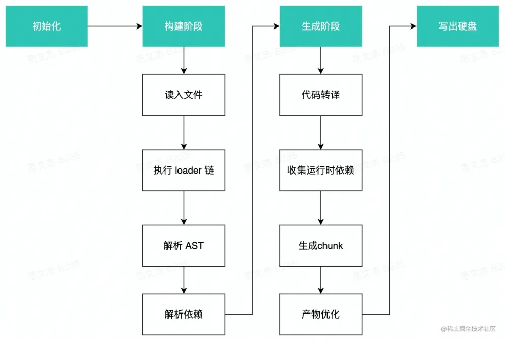
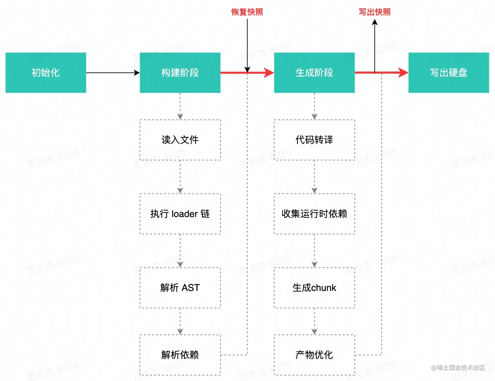
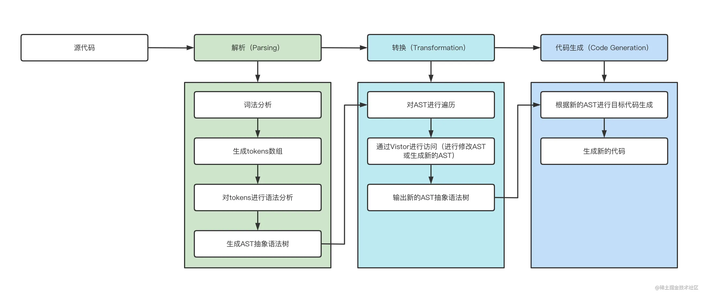

## Webpack
[参考1](https://juejin.cn/post/6844904094281236487)
[参考2](https://juejin.cn/post/7002839760792190989)
[面试题1](https://juejin.cn/post/7023242274876162084)
### 核心概念
- entry（入口），提示webpack从哪里开始构建依赖图
- output（输出），告诉webpack在哪里输出构建后的文件
- loader（加载器）
- plugins（插件）
- mode（模式）

```js
module.exports = {
    //入口
    entry: './src/index.js',
    //输出
    output: {
        filename: 'built.js',
        path: resolve(__dirname, 'build')
    },
    module: {
        rules: [
        // loader配置
        ]
    },
    plugins: [
        // plugins配置
    ],
    // 模式 development/production
    mode: 'development'
}
```

### loader
> webpack本身只能识别js和json资源，不能识别其他资源，所以需要loader来处理其他资源，将其转化为webpack能处理的内容。loader本身是一个函数，接受源文件作为参数，返回转换的结果
- Loader 通常是一种 mapping 函数形式，接收原始代码内容，返回翻译结果。在 Webpack 进入构建阶段后，首先会通过 IO 接口读取文件内容，之后调用 LoaderRunner (opens new window)并将文件内容以 source 参数形式传递到 Loader 数组，source 数据在 Loader 数组内可能会经过若干次形态转换，最终以标准 JavaScript 代码提交给 Webpack 主流程，以此实现内容翻译功能
- Loader **本质**上是导出为函数的 JavaScript 模块。它接收资源文件或者上一个 Loader 产生的结果作为入参，也可以用多个 Loader 函数组成 loader chain（链），最终输出转换后的结果。这里要注意的是，如果是组成的 loader chain（链），它们的执行顺序是从右向左，或者说是从下往上执行。loader chain（链） 这样设计的好处，是可以保证每个 Loader 的职责单一。同时，也方便后期 Loader 的组合和扩展
- 经过模块化包装之后，这段文本内容变成 Webpack 可以理解的 JavaScript，其它 Module 也就能引用、使用它了
- 需要注意，Loader 中执行的各种资源内容转译操作通常都是 CPU 密集型 —— 这放在 JavaScript 单线程架构下可能导致性能问题；又或者异步 Loader 会挂起后续的加载器队列直到异步 Loader 触发回调，稍微不注意就可能导致整个加载器链条的执行时间过长。
为此，Webpack 默认会缓存 Loader 的执行结果直到资源或资源依赖发生变化，开发者需要对此有个基本的理解，必要时可以通过 this.cachable 显式声明不作缓存：
```js
module.exports = function(source) {
  this.cacheable(false);
  // ...
  return output;
};
```


#### loader开发
- 使用上下文接口：除了作为内容转换器外，Loader 运行过程还可以通过一些上下文接口 (opens new window)，有限制地影响 Webpack 编译过程，从而产生内容转换之外的副作用。上下文接口将在运行 Loader 时以 this 方式注入到 Loader 函数，this中常用的接口：
    - fs：Compilation 对象的 inputFileSystem 属性，我们可以通过这个对象获取更多资源文件的内容；
    - resource：当前文件路径；
    - resourceQuery：文件请求参数，例如 import "./a?foo=bar" 的 resourceQuery 值为 ?foo=bar；
    - callback：可用于返回多个结果；
    - getOptions：用于获取当前 Loader 的配置对象；
    - async：用于声明这是一个异步 Loader，开发者需要通过 async 接口返回的 callback 函数传递处理结果；
    - emitWarning：添加警告；
    - emitError：添加错误信息，注意这不会中断 Webpack 运行；
    - emitFile：用于直接写出一个产物文件，例如 file-loader 依赖该接口写出 Chunk 之外的产物；
    - addDependency：将 dep 文件添加为编译依赖，当 dep 文件内容发生变化时，会触发当前文件的重新构建

#### less文件使用loader过程
- less-loader ：将 less 规格的内容转换为标准 css；
- css-loader ：将 css 内容包裹为 JavaScript 模块；
- style-loader ：将 JavaScript 模块的导出结果以 link 、style 标签等方式挂载到 html 中，让 css 代码能够正确运行在浏览器上

#### 手写 babel-loader
- babel-loader (opens new window)做的事情其实很简单，只需将 Loader 中的源代码交给 babel 库处理 (opens new window)，拿到处理过后的值返回，仅此而已
```js
const babel = require("@babel/core");
const path = require("path");

function babelLoader(source) {
  // loade里面的 this=loaderContext，是一个唯一的对象，
  // 不管在哪个loader或方法里，它的this都是同一个对象，称为loaderContext，这个等会就会实现
  // 拿到在webpack中传递给该loader的参数，也就是presets: ["@babel/preset-env"]
  const options = this.getOptions(); 
  console.log("自己写的babel-loader");
  const { code } = babel.transformSync(source, options); //交给babel库去解析
  return code;
}

module.exports = babelLoader;
```


### plugins
- loader用于转换某些类型的模块，而插件则可以用于执行范围更广的任务，包括打包优化、资源管理、注入环境变量等，能够深度介入 Webpack 构建过程，重塑 构建逻辑
- Webpack Plugin 其实就是一个普通的函数，在该函数中需要我们定制一个 apply 方法。当 Webpack 内部进行插件挂载时会执行 apply 函数。我们可以在 apply 方法中订阅各种生命周期钩子，当到达对应的时间点时就会执行。
- Webpack5 暴露了多达 200+ 个 Hook，基本上覆盖了整个构建流程的所有环节 —— 这也就意味着通过编写插件，我们几乎可以改写 Webpack 的所有执行逻辑


### 构建流程和原理
> Webpack 的核心能力就是**静态模块打包能力**。Webpack 能够将各种类型的资源 —— 包括图片、音视频、CSS、JavaScript 代码等，通通转译、组合、拼接、生成标准的、能够在不同版本浏览器兼容执行的 JavaScript 代码文件，这一特性能够轻易抹平开发 Web 应用时处理不同资源的逻辑差异，使得开发者以一致的心智模型开发、消费这些不同的资源文件

#### 构建流程
Webpack 底层的工作流程大致可以总结为这么几个阶段：

1. 初始化阶段：
    - 初始化参数：从配置文件、 配置对象、Shell 参数中读取，与默认配置结合得出最终的参数；
    - 创建编译器对象 Compiler：用上一步得到的参数创建 `Compiler` 对象, 其中存储了配置信息，挂载了许多生命周期 hook。
    - 初始化编译环境：包括注入内置插件、注册各种模块工厂、初始化 RuleSet 集合、加载配置的插件等；
    - 开始编译：执行 compiler 对象的 run 方法，创建 Compilation 对象，调用 compiler.compile 方法开始执行构建。
    - 确定入口：根据配置中的 entry 找出所有的入口文件，调用 compilation.addEntry 将入口文件转换为 dependence 对象。把入口文件的绝对路径添加到依赖数组，记录此次编译依赖的模块。

2. 构建阶段：
    - 编译模块(make)：从 entry 文件开始，调用 loader 将模块转译为标准 JS 内容，调用 JS 解析器 Acorn (opens new window)将内容转换为 AST 对象，从中找出该模块依赖的模块，再 递归 处理这些依赖模块，直到所有入口依赖的文件都经过了本步骤的处理；
    - 完成模块编译：上一步递归处理所有能触达到的模块后，得到了每个模块被翻译后的内容以及它们之间的依赖关系图 - ModuleGraph。构建阶段经历了 `module => ast => dependences => module` 的流转，先将源码解析为 AST 结构，再在 AST 中遍历 import 等模块导入语句，收集模块依赖数组 —— dependences，最后遍历 dependences 数组将 Dependency 转换为 Module 对象，之后递归处理这些新的 Module，直到所有项目文件处理完毕。

3. 封装阶段：
    - 合并(seal)：根据入口和模块之间的依赖关系，组装成一个个包含多个模块的 Chunk；
    优化(optimization)：对上述 Chunk 施加一系列优化操作，包括：tree-shaking、terser、scope-hoisting、压缩、Code Split 等；
    - 写入文件系统(emitAssets)：在确定好输出内容后，根据配置确定输出的路径和文件名，把文件内容写入到文件系统。


### 整体配置
```js
const path = require('path');

module.exports = {
  // entry 表示 入口，Webpack 执行构建的第一步将从 Entry 开始，可抽象成输入。
  // 类型可以是 string | object | array   
  entry: './app/entry', // 只有1个入口，入口只有1个文件
  entry: ['./app/entry1', './app/entry2'], // 只有1个入口，入口有2个文件
  entry: { // 有2个入口
    a: './app/entry-a',
    b: ['./app/entry-b1', './app/entry-b2']
  },

  // 如何输出结果：在 Webpack 经过一系列处理后，如何输出最终想要的代码。
  output: {
    // 输出文件存放的目录，必须是 string 类型的绝对路径。
    path: path.resolve(__dirname, 'dist'),

    // 输出文件的名称
    filename: 'bundle.js', // 完整的名称
    filename: '[name].js', // 当配置了多个 entry 时，通过名称模版为不同的 entry 生成不同的文件名称
    filename: '[chunkhash].js', // 根据文件内容 hash 值生成文件名称，用于浏览器长时间缓存文件

    // 发布到线上的所有资源的 URL 前缀，string 类型
    publicPath: '/assets/', // 放到指定目录下
    publicPath: '', // 放到根目录下
    publicPath: 'https://cdn.example.com/', // 放到 CDN 上去

    // 导出库的名称，string 类型
    // 不填它时，默认输出格式是匿名的立即执行函数
    library: 'MyLibrary',

    // 导出库的类型，枚举类型，默认是 var
    // 可以是 umd | umd2 | commonjs2 | commonjs | amd | this | var | assign | window | global | jsonp ，
    libraryTarget: 'umd', 

    // 是否包含有用的文件路径信息到生成的代码里去，boolean 类型
    pathinfo: true, 

    // 附加 Chunk 的文件名称
    chunkFilename: '[id].js',
    chunkFilename: '[chunkhash].js',

    // JSONP 异步加载资源时的回调函数名称，需要和服务端搭配使用
    jsonpFunction: 'myWebpackJsonp',

    // 生成的 Source Map 文件名称
    sourceMapFilename: '[file].map',

    // 浏览器开发者工具里显示的源码模块名称
    devtoolModuleFilenameTemplate: 'webpack:///[resource-path]',

    // 异步加载跨域的资源时使用的方式
    crossOriginLoading: 'use-credentials',
    crossOriginLoading: 'anonymous',
    crossOriginLoading: false,
  },

  // 配置模块相关
  module: {
    rules: [ // 配置 Loader
      {  
        test: /\.jsx?$/, // 正则匹配命中要使用 Loader 的文件
        include: [ // 只会命中这里面的文件
          path.resolve(__dirname, 'app')
        ],
        exclude: [ // 忽略这里面的文件
          path.resolve(__dirname, 'app/demo-files')
        ],
        use: [ // 使用那些 Loader，有先后次序，从后往前执行
          'style-loader', // 直接使用 Loader 的名称
          {
            loader: 'css-loader',      
            options: { // 给 html-loader 传一些参数
            }
          }
        ]
      },
    ],
    noParse: [ // 不用解析和处理的模块
      /special-library\.js$/  // 用正则匹配
    ],
  },

  // 配置插件
  plugins: [
  ],

  // 配置寻找模块的规则
  resolve: { 
    modules: [ // 寻找模块的根目录，array 类型，默认以 node_modules 为根目录
      'node_modules',
      path.resolve(__dirname, 'app')
    ],
    extensions: ['.js', '.json', '.jsx', '.css'], // 模块的后缀名
    alias: { // 模块别名配置，用于映射模块
       // 把 'module' 映射 'new-module'，同样的 'module/path/file' 也会被映射成 'new-module/path/file'
      'module': 'new-module',
      // 使用结尾符号 $ 后，把 'only-module' 映射成 'new-module'，
      // 但是不像上面的，'module/path/file' 不会被映射成 'new-module/path/file'
      'only-module$': 'new-module', 
    },
    alias: [ // alias 还支持使用数组来更详细的配置
      {
        name: 'module', // 老的模块
        alias: 'new-module', // 新的模块
        // 是否是只映射模块，如果是 true 只有 'module' 会被映射，如果是 false 'module/inner/path' 也会被映射
        onlyModule: true, 
      }
    ],
    symlinks: true, // 是否跟随文件软链接去搜寻模块的路径
    descriptionFiles: ['package.json'], // 模块的描述文件
    mainFields: ['main'], // 模块的描述文件里的描述入口的文件的字段名称
    enforceExtension: false, // 是否强制导入语句必须要写明文件后缀
  },

  // 输出文件性能检查配置
  performance: { 
    hints: 'warning', // 有性能问题时输出警告
    hints: 'error', // 有性能问题时输出错误
    hints: false, // 关闭性能检查
    maxAssetSize: 200000, // 最大文件大小 (单位 bytes)
    maxEntrypointSize: 400000, // 最大入口文件大小 (单位 bytes)
    assetFilter: function(assetFilename) { // 过滤要检查的文件
      return assetFilename.endsWith('.css') || assetFilename.endsWith('.js');
    }
  },

  devtool: 'source-map', // 配置 source-map 类型

  context: __dirname, // Webpack 使用的根目录，string 类型必须是绝对路径

  // 配置输出代码的运行环境
  target: 'web', // 浏览器，默认
  target: 'webworker', // WebWorker
  target: 'node', // Node.js，使用 `require` 语句加载 Chunk 代码
  target: 'async-node', // Node.js，异步加载 Chunk 代码
  target: 'node-webkit', // nw.js
  target: 'electron-main', // electron, 主线程
  target: 'electron-renderer', // electron, 渲染线程

  externals: { // 使用来自 JavaScript 运行环境提供的全局变量
    jquery: 'jQuery'
  },

  stats: { // 控制台输出日志控制
    assets: true,
    colors: true,
    errors: true,
    errorDetails: true,
    hash: true,
  },

  devServer: { // DevServer 相关的配置
    proxy: { // 代理到后端服务接口
      '/api': 'http://localhost:3000'
    },
    contentBase: path.join(__dirname, 'public'), // 配置 DevServer HTTP 服务器的文件根目录
    compress: true, // 是否开启 gzip 压缩
    historyApiFallback: true, // 是否开发 HTML5 History API 网页
    hot: true, // 是否开启模块热替换功能
    https: false, // 是否开启 HTTPS 模式
    },

    profile: true, // 是否捕捉 Webpack 构建的性能信息，用于分析什么原因导致构建性能不佳

    cache: false, // 是否启用缓存提升构建速度

    watch: true, // 是否开始
    watchOptions: { // 监听模式选项
    // 不监听的文件或文件夹，支持正则匹配。默认为空
    ignored: /node_modules/,
    // 监听到变化发生后会等300ms再去执行动作，防止文件更新太快导致重新编译频率太高
    // 默认为300ms 
    aggregateTimeout: 300,
    // 判断文件是否发生变化是不停的去询问系统指定文件有没有变化，默认每隔1000毫秒询问一次
    poll: 1000
  },
}
```

### 持久化缓存
- webpack 的持久化缓存它能够将首次构建的过程与结果数据持久化保存到本地文件系统，在下次执行构建时跳过解析、链接、编译等一系列非常消耗性能的操作，直接复用上次的 Module/ModuleGraph/Chunk 对象数据，迅速构建出最终产物
- 空间换时间是见效非常明显的提速方案，在 Webpack5 中通过配置 cache: 'filesystem' 来开启持久缓存，开启后命中缓存的情况下会直接反序列化缓存文件并跳过构建流程
```js
module.exports = {
    //...
    cache: {
        type: 'filesystem'
    },
    //...
};
```

#### 原理
- Webpack5 会将首次构建出的 Module、Chunk、ModuleGraph 等对象序列化后保存到硬盘中，后面再运行的时候，就可以跳过许多耗时的编译动作，直接复用缓存数据。回顾 Webpack 构建三大阶段，过程中存在许多 CPU 密集型操作，例如调用 Loader 链加载文件时，遇到 babel-loader、eslint-loader、ts-loader 等工具时可能需要重复生成 AST；分析模块依赖时则需要遍历 AST，执行大量运算；Seal 阶段也同样存在大量 AST 遍历，以及代码转换、优化操作，等等。而 Webpack5 的持久化缓存功能则将构建结果保存到文件系统中，在下次编译时对比每一个文件的内容哈希或时间戳，未发生变化的文件跳过编译操作，直接使用缓存副本，减少重复计算；发生变更的模块则重新执行编译流程。缓存执行时机如下图：

- Webpack 在首次构建完毕后将 Module、Chunk、ModuleGraph 三类对象的状态序列化并记录到缓存文件中；在下次构建开始时，尝试读入并恢复这些对象的状态，从而跳过执行 Loader 链、解析 AST、解析依赖等耗时操作，提升编译性能


### tree-shaking
- Tree Shaking是一种基于 ES Module 规范的 Dead Code Elimination 技术，它会在运行过程中静态分析模块之间的导入导出，确定 ESM 模块中哪些导出值未曾其他模块使用，并将其删除，以此实现打包产物的优化
  - Dead Code 一般具有以下几个特征:
  - 代码不会被执行，不可到达
  - 代码执行的结果不会被用到
  - 代码只会影响死变量（只写不读）
#### 原理
- Webpack 中，Tree-shaking 的实现，一是需要先 「标记」 出模块导出值中哪些没有被用过；二是使用代码压缩插件 —— 如 Terser (opens new window)删掉这些没被用到的导出变量。标记的效果就是删除那些没有被其它模块使用的“导出语句”，真正执行“Shaking”操作的是 Terser 插件。
- Tree-Shaking 的实现大致上可以分为三个步骤：

  - 「构建」阶段，「收集」 模块导出变量并记录到模块依赖关系图 ModuleGraph 对象中；
  - 「封装」阶段，遍历所有模块，「标记」 模块导出变量有没有被使用；
  - 使用代码优化插件 —— 如 Terser，删除无效导出代码


### 懒加载
- 懒加载或者按需加载，是一种很好的优化网页或应用的方式。这种方式实际上是先把你的代码在一些逻辑断点处分离开，然后在一些代码块中完成某些操作后，立即引用或即将引用另外一些新的代码块。这样加快了应用的初始加载速度，减轻了它的总体体积，因为某些代码块可能永远不会被加载
- 以 Vue 为例，Vue 是**单页面应用**，可能会有很多的**路由**引入 ，这样使用 webpcak 打包后的文件很大，当进入首页时，加载的资源过多，页面会出现白屏的情况，不利于用户体验。如果我们能把不同路由对应的组件分割成不同的代码块，然后当路由被访问的时候才加载对应的组件，这样就更加高效了。这样会大大提高首屏显示的速度，但是可能其他的页面的速度就会降下来。对于每个路由都使用懒加载的方式引入，则每个模块都会被单独打为一个 js，首屏只会加载当前模块引入的 js
- 所以，懒加载的本质实际上就是**代码分离**。把代码分离到不同的 bundle 中，然后按需加载或并行加载这些文件

#### 懒加载实现原理
1. 将需要进行懒加载的模块打包成独立的文件（async chunk）
2. 借助函数来实现延迟执行模块的加载代码


### AST 及使用场景
#### AST
> 抽象语法树（Abstract Syntax Tree，AST）是源代码语法结构的一种抽象表示，它以树状的形式表现编程语言的语法结构，树上的每个节点都表示源代码中的一种结构。在代码语法的检查、代码风格的检查、代码的格式化、代码的高亮、代码错误提示、代码自动补全等等场景均有广泛的应用。
- Parsing(解析过程)：这个过程要经词法分析、语法分析、构建AST（抽象语法树）一系列操作；

- Transformation（转化过程）：这个过程就是将上一步解析后的内容，按照编译器指定的规则进行处理，形成一个新的表现形式；

- Code Generation（代码生成）：将上一步处理好的内容转化为新的代码
