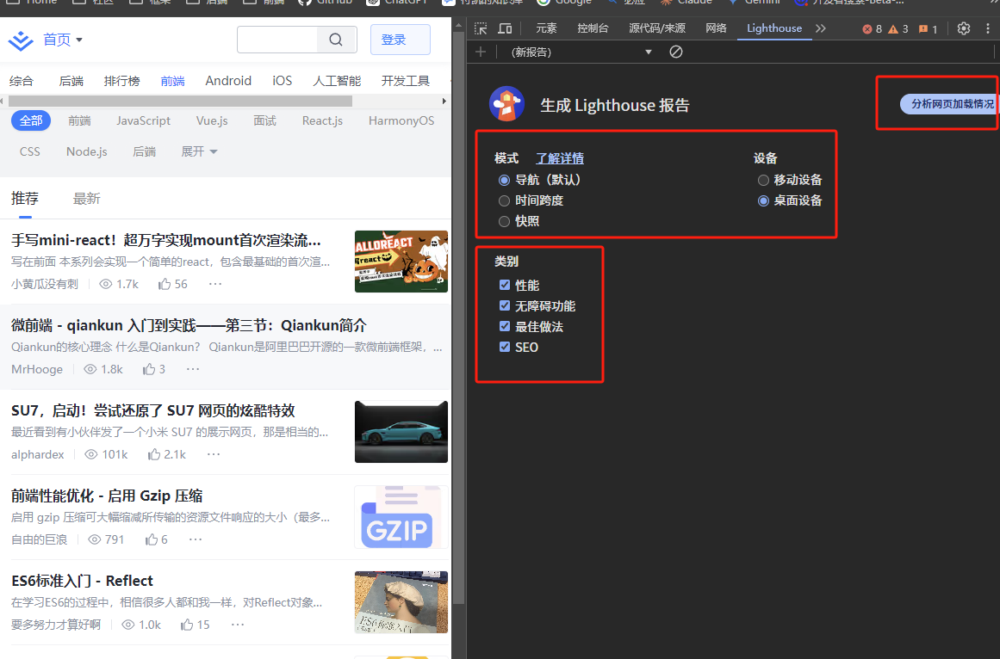
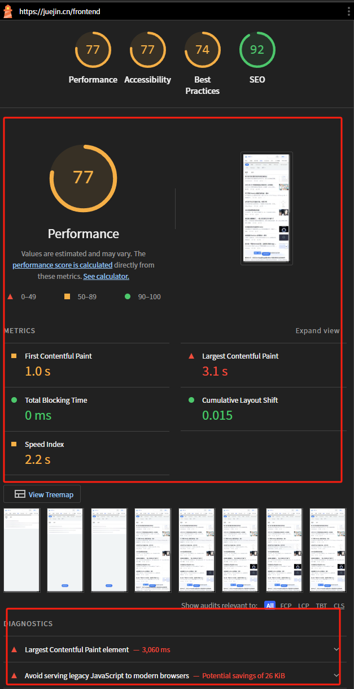
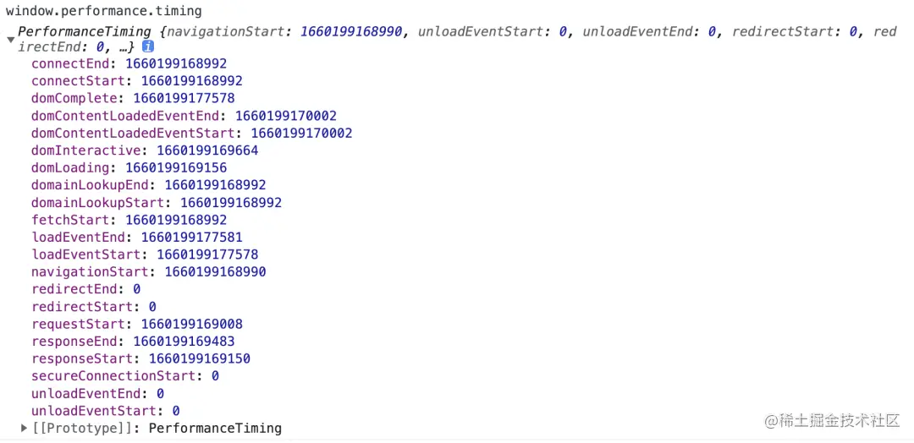
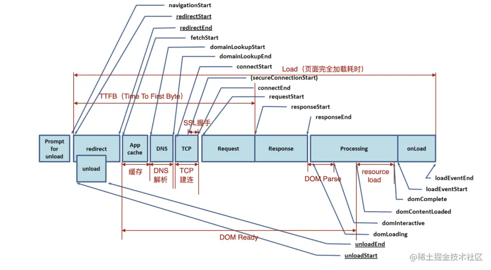
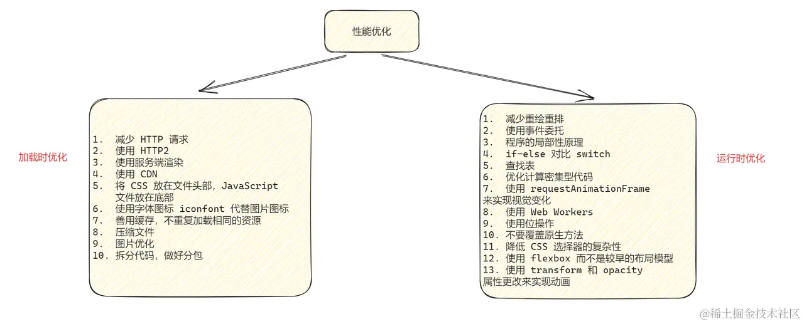

[参考](https://juejin.cn/post/6941278592215515143)
[参考2](https://mp.weixin.qq.com/s?__biz=MjM5MjQ0NTY4MQ==&mid=2447942523&idx=1&sn=92e803d1f95826f5da2dc747edb1842b&chksm=b2ba26e585cdaff3ef35d1622b0a5a1e197b453ba3367f74d543220f12f1b053e0d2d24e18f0#rd)
[参考3](https://juejin.cn/post/7370630910071226418?searchId=202410121905565701EB4F2B3F34B57843#heading-0)
[参考4](https://juejin.cn/post/7188894691356573754?searchId=202410222303278CFD6A3A787A5829D644)


### 性能指标

#### 何时开始渲染
- FP (First Paint，首次绘制) 用于记录页面第一次绘制像素的时间。 FP 时间点之前，用户看到的都是没有任何内容的白色屏幕，可以视为白屏时间。
- FCP（First Contentful Paint），首次有内容渲染的时间点。用于记录页面首次绘制文本、图片、非空白 Canvas 或 SVG 的时间。在用户访问 Web 网页的过程中，FCP 时间点之前，用户看到的都是没有任何实际内容的屏幕。FCP 反映当前 Web 页面的网络加载性能情况、页面 DOM 结构复杂度情况、inline script 的执行效率的情况。当所有的阶段性能做的非常好的情况下，首次出现内容的时间就会越短，用户等待的时间就会越短，流失的概率就会降低，可以作为首屏时间
- 通过FP和FCP这两个指标，就可以衡量页面何时开始渲染内容。官方推荐，FP 及 FCP 两指标在 1.8 秒内完成的话我们的页面就算体验优秀
  - FP vs FCP：
    - FP：从开始加载到第一次渲染
    - FCP：从开始加载到第一次内容渲染。
    - FCP 是 FP 的增强版，对用户来说更关键。因为 FCP 带着图像和文字这些内容信息，是用户更关心的。
    - FP 和 FCP 可能是重合的。

#### 何时渲染出主要内容
- FMP（First Meaningful Paint）: 首次绘制有意义内容的时间点。当整体页面的布局和文字内容全部渲染完成后，可认为是完成了首次有意义内容的绘制。业界比较认可的方式是在加载和渲染过程中最大布局变动之后的那个绘制时间即为当前页面的 FMP。FMP 通常被认为是用户获取到了页面主要信息的时刻，也就是说此时用户的需求是得到了满足的，所以产品通常也会关注 FMP 指标。只不过它计算相对复杂，且存在准确性等问题，Lighthouse 6.0 中已被废弃
  - FMP 代码实现原理:
  - 认为DOM 结构变化的时间点与之对应渲染的时间点近似相同。所以 FMP 的时间点为 DOM 结构变化最剧烈的时间点
  - DOM 结构变化的时间点」可以利用 MutationObserver (opens new window)API (opens new window)来获得:
    -  通过 MutationObserver 监听每一次页面整体的 DOM 变化，触发 MutationObserver 的回调
    - 在回调计算出当前 DOM 树的分数，分数变化最剧烈的时刻，即为 FMP 的时间点

- LCP（Largest Contentful Paint）: 最大的内容在可视区域内变得可见的时间点。用于记录视窗内最大的元素绘制的时间，该时间会随着页面渲染变化而变化，因为页面中的最大元素在渲染过程中可能会发生改变，另外该指标会在用户第一次交互后停止记录。页面的最大内容（通常是比较核心的内容）加载完成的时间，这个最大内容可以是图片/文本块。它是一个 SEO 相关的指标
  - LCP 其实能比前两个指标更能体现一个页面的性能好坏程度，因为这个指标会持续更新。举个例子：当页面出现骨架屏或者 Loading 动画时 FCP 其实已经被记录下来了，但是此时用户希望看到的内容其实并未呈现，我们更想知道的是页面主要的内容是何时呈现出来的。此时 LCP 指标是能够帮助我们实现想要的需求的。官方推荐，在 2.5 秒内表示体验优秀
  -  FMP vs LCP
    - FMP: 早期比较推荐的性能指标，但是计算更复杂，而且准确性不是很好
    - LCP: 更新的数据指标，有 API 直接支持，统计简单，且准确，但也存在最大内容是否为最核心内容这样的问题

- SI（Speed Index）: 衡量页面可视区域加载速度，帮助检测页面的加载体验差异。两个页面如果首次内容出现和完全加载时间一样，那么渐进加载的页面体验更好

- 何时渲染出主要内容：FMP && LCP && SI:

    - FMP：First Meaningful Paint，完成首次有意义内容绘制的时间点。

    - LCP：Largest Contentful Paint，最大的内容在可视区域内变得可见的时间点。

    - SI：Speed Index，衡量页面可视区域的加载速度，反映页面的加载体验差异。
    - 有了这三个指标，就可以衡量页面何时渲染出主要内容了。不过业界有测试得出， LCP 非常近似于 FMP 的时间点，同时 FMP 性能消耗较大，且会因为一些细小的变化导致数值巨大波动，所以推荐使用 LCP。 而 SI 因为计算复杂，指标难以解释，所以一般只在实验室环境下使用

#### 何时可以交互 - TTI & TBT
- TTI（Time to Interactive）: 测量页面从开始加载到主要子资源完成渲染，并能够快速、可靠地响应用户输入所需的时间。通常是发生在页面依赖的资源已经加载完成，此时浏览器可以快速响应用户交互的时间。TTI 反映页面可用性的重要指标。TTI 值越小，代表用户可以更早地操作页面，用户体验就更好。指标的计算过程，需要满足以下几个条件：
  - 从 FCP 指标后开始计算；
  - 持续 5 秒内无长任务（执行时间超过 50 ms）且无两个以上正在进行中的 GET 请求；
  - 往前回溯至 5 秒前的最后一个长任务结束的时间。
- TBT（Total Blocking Time）: 阻塞总时间。量化主线程在空闲之前的繁忙程度，有助于理解在加载期间，页面无法响应用户输入的时间有多久。一个页面的 TBT，是从 FCP 到 TTI 之间所有长任务的阻塞时间的总和。主线程执行的任务分为长任务和短任务。规定持续时间超过 50ms 的任务为长任务，低于 50ms 的任务为短任务。长任务中超过 50ms 的时间被认为是“阻塞”的，因此，TBT 是所有长任务中阻塞时间的总和。
- 这个指标的高低其实也影响了 TTI 的高低，或者说和长任务相关的几个指标都有关联性。TTI 虽然可以衡量页面可以交互的时间点，但是却无法感知这个期间浏览器的繁忙状态。而结合 TBT ，就能帮助理解在加载期间，页面无法响应用户输入的时间有多久

#### 交互时是否有延迟 - FID & MPFID
- FID（First Input Delay）: 首次输入延迟。测量从用户第一次与页面交互（比如当他们单击链接、点按按钮等等）直到浏览器对交互作出响应，实际能够开始处理事件处理程序所经过的时间，即交互延迟时间。一般来说，发生输入延迟是因为浏览器的主线程正忙着执行其他工作（比如解析和执行大型 JS 文件），还不能响应用户
- MPFID（Max Potential First Input Delay）：记录在页面加载过程中用户和页面进行首次交互操作可能花费的最长时间。MPFID 是一个虚拟的可能的延迟时间，而FID是用户真实的首次交互的延迟时间。所以一般推荐使用FID，它是用户对页面交互性和响应性的第一印象。良好的第一印象有助于用户建立对整个应用的良好印象。同时在页面加载阶段，资源的处理任务最重，最容易产生输入延迟

#### 页面是否稳定 - CLS
- CLS（Cumulative Layout Shift）: 累积布局偏移。量化了在页面加载期间，视口中元素的移动程度。在一个页面的生命周期中，会不断的发生布局变化（layout shift），对每一次布局变化做一个累积的记分，其中得分最大布局变化即为 CLS，是衡量页面稳定性的重要指标


### 页面性能分析
#### 使用浏览器进行分析
如果不需要持续的监控页面性能，而只想进行一次评测，可以使用如chrome浏览器自带的lighthouse工具来进行测试

选择完指标后，点击分析网页加载情况即可进行测试，然后就能得到该网页的诊断结果，里面包含核心性能指标以及性能分数，以及最下方的诊断结果优化建议


#### 使用监控SDK进行监测
- 使用开源监控系统[sentry](https://github.com/getsentry/sentry)，来监控性能和追踪错误
- 或者自己开发一套前端监控SDK,参考：https://github.com/woai3c/Front-end-articles/issues/26
```js
// 记录FP、FCP、LCP
const entryHandler = (list: any) => {
  for (const entry of list.getEntries()) {
    console.log('entry',entry);
  }
}
const observer = new PerformanceObserver(entryHandler);
// type参考：https://developer.mozilla.org/en-US/docs/Web/API/PerformanceEntry/entryType
observer.observe({ entryTypes: ['paint', 'largest-contentful-paint'], buffered: true });
// 记录DOMContentLoaded、load时间
window.addEventListener('DOMContentLoaded', () => {
  console.log('DOMContentLoaded', performance.now());
});
window.addEventListener('load', () => {
  console.log('load', performance.now());
});
// 资源加错误
window.addEventListener('error', (event: ErrorEvent) => {
  const target = event.target as any;
  if(!target) return;
  if (target.src || target.href) {
    const url = target.src || target.href;
    // 上报错误数据
    console.log({
      url,
      type: 'error',
      subType: 'resource',
      startTime: event.timeStamp,
      html: target.outerHTML,
      resourceType: target.tagName,
      pageURL: window.location.href,
    })
  }
});
// js错误
window.onerror = (msg, url, line, column, error) => {
  console.log({
    msg,
    line,
    column,
    error: error?.stack,
    subType: 'js',
    pageUrl: window.location.href,
    type: 'error',
    startTime: performance.now(),
  })
}
```
**数据上报方式：**
  - Navigator.sendBeacon() ：https://developer.mozilla.org/zh-CN/docs/Web/API/Navigator/sendBeacon
  - XMLHttpRequest：https://developer.mozilla.org/zh-CN/docs/Web/API/XMLHttpRequest
  - image
  - 使用`sendBeacon()` 方法会使用户代理在有机会时异步地向服务器发送数据，同时不会延迟页面的卸载或影响下一导航的载入性能。这就解决了提交分析数据时的所有的问题：数据可靠，传输异步并且不会影响下一页面的加载。
  - 在不支持 sendBeacon 的浏览器下我们可以使用 XMLHttpRequest 来进行上报。一个 HTTP 请求包含发送和接收两个步骤。其实对于上报来说，我们只要确保能发出去就可以了。也就是发送成功了就行，接不接收响应无所谓。

**数据上报时机**
上报时机有三种：
1. 采用 requestIdleCallback/setTimeout 延时上报。
2. 在 beforeunload 回调函数里上报。
3. 缓存上报数据，达到一定数量后再上报。

建议将三种方式结合一起上报：
1. 先缓存上报数据，缓存到一定数量后，利用 requestIdleCallback/setTimeout 延时上报。
2. 在页面离开时统一将未上报的数据进行上报。

### 性能指标采集
#### 传统指标采集
- 采集页面加载过程的各阶段耗时
- 所要用到的接口是PerformanceNavigationTiming 接口，提供了用于存储和检索有关浏览器文档事件的指标的方法和属性，如下：
```js
// navigation timing
const timing = window.performance.timing

// navigation timing 2
performance.getEntriesByType('navigation')
```

- 基于这些数据，不仅可以计算出 DNS / TCP / Request 等耗时，还可以计算出 DOMReady / DOMParse / Load 等耗时


#### 采集 DOMContentLoaded & Load
- DOMContentLoaded(DCL),DOM 加载完成即触发，不用等页面资源加载
- Load, 页面及其依赖的资源全部加载完成的时间，包括所有的资源文件，如样式表和图片等
```js
new PerformanceObserver(list => {
  for (const entry of list.getEntries()) {
    const Load = entry.loadEventStart - entry.fetchStart;
    console.log('Load:', Load);
  }
}).observe({ type: 'navigation', buffered: true});

new PerformanceObserver(list => {
  for (const entry of list.getEntries()) {
    const DOMContentLoaded = entry.domContentLoadedEventStart - entry.fetchStart;
    console.log('DOMContentLoaded:', DOMContentLoaded);
  }
}).observe({type: 'navigation', buffered: true});
```
#### 采集 FP & FCP
- FP 和 FCP 可以通过浏览器提供的 API 直接获取，所以采集原理并不复杂。如果页面已经完成了首次绘制和首次内容绘制，可以使用下面的方式直接获取
```js
window.performance.getEntriesByType('paint')
// or
window.performance.getEntriesByName('first-paint')
window.performance.getEntriesByName('first-contentful-paint')
```
- 如果页面还没有开始首次绘制，就需要通过监听获取
```js
const observer = new PerformanceObserver(function(list) {
  const perfEntries = list.getEntries();
  for (const perfEntry of perfEntries) {
      // Process entries
      // report back for analytics and monitoring
      // ...
  }
});

// register observer for paint timing notifications
observer.observe({entryTypes: ["paint"]});
```

### 性能优化方向
性能监控、性能指标是用来收集数据、分析性能瓶颈用的，在找到性能瓶颈后，就得使用对应的性能方法去优化它，可以从两方面入手：
- 加载时（优化页面加载速度）
- 运行时（资源加载完毕后，在页面开始运行的时候进行优化）


在所有性能优化方法中，收益最大的有三个：压缩、懒加载和分包、缓存策略。绝大多数的应用做了这三个优化后，页面性能都能得到极大的提升。
#### 压缩
- 压缩包含代码压缩和文件压缩，常用的代码压缩工具有 terser、uglify，文件压缩一般使用 gzip。1m 的文件使用 gzip 压缩后体积一般是 300-400kb。

- 压缩通常情况都是在前端打包的时候做，然后将打包好的文件上传到服务器。用户访问网站时，nginx 先查看用户访问的资源是否有 .gz 后缀的文件（gzip 压缩后的文件），如果有就返回，没有就自己压缩后再返回。这一块需要在 nginx 上进行配置才支持，默认不开启。尽量不要让 nginx 压缩，因为访问量高的时候，对服务器压力很大。
- 压缩是对整体项目的体积大小进行优化。

#### 懒加载和分包
- 路由懒加载基本上每个前端都会，但是某些系统仍然需要手动优化。比如一些构建工具会默认把所有的第三方包都打在 verdor.js 文件里。但实际上并不是所有的页面都需要把所有的第三方包都加载进来，所以需要做好具体的分包策略来进行优化。分包主要是为了对打包好的资源进行拆分，让一些不是所有页面都要使用的资源做到懒加载。
- 懒加载和分包不改变项目的体积大小，而是将一些不是那么重要的资源放到后面再加载。比如有 10 个页面的资源，每个 1m，假设加载时间为 1 秒，都做成懒加载后，每次访问页面只需要一秒，而不是都打包在一起，首次访问要 10 秒。

#### 缓存策略
- 浏览器缓存分为强制缓存和协商缓存，强制缓存就是缓存生效期间，浏览器会直接使用缓存的资源，而不会发起请求。协商缓存就是浏览器发起请求后，发现文件未变化，然后再使用缓存。
- 缓存策略就是围绕着强制缓存、协商缓存做的优化方案。
- `缓存命中率=缓存命中的资源/所有请求的资源`。缓存命中率越高，说明你的缓存策略做得越好。
- 缓存策略一般通过 nginx 来实现，当然也可以自己手写代码实现。现在常用的缓存策略是：
  1. 打包文件时所有文件名称按照文件内容进行 hash 命名，当内容改变时文件名也会改变
  2. 在 nginx 配置 html 文件为 `cache-control: no-cache`，每次浏览器请求 html 时都要向服务器发起请求，查询 html 文件是否有变化，即协商缓存
  3. 其他所有静态资源文件设为长缓存（例如缓存时间为一年），即强制缓存


#### 性能优化的成本和收益
  - 在绝大多数的单页面应用（SPA）中，页面采用懒加载的策略，并且通过打包工具实现代码压缩，基本上不会有性能问题。但是随着项目规模的扩大，可能会出现性能问题，这时就需要做性能优化了。
  - 但是，性能优化并非无止境的进行。我们需要充分考虑优化的成本和收益，而不是盲目地采用所有可能的优化方法，因为这将带来过高的开发和维护成本。只有当项目的性能表现无法满足预设的性能指标时，我们才需要进行进一步的优化。这样，我们可以在保证项目性能的同时，也能控制好优化的成本。
  - 举例，性能优化实战中说到 vite 不能实现按内容进行 hash。也可以打包时用 webpack 来替代 vite。但成本比较高，没什么必要，除非对性能有极端的要求。


### 页面渲染优化
* webkit引擎渲染流程：
  * 解析HTML构建DOM树
  * 解析CSS构建CSSOM树
  * 将DOM树和CSSOM树结合生成渲染树（Render Tree）
  * 根据Render Tree计算布局（Layout）所有的节点
  * 调用GPU绘制，合成图层，显示在屏幕上

优化方案：
1. 避免css阻塞：css会影响render tree的构建，阻塞页面渲染。因此应该尽早（将 CSS 放在 head 标签里）和尽快（启用 CDN 实现静态资源加载速度的优化的将css资源加载
2. 避免js阻塞：js可以修改CSSOM和DOM，因此js会阻塞页面的解析和渲染，并且会等待css资源的加载。也就是说js会抢走渲染引擎的控制权。所以我们需要给js资源添加defer或者async，延迟js脚本的执行。
3. 使用字体图标 iconfont 代替图片图标：iconfont可以很好的缩放并且不会添加额外的请求。图片会增加网络请求次数，从而拖慢页面加载时间
4. 降低css选择器的复杂度：浏览器读取选择器，遵循的原则是从选择器的右边到左边读取。
    减少嵌套：最多不要超过三层，并且后代选择器的开销较高，慎重使用
    避免使用通配符，对用到的元素进行匹配即可
    利用继承，避免重复匹配和定义
    正确使用类选择器和id选择器
5. 减少重绘和回流
   1. 避免频繁操作样式，最好一次性重写style属性，或者将样式列表定义为class并一次性更改class属性。
   2. 避免频繁操作DOM，创建一个documentFragment，在它上面应用所有DOM操作，最后再把它添加到文档中。
   3. 为元素设置display: none，操作结束后再把它显示出来。因为在display属性为none的元素上进行的DOM操作不会引发回流和重绘。用一次回流替代多次回流
   4. 避免频繁读取会引发回流/重绘的属性，如果确实需要多次使用，就用一个变量缓存起来。
   5. 对具有复杂动画的元素生成一个新图层

### JS性能优化
1. 使用事件委托：事件委托利用了事件冒泡，只指定一个事件处理程序，就可以管理某一类型的所有事件。事件委托的原理是把事件绑定到父元素上，让父元素担当事件监听的职务。事件监听函数会被自动触发，而且由于事件冒泡的原因，我们可以在父元素那里监听到子元素的事件并且做出相应的处理。
2. 防抖和节流：防抖和节流的目的都是防止函数多次调用。防抖是指在一定时间内，事件回调函数只执行一次，如果在这个时间内又触发了事件，就重新开始计时。节流是指连续触发事件但是在一定时间内只执行一次函数。
3. 尽量减少使用JS动画，使用CSS3/canvas动画代替JS动画: CSS3动画的优势在于浏览器会对动画进行优化，使得动画效果更加流畅，而且还能避免JS动画的性能问题。

### 图片资源优化
1. 图片懒加载：图片懒加载的原理是只加载可视区域内的图片，可以减少页面首屏加载时间。当页面滚动时，再去加载未加载的图片。
2. 雪碧图：雪碧图是将多张图片拼接在一张图片上，通过background-position来显示需要的部分。雪碧图的优点是减少了图片的HTTP请求数量，缺点是图片合并麻烦，维护成本高。
3. 使用CSS3代替图片：CSS3可以实现圆角、阴影、渐变、旋转、缩放、动画等效果，可以减少图片的使用。

### webpack优化
1. 优化webpack的打包速度：使用DllPlugin和DllReferencePlugin预编译资源模块，使用happypack开启多进程Loader转换，使用webpack-uglify-parallel和uglifyjs-webpack-plugin开启多进程压缩JS文件，使用tree-shaking和scope hoisting去除无用代码，使用webpack-parallel-uglify-plugin开启多进程压缩JS文件。
2. tree shaking：tree shaking是指通过静态分析，去除代码中不会被执行的部分。tree shaking依赖ES6模块的静态结构特性，例如import和export。webpack4默认支持tree shaking，但是需要满足以下两个条件：
    使用ES6模块，不支持CommonJS和AMD模块
    使用production模式，不支持development模式
3. scope hoisting：scope hoisting是指将所有模块的代码按照引用顺序放在一个函数作用域里，然后适当的重命名一些变量以防止变量名冲突。scope hoisting可以减少函数声明代码和内存开销。
4. babel-plugin-transform-runtime 和 babel-polyfill：babel-plugin-transform-runtime和babel-polyfill都可以实现ES6+的语法转换，但是babel-plugin-transform-runtime只是转换语法，而babel-polyfill除了转换语法，还模拟了一个完整的ES2015+环境。babel-plugin-transform-runtime可以减少打包后的代码体积，但是不能转换实例方法，例如includes、generator等，需要手动引入babel-polyfill。


### vue优化
1. 路由懒加载：路由懒加载的原理是将路由对应的组件打包成一个个的js文件，当路由被访问时才加载对应的组件。路由懒加载可以减少首屏加载时间，提升用户体验。
2. 合理使用computed和watch：computed是计算属性，当计算属性的值发生变化时，会触发computed对应的函数，重新计算计算属性的值。watch是监听属性，当监听的属性发生变化时，会触发watch对应的函数，执行相应的操作。如果一个数据需要同时被多个组件使用，那么可以使用computed，如果一个数据需要被监听并且需要执行异步操作，那么可以使用watch。
3. v-for添加key：v-for遍历数组时，如果数组中的元素顺序发生了变化，那么vue会尽可能的复用已有的元素，而不是重新创建新的元素。如果数组中的元素顺序发生了变化，但是需要重新创建新的元素，那么可以给v-for添加一个key，key的值为每个元素的唯一标识。
4. destroy销毁时间：当一个组件被销毁时，会依次触发beforeDestroy、destroyed钩子函数。如果一个组件中有定时器或者事件监听函数，那么在组件销毁时，需要手动清除定时器或者事件监听函数，否则会造成内存泄漏。
5. 第三方组件按需引入：第三方组件库一般都是按需引入，例如element-ui。如果需要引入第三方组件库，那么可以按需引入，减少打包后的文件体积。

### react优化
1. 使用shouldComponentUpdate生命周期函数：shouldComponentUpdate生命周期函数会在组件更新之前被调用，可以在该函数中通过返回false来阻止组件的更新。shouldComponentUpdate生命周期函数可以减少组件的更新次数，提升组件的性能。
2. 使用memo函数：memo函数可以用来包裹函数组件，如果函数组件的props没有发生变化，那么就会返回上一次的渲染结果，否则重新渲染组件。memo函数可以减少组件的更新次数，提升组件的性能。
3. 使用pureComponent组件：pureComponent组件是继承自component组件的，pureComponent组件会对props和state进行**浅比较**，如果props和state没有发生变化，那么就不会重新渲染组件。pureComponent组件可以减少组件的更新次数，提升组件的性能。
> 注意，由于pureComponent使用的是浅比较，当传入的props在父组件调用push、slice等方法，不改变props的引用时，pureComponent组件不会重新渲染。如果传入的props是一个对象或者数组，那么需要使用深拷贝来改变props的引用，否则pureComponent组件不会重新渲染。
> 为解决pureComponent可能导致的不更新的问题，可使用[immutable-js](https://github.com/immutable-js/immutable-js)来对原对象进行修改,任何对数据的修改都会导致数据指针的变化。


### tree shaking
[参考1](https://juejin.cn/post/7265125368553685050)
tree shaking是指通过静态分析，去除代码中不会被执行的部分。tree shaking依赖ES6模块的静态结构特性，例如import和export。webpack4默认支持tree shaking，但是需要满足以下两个条件：
1. 使用ES6模块，不支持CommonJS和AMD模块
2. 使用production模式，不支持development模式

### 打包优化
- 减少产物体积：代码压缩、代码分割、摇树优化、优化 SourceMap、按需引入、路由懒加载、动态垫片、依赖外置、作用提升等，用于提高首屏性能
- 减少打包时间：缩减范围、定向搜索、持久化缓存、提前构建、按需构建、并行构建、可视结构等,提高开发体验
#### 减少产物体积：
- 压缩 HTML/JS/CSS。利用 AST 压缩混淆代码，压缩的过程中还伴随着 tree-shaking。目的是减小产物体积，减小页面加载和渲染时间，防止反向编译工程的可能性，进而提高首屏性能
- 压缩js，使用Terser
- 分离 CSS 样式，成单独 bundle。避免大量 CSS 内联 JS，减小 JS Bundle 体积与样式闪动，提高资源下载速度；利用浏览器强缓存，减少静态资源的网络请求，进而提高首屏性能
- 按需引入。组件库、工具库按需引入，减小产物体积，进而提高首屏性能
- 利用 Tree-Shaking。始终使用 ESM，避免无意义的赋值、尽量不写带有副作用的代码、禁止 Babel 转译模块导入导出语句、优化导出值的粒度、使用支持 Tree Shaking 的包、在异步模块中使用 Tree-Shaking 等手段，利用 Tree-Shaking，减小产物体积，进而提高首屏性能。
- 图片内联或使用 CDN。HTTP1.1 经常将小体积图片利用一些 loader 将小图像转为 base64 形式的字符串，内敛到产物中，从而减少 HTTP 请求。但目前的网站大多使用 HTTP2，所以图片内联优化收效甚微，有时还会有反作用，因为图片内联增加了产物体积，所以生产环境尽量将图片上传图床，并利用 CDN 加载，减小产物体积，进而提高首屏性能。
- 优化 SourceMap。生产环境用 `cheap-module-source-map`，减少 SourceMap 体积，进而减小产物体积，进而提高首屏性能.
- 路由懒加载。懒加载的本质实际上就是代码分离。把代码分离到不同的 bundle 中，然后按需加载或并行加载这些文件。单页面应用，可能会有很多的路由引入，打包后产物很大。当进入首页时，加载的资源过多，页面会出现白屏的情况，不利于用户体验，通过路由懒加载，需要时再异步加载资源，减少首页产物体积，提高首屏性能。
- Code Split 代码分割。根据产物包的体积、引用次数等做分包优化，减少产物体积，有效利用浏览器缓存，提高首屏性能
- CDN 动态加载 polyfil（动态垫片）。polyfill 通过 CDN 加载， 减小产物体积，提高首屏性能。
- 依赖外置并 CDN 加载。公共依赖外置，防止将某些 import 的包打包到 bundle 中，在运行时去从外部获取这些扩展依赖(external dependencies)，并且通过 CDN 加载，减小产物体积，提高首屏性能

#### 减少打包时间
- 缩小文件搜索范围。约束 Loader 执行范围，使用 noParse 跳过文件编译，设置 resolve 缩小搜索范围，提高构建速度，提高开发体验
- 持久化缓存。提高二次构建速度，提高构建速度，提升开发体验
- 并行构建。多进程多线程并行构建，提高构建速度，提升开发体验

#### 具体操作
https://jonny-wei.github.io/blog/devops/performance/webpack.html#%E5%8E%8B%E7%BC%A9-html-js-css


### 网络优化
> 减小请求资源体积，减少网络请求、利用网络缓存、利用预解析、预建连、预请求、路由懒加载、使用高性能网络协议，最小化 HTTP 请求大小、最小化 HTTP 响应大小，减少不必要的重定向。

- 使用 http/2 协议，同时做好域名收敛。利用 HTTP/2 提供的基于帧的解析速度，利用二进制分帧层的多路复用，首部压缩、优先级、流量控制，服务器推送等特性，提升网络传输速率和吞吐率，降低网络延迟，停止合并文件、停止内联资源、停止细分域名。

- 使用 CDN 部署和加载静态资源。使用 CDN 降低网络延时即丢包率，分布式 CDN 增加并发连接，CDN 长缓存，加速下载静态资源，提升静态资源访问速度。

- DNS 预解析。常用于 CDN 域名场景，减少 DNS 解析耗时。<link rel="dns-prefetch" href="cdn.example.com">

- preconnect 提前建立网络连接。常用于 Server API 等域名，兼容性更好。<link rel="preconnect" href="example.com">

- 开启 gzip/br 压缩。使用 gzip/br 压缩编码技术，减小资源体积。

- 利用浏览器缓存。利用浏览器缓存(强缓存与协商缓存)与 Nginx 代理层缓存，缓存静态资源文件。

- 资源加载优化，减少网络请求次数。通过压缩、分包、按需加载、字体图标、高性能格式图片、缓存优化等，减少网络请求次数，但需要找到合理的平衡点。
  - 压缩静态资源文件
  - 合理进行 js、css 分包，并利用 HTTP/2
  - 减少外部脚本数量
  - 懒加载或者按需加载
  - 行内图片(Base64编码)、图片懒加载、使用 webp 等高性能图片格式
  - 使用字体图标，iconfont 代替图片图标
  - 浏览器缓存(强缓存与协商缓存)
- 提升 HTTPS 性能。通过有效的优化手段，如 OCSP Stapling、Session Resume 等等，提升 HTTPS 性能。


### SEO 优化措施
- 使用CSS图标，背景图片压缩，使用雪碧图，减少HTTP请求数等。
结构、表现和行为的分离：尽量不要把CSS和JS 放在同一个页面，采用外链的方式。
- 优化网站分级结构，调整页面布局。在每个内页加面包屑导航，页面内容尽量不要做成flash、视频。
- 集中网站权重，可以使用"rel=nofollown"属性，告诉爬虫无需抓取此页，从而将权重分绐其他的链接
- strong、em标签强调关键字。strong标签在搜索引擎中能够得到高度的重视。
利用a标签的title属性。在不影响页面功能的情况下，尽量绐a标签加上title属性，更有利于爬虫抓取信息。
- img应使用"alt"属性加以说明，这个属性可以在图片加载不出来的时候显示在页面上相关的文字信息。
- 精心设置meta标签，如title， keywords，description等，反映网站的定位。内容与关键字要对应，增加关键字的密度。
- 增加网站的404页面，利于提高用户体验，主要防止爬虫丟失。
- 重要内容不要用JS输出，爬虫不识别JS代码里的程序内容。
- 尽量少使用iframe框架，爬虫一般不会读取其中的内容
- 添加外链。选择与网站相关性比较高，整体质量比较好的网站交换友链，巩固稳定关键词排名。
- 填充优质的原创内容。