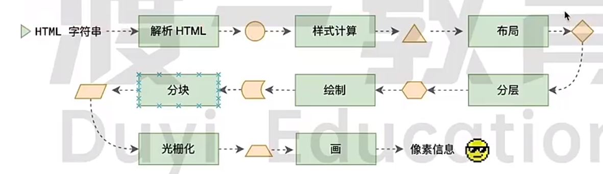
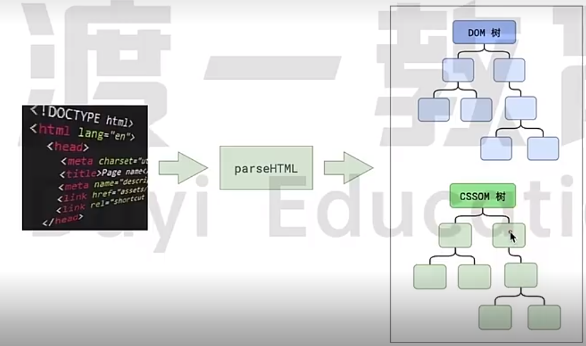
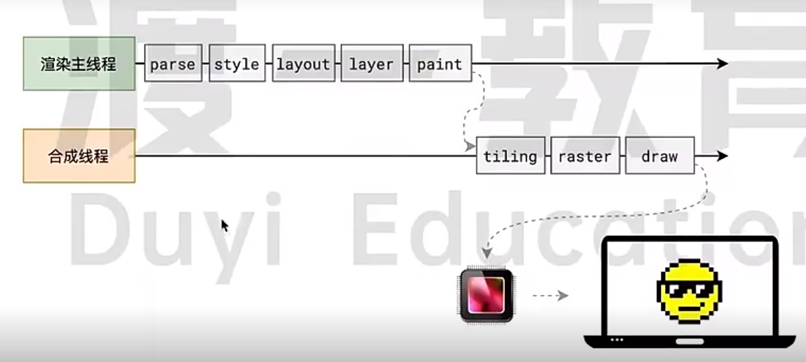
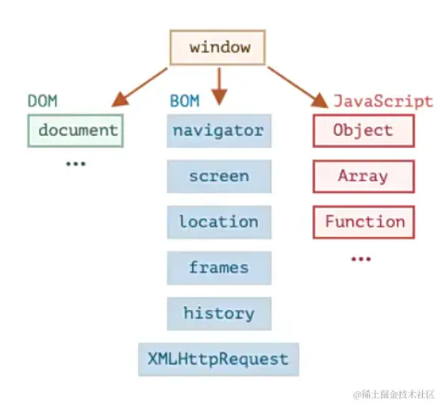

[参考1](https://juejin.cn/post/6844904021308735502)
[参考2](https://juejin.cn/post/6916157109906341902/)


### 垃圾回收
文章参考：https://juejin.cn/post/6981588276356317214
分为两种策略：
* **标记清理**：标记阶段即为所有活动对象做上标记，清除阶段则把没有标记（也就是非活动对象）销毁
* **引用计数**：它把对象是否不再需要简化定义为对象有没有其他对象引用到它。如果没有引用指向该对象（引用计数为 0），对象将被垃圾回收机制回收。

### 浏览器如何渲染页面的？
- 当浏览器的网络线程接受到HTML文档后，会生成一个渲染任务，将其传递给渲染主线程的消息队列。在事件循环机制下，渲染主线程取出消息队列中的渲染任务，开启渲染流程
- 渲染流程分为多个阶段：HTML解析、样式计算、布局、分层、绘制、分块、光栅化、画。每个阶段都有明确的输入输出，上个阶段的输出成为下个阶段的输入，这样整个渲染流程就形成了一套组织严密的生产流水线


#### 第一步 解析HTML-Parse HTML

- 主线程首先会对HTML进行解析，解析过程中遇到CSS解析CSS，遇到JS执行JS。为提高效率，浏览器在开启解析前，会启动一个预解析线程，率先下载HTML中外部的CSS文件和外部的JS文件
- 如果主线程解析到`<link>`位置，此时外部的CSS文件还没有下载解析好，主线程不会等待，会继续解析后续的HTML。这是因为下载和解析CSS的工作是在预解析线程中进行的，这就是CSS不会阻塞HTML解析的根本原因
- 如果主线程解析到`<script>`位置，则会停止解析HTML，转而等待script下载好，并将其中的全局代码执行完成后，才继续解析HTML。这是因为在JS执行过程中可能会修改当前DOM树，所以DOM树的生成必须暂停。这就是JS执行会阻塞HTML解析的根本原因
- 第一步完成后，会得到DOM树和CSSOM树，浏览器的默认样式、内部样式、外部样式、行内样式均会包含在CSSOM树中
#### 第二步 样式计算
- 解析完HTML后会进行样式计算。
- 主线程会遍历得到的ODM树，根据CSSOM树依次为DOM树中的每个节点计算出其最终的样式，称之为Computed Style。（可在浏览器控制台中查看）
- 在这一过程中，很多预设值会变成绝对值，如`red`会变为`rgb(255,0,0)`，相对单位会变为绝对单位，如`em`会变为`px`
- 这步完成后会得到一个带有样式的DOM树

#### 第三步 布局
- 依次遍历带有样式的DOM树的每一个节点，计算每个节点的几何信息，如节点宽高、相对包含块的位置。
- 大部分时候,DOM树和布局树并非一一对应，比如`display:none`的节点没有布局信息，不会生成到布局树上；或者使用了伪元素选择器，虽然DOM树不存在这些伪元素节点，但他们拥有几何信息，因此会生成到布局树中。
- 计算完成后生成布局（layout）树

#### 第四步 分层(Layer)
- 主线程会使用一套复杂的策略对整个布局树进行分层
- 分层的好处在于，将来某一层改变后，仅会对该层进行后续的处理，从而提升效率
- 滚动条、堆叠上下文、transform、opacity都会或多或少的影响分层结果，`will-change`可以更大程度上影响分层

#### 第五步 绘制
- 主线程会对 每个图层产生单独的绘制指令集，用于描述这一层的内容如何绘制出来
- 此时渲染主线程的任务结束，剩余工作交给其他线程来进行

#### 第六步 分块（Tiling）
- 主线程将每个图层的绘制信息交给合成线程
- 合成线程首先会对每个图层进行分块，将其划分为更多的小区域
- 合成线程会从线程池中拿取多个线程来完成分块工作

#### 第七步 光栅化（Raster）
- 分块完成后，合成线程会将块信息交给GPU进程，以极高的速度完成光栅化
- GPU进程会开启多个线程来完成光栅化，并优先处理靠近视口区域的块
- 光栅化完成后，会生成一块一块的位图（位图：内存里面的二维数组，里面记录了每个像素点的颜色）

#### 第八步 画（Draw）
- 合成线程拿到每个层、每个块的位图后，会生成一个个指引（quad）信息
- 指引会标识出每个位图应该画到屏幕的哪个位置，以及考虑旋转、缩放等变形
- 变形发生在合成线程，与主线程无关，这就是`transform`效率高的本质原因
- 合成线程会把quad交给GPU进程，由GPU进程产生系统调用，提交给GPU硬件，完成最终的屏幕成像

> 为什么不是由合成线程直接进行GPU系统调用？
>  - 因为合成线程和渲染主线程一样，都属于渲染进程，而浏览器的渲染进程是一个沙盒，这样设计的目的就是最大程度的保证计算机系统的安全，使得就算浏览器内部出现病毒，也无法对计算机系统照成破坏
>  - 所以合成线程将信息交给GPU进程，来进行系统调用



#### 常见面试题
##### 什么是reflow（重排）
- reflow本质就是重新计算layout树（从第三步重新开始）
- 当进行了影响布局树的操作后（宽高、增删节点），需要重新计算布局树，引发layout
- 为了避免来连续的多次操作导致布局树反复计算，浏览器会合并这些操作，当JS代码全部执行完后在进行同意计算。所以改动属性造成的reflow是异步完成的。
- 也是因为如此，当JS获取布局属性时，就能能无法获取到最新的布局信息。所以在浏览器的权衡下，若在改变布局属性后获取布局属性时，会立即reflow

##### 什么是repaint（重绘）
- repaint本质上是重新根据分层信息计算绘制指令（从第五步重新开始）
- 当改动可见样式后，就需要重新计算，引发repaint
- 由于元素的布局信息也属于可见样式，所以reflow一定会引发repaint

##### 为什么transform效率高
- 因为tansform既不会影响布局也不会影响绘制指令，它只影响渲染最后一个阶段-draw。
- 由于draw阶段是在合成线程中，所以transform的变化几乎不会影响到渲染主线程。反之，无论渲染主线程如何忙碌，甚至阻塞，都不会影响到transform 的变化

### 浏览器渲染流程

#### 浏览器渲染流程:

1. 解析HTML，生成DOM树，解析CSS，生成CSSOM树
2. 将DOM树和CSSOM树结合，生成渲染树(Render Tree)
3. Layout(回流):根据生成的渲染树，进行回流(Layout)，得到节点的几何信息（位置，大小）
4. Painting(重绘):根据渲染树以及回流得到的几何信息，得到节点的绝对像素
5. Display:将像素发送给GPU，展示在页面上。

#### 生成渲染树

为了构建渲染树，浏览器主要完成了以下工作：
1. 从DOM树的根节点开始遍历每个可见节点。
2. 对于每个可见的节点，找到CSSOM树中对应的规则，并应用它们。
3. 根据每个可见节点以及其对应的样式，组合生成渲染树

**注：** 不可见节点：
* 不会渲染输出的节点，比如script、meta、link等。
* 通过css进行隐藏的节点。比如display:none。注意，利用visibility和opacity隐藏的节点，还是会显示在渲染树上的。只有display:none的节点才不会显示在渲染树上。

#### 回流（重排）重绘触发时机
> 回流一定会触发重绘，而重绘不一定会回流

* 添加或删除可见的DOM元素
* 元素的位置发生变化
* 元素的尺寸发生变化（包括外边距、内边框、边框大小、高度和宽度等）
* 内容发生变化，比如文本变化或图片被另一个不同尺寸的图片所替代。
* 页面一开始渲染的时候（这肯定避免不了）
* 浏览器的窗口尺寸变化（因为回流是根据视口的大小来计算元素的位置和大小的）

#### 浏览器重排优化机制
* 由于每次重排都会造成额外的计算消耗，因此大多数浏览器都会通过队列化修改并批量执行来优化重排过程。浏览器会将修改操作放入到队列里，直到过了一段时间或者操作达到了一个阈值，才清空队列。
* 但是，当获取布局信息的操作的时候，会强制队列刷新，比如当你访问以下属性或者使用以下方法：
  * offsetTop、offsetLeft、offsetWidth、offsetHeight
  * scrollTop、scrollLeft、scrollWidth、scrollHeight
  * clientTop、clientLeft、clientWidth、clientHeight
  * getComputedStyle()
  * getBoundingClientRect
  * 具体参考：https://gist.github.com/paulirish/5d52fb081b3570c81e3a

#### 减少回流(重排)和重绘
1. 最小化重绘和重排,如合并多次对DOM和样式的修改，然后一次处理掉
     * 以下代码中，有三个样式属性被修改，且都会影响元素几何属性，引起重排，大部分现代浏览器都对其做了优化，因此，只会触发一次重排。但是如果在旧版的浏览器或者在上面代码执行的时候，有其他代码访问了布局信息(上文中的会触发回流的布局信息)，那么就会导致三次重排。
     * 因此可以使用cssText或者class合并所有的改变然后依次处理.
```js
const el = document.getElementById('test');
el.style.padding = '5px';
el.style.borderLeft = '1px';
el.style.borderRight = '2px';

// 以上代码使用cssText优化
const el = document.getElementById('test');
el.style.cssText += 'border-left: 1px; border-right: 2px; padding: 5px;';
// 修改CSS的class
const el = document.getElementById('test');
el.className += ' active';
```
2. 批量修改DOM
   * 需要对DOM对一系列修改的时候，可以通过以下步骤减少回流重绘次数：
     * 使元素脱离文档流
     * 对其进行多次修改(该步骤的修改不会引起回流重绘，因为已经不在渲染树上)
     * 将元素带回到文档中。
   * 让DOM脱离文档流的三种方式：
     * 隐藏元素，应用修改，重新显示
     * 使用文档片段(document fragment)在当前DOM之外构建一个子树，再把它拷贝回文档。
     * 将原始元素拷贝到一个脱离文档的节点中，修改节点后，再替换原始的元素。
3. 避免触发同步布局事件
4. 对于复杂动画效果,使用绝对定位让其脱离文档流
5. css3硬件加速（GPU加速）
   * 使用css3硬件加速，可以让transform、opacity、filters这些动画不会引起回流重绘 。
   * 常见的触发硬件加速的css属性：
     * transform
     * opacity
     * filters
     * Will-change

### 浏览器不同tab页之间的通信
参考：
* https://www.jianshu.com/p/72b7b69ac101
* https://developer.mozilla.org/en-US/docs/Web/API/Broadcast_Channel_API
* https://developer.mozilla.org/en-US/docs/Web/API/ServiceWorker
* https://developer.mozilla.org/en-US/docs/Web/API/Window/localStorage
* https://developer.mozilla.org/zh-CN/docs/Web/API/Window/storage_event

### 浏览器包含的进程
- Browser进程
  - 浏览器的主进程(负责协调、主控)，该进程只有一个
  - 负责浏览器界面显示，与用户交互。如前进，后退等
  - 负责各个页面的管理，创建和销毁其他进程
  - 将渲染(Renderer)进程得到的内存中的Bitmap(位图)，绘制到用户界面上
  - 网络资源的管理，下载等
- 第三方插件进程:每种类型的插件对应一个进程，当使用该插件时才创建
- GPU进程:该进程也只有一个，用于3D绘制等等
- **渲染进程**
  - 即通常所说的浏览器内核(Renderer进程，内部是多线程)
  - 每个Tab页面都有一个渲染进程，互不影响
  - 主要作用为页面渲染，脚本执行，事件处理等

#### 简述渲染进程Renderer
> 页面的渲染，JS的执行，事件的循环，都在渲染进程内执行，需要重点关注。
> 渲染进程是多线程的.


##### GUI渲染线程
- 负责渲染浏览器界面，解析HTML，CSS，构建DOM树和RenderObject树，布局和绘制等
  - 解析html代码(HTML代码本质是字符串)转化为浏览器认识的节点，生成DOM树，也就是DOM Tree
  - 解析css，生成CSSOM(CSS规则树)
  - 把DOM Tree 和CSSOM结合，生成Rendering Tree(渲染树)
- 当我们修改了一些元素的颜色或者背景色，页面就会重绘(Repaint)
- 当我们修改元素的尺寸，页面就会回流(Reflow)
- 当页面需要Repaing和Reflow时GUI线程执行，绘制页面
- 回流(Reflow)比重绘(Repaint)的成本要高，我们要尽量避免Reflow和Repaint
- GUI渲染线程与JS引擎线程是互斥的
  - 当JS引擎执行时GUI线程会被挂起(相当于被冻结了)
  - GUI更新会被保存在一个队列中等到JS引擎空闲时立即被执行'

##### JS引擎线程
- JS引擎线程就是JS内核，负责处理Javascript脚本程序(例如V8引擎)
- JS引擎线程负责解析Javascript脚本，运行代码
- JS引擎一直等待着任务队列中任务的到来，然后加以处理
  - 浏览器同时只能有一个JS引擎线程在运行JS程序，所以js是单线程运行的
  - 一个Tab页(renderer进程)中无论什么时候都只有一个JS线程在运行JS程序
- GUI渲染线程与JS引擎线程是互斥的，js引擎线程会阻塞GUI渲染线程
  - 就是我们常遇到的JS执行时间过长，造成页面的渲染不连贯，导致页面渲染加载阻塞(就是加载慢)
  - 例如浏览器渲染的时候遇到`<script>`标签，就会停止GUI的渲染，然后js引擎线程开始工作，执行里面的js代码，等js执行完毕，js引擎线程停止工作，GUI继续渲染下面的内容。所以如果js执行时间太长就会造成页面卡顿的情况

##### 事件触发线程
* 属于浏览器而不是JS引擎，用来控制事件循环，并且管理着一个事件队列(task queue)
* 当js执行碰到事件绑定和一些异步操作(如setTimeOut，也可来自浏览器内核的其他线程，如鼠标点击、AJAX异步请求等)，会走事件触发线程将对应的事件添加到对应的线程中(比如定时器操作，便把定时器事件添加到定时器线程)，等异步事件有了结果，便把他们的回调操作添加到事件队列，等待js引擎线程空闲时来处理。
* 当对应的事件符合触发条件被触发时，该线程会把事件添加到待处理队列的队尾，等待JS引擎的处理
* 因为JS是单线程，所以这些待处理队列中的事件都得排队等待JS引擎处理


##### 定时触发器线程
- setInterval与setTimeout所在线程
- 浏览器定时计数器并不是由JavaScript引擎计数的(因为JavaScript引擎是单线程的，如果处于阻塞线程状态就会影响记计时的准确)
- 通过单独线程来计时并触发定时(计时完毕后，添加到事件触发线程的事件队列中，等待JS引擎空闲后执行)，这个线程就是定时触发器线程，也叫定时器线程
- W3C在HTML标准中规定，规定要求setTimeout中低于4ms的时间间隔算为4ms

##### 异步http请求线程
- 在XMLHttpRequest在连接后是通过浏览器新开一个线程请求
- 将检测到状态变更时，如果设置有回调函数，异步线程就产生状态变更事件，将这个回调再放入事件队列中再由JavaScript引擎执行
- 简单说就是当执行到一个http异步请求时，就把异步请求事件添加到异步请求线程，等收到响应(准确来说应该是http状态变化)，再把回调函数添加到事件队列，等待js引擎线程来执行

### 浏览器输入URL

#### 地址栏输入url回车后的流程
1. 解析URL：首先会对 URL 进行解析，分析所需要使用的传输协议和请求的资源的路径。如果输入的 URL 中的协议或者主机名不合法，将会把地址栏中输入的内容传递给搜索引擎。如果没有问题，浏览器会检查 URL 中是否出现了非法字符，如果存在非法字符，则对非法字符进行转义后再进行下一过程。
2. 缓存判断：浏览器会判断所请求的资源是否在缓存里，如果请求的资源在缓存里并且没有失效，那么就直接使用，否则向服务器发起新的请求。
3. DNS解析： 下一步首先需要获取的是输入的 URL 中的域名的 IP 地址，首先会判断本地是否有该域名的 IP 地址的缓存，如果有则使用，如果没有则向本地 DNS 服务器发起请求。本地 DNS 服务器也会先检查是否存在缓存，如果没有就会先向根域名服务器发起请求，获得负责的顶级域名服务器的地址后，再向顶级域名服务器请求，然后获得负责的权威域名服务器的地址后，再向权威域名服务器发起请求，最终获得域名的 IP 地址后，本地 DNS 服务器再将这个 IP 地址返回给请求的用户。用户向本地 DNS 服务器发起请求属于递归请求，本地 DNS 服务器向各级域名服务器发起请求属于迭代请求。
4. 获取MAC地址： 当浏览器得到 IP 地址后，数据传输还需要知道目的主机 MAC 地址，因为应用层下发数据给传输层，TCP 协议会指定源端口号和目的端口号，然后下发给网络层。网络层会将本机地址作为源地址，获取的 IP 地址作为目的地址。然后将下发给数据链路层，数据链路层的发送需要加入通信双方的 MAC 地址，本机的 MAC 地址作为源 MAC 地址，目的 MAC 地址需要分情况处理。通过将 IP 地址与本机的子网掩码相与，可以判断是否与请求主机在同一个子网里，如果在同一个子网里，可以使用 APR 协议获取到目的主机的 MAC 地址，如果不在一个子网里，那么请求应该转发给网关，由它代为转发，此时同样可以通过 ARP 协议来获取网关的 MAC 地址，此时目的主机的 MAC 地址应该为网关的地址。
5. TCP三次握手： 下面是 TCP 建立连接的三次握手的过程，首先客户端向服务器发送一个 SYN 连接请求报文段和一个随机序号，服务端接收到请求后向客户端发送一个 SYN ACK报文段，确认连接请求，并且也向客户端发送一个随机序号。客户端接收服务器的确认应答后，进入连接建立的状态，同时向服务器也发送一个ACK 确认报文段，服务器端接收到确认后，也进入连接建立状态，此时双方的连接就建立起来了。
6. HTTPS握手： 如果使用的是 HTTPS 协议，在通信前还存在 TLS 的一个四次握手的过程。首先由客户端向服务器端发送使用的协议的版本号、一个随机数和可以使用的加密方法。服务器端收到后，确认加密的方法，也向客户端发送一个随机数和自己的数字证书。客户端收到后，首先检查数字证书是否有效，如果有效，则再生成一个随机数，并使用证书中的公钥对随机数加密，然后发送给服务器端，并且还会提供一个前面所有内容的 hash 值供服务器端检验。服务器端接收后，使用自己的私钥对数据解密，同时向客户端发送一个前面所有内容的 hash 值供客户端检验。这个时候双方都有了三个随机数，按照之前所约定的加密方法，使用这三个随机数生成一把秘钥，以后双方通信前，就使用这个秘钥对数据进行加密后再传输。
7. 返回数据： 当页面请求发送到服务器端后，服务器端会返回一个 html 文件作为响应，浏览器接收到响应后，开始对 html 文件进行解析，开始页面的渲染过程。
8. 页面渲染： 浏览器首先会根据 html 文件构建 DOM 树，根据解析到的 css 文件构建 CSSOM 树，如果遇到 script 标签，则判端是否含有 defer 或者 async 属性，要不然 script 的加载和执行会造成页面的渲染的阻塞。当 DOM 树和 CSSOM 树建立好后，根据它们来构建渲染树。渲染树构建好后，会根据渲染树来进行布局。布局完成后，最后使用浏览器的 UI 接口对页面进行绘制。这个时候整个页面就显示出来了。
9. TCP四次挥手： 最后一步是 TCP 断开连接的四次挥手过程。若客户端认为数据发送完成，则它需要向服务端发送连接释放请求。服务端收到连接释放请求后，会告诉应用层要释放 TCP 链接。然后会发送 ACK 包，并进入 CLOSE_WAIT 状态，此时表明客户端到服务端的连接已经释放，不再接收客户端发的数据了。但是因为 TCP 连接是双向的，所以服务端仍旧可以发送数据给客户端。服务端如果此时还有没发完的数据会继续发送，完毕后会向客户端发送连接释放请求，然后服务端便进入 LAST-ACK 状态。客户端收到释放请求后，向服务端发送确认应答，此时客户端进入 TIME-WAIT 状态。该状态会持续 2MSL（最大段生存期，指报文段在网络中生存的时间，超时会被抛弃） 时间，若该时间段内没有服务端的重发请求的话，就进入 CLOSED 状态。当服务端收到确认应答后，也便进入 CLOSED 状态。


### 渲染合成层
> 渲染合成层（Compositing Layer）是浏览器中的一个关键概念，用于优化页面的渲染性能和动画效果。它是浏览器渲染引擎的一部分，用于将页面元素分成多个层，并将这些层按照正确的顺序进行合成，以最终呈现在屏幕上。


### 内存泄露排查
[参考](https://juejin.cn/post/7309040097936474175)

### 跨域
- 原因：浏览器的同源策略（浏览器安全功能，阻止页面加载或执行来自不同源的资源，能有效防止 XSS、CSRF 等攻击）限制了不同源之间的交互。
- 解决方案：
  - JSONP
  - 设置 CORS(跨域资源共享)
  - 服务器代理
  - Nginx反向代理
  - iframe

### 浏览器存储
- cookie
- localStorage
- sessionStorage
- indexedDB：浏览器本地数据库，可用于存储大量结构化数据。该 API 使用异步操作，因此不会阻塞应用程序。且使用索引实现对数据的高性能检索。
- cacheStorage：浏览器缓存,用于对请求的资源进行缓存


### 什么是 WebAssembly
[参考](https://developer.mozilla.org/zh-CN/docs/WebAssembly/Concepts)
> WebAssembly 是一种新型的低级字节码格式，它是一种可移植、体积小、加载快并且兼容 Web 的编译目标。WebAssembly 旨在为 Web 平台上的高性能应用程序提供一个高效的编译目标。WebAssembly 代码可以直接在浏览器中运行，而不需要解释器或虚拟机。WebAssembly 代码可以通过 JavaScript 调用，也可以通过 JavaScript 调用 WebAssembly 代码。
> 


### 为什么浏览器的最大并发请求数是6-8 ？
1. 资源限制：浏览器需要管理有限的系统资源，如网络带宽、CPU和内存。过多的并发请求可能会导致资源耗尽，影响浏览器的性能和稳定性。
2. 防止恶意攻击：在服务端通常会对同一个客户端来源设置并发阈值，以避免恶意攻击。如果浏览器不对同一域名做并发限制，可能会导致超过服务端的并发阈值，从而被服务器封禁
3. 性能优化：并发请求过多可能会导致频繁的线程切换，而线程上下文切换是资源密集型操作，可能会降低性能
4. 客户端良知机制：浏览器通过限制并发请求数量，可以防止两个应用抢占资源时，强势一方无限获取资源，导致另一方永远处于阻塞状态的情况。

### hash 和 history 的区别
- hash： URL中以#符号开始的部分被称为哈希部分。在Web开发中，通常使用哈希来实现页面内的导航或锚点定位。当浏览器的哈希发生变化时，页面不会重新加载，而是触发一个hashchange事件。通过监听此事件，你可以根据哈希的变化来执行相应的操作，例如显示不同的内容或调用特定的函数。哈希可以直接通过JavaScript进行修改，例如window.location.hash = "section2"，URL将变为（此时hashchange事件也会触发）
- history：是浏览器跟踪用户访问过的URL的一种机制。通过history对象，你可以在JavaScript中操作浏览器的历史记录。一些常用的方法包括history.pushState()、history.replaceState()和history.back()。这些方法允许你添加、替换和移动浏览器的历史记录，并且不会导致页面的实际刷新。当历史记录发生变化时，浏览器不会重新加载页面，但可以通过popstate事件来捕获这些变化并做出响应。

- 路由需要实现三个功能：
  - 当浏览器地址变化时，切换页面；
  - 点击浏览器【后退】、【前进】按钮，网页内容跟随变化；
  - 刷新浏览器，网页加载当前路由对应内容；
- 在单页面web网页中, 单纯的浏览器地址改变, 网页不会重载，如单纯的hash网址改变网页不会变化，因此我们的路由主要是通过监听事件，并利用js实现动态改变网页内容，有两种实现方式：
  - hash模式：监听浏览器地址hash值变化，执行相应的js切换网页
  - history模式：利用history API实现url地址改变，网页内容改变


### BOM 和 DOM 区别
  - DOM:文档对象模型 (Document Object Model)，简称 DOM，将页面所有的内容表示为可以修改的对象
    - DOM 将整个页面抽象为一组分层节点，HTML页面的每个组成部分都是一种节点，包含不同数据
    - DOM通过创建表示文档的树，让开发者可以控制网页的内容和结构，使用DOM API可以删除、添加、替换、修改节点
  - BOM: 浏览器对象模型 (Browser Object Model)，简称 BOM，由浏览器提供的用于处理文档 (document) 之外（例如浏览器本身）的所有内容的其他对象，比如navigator、 location、 history、screen、performance、XHR等对象，以及对cookie的支持
  