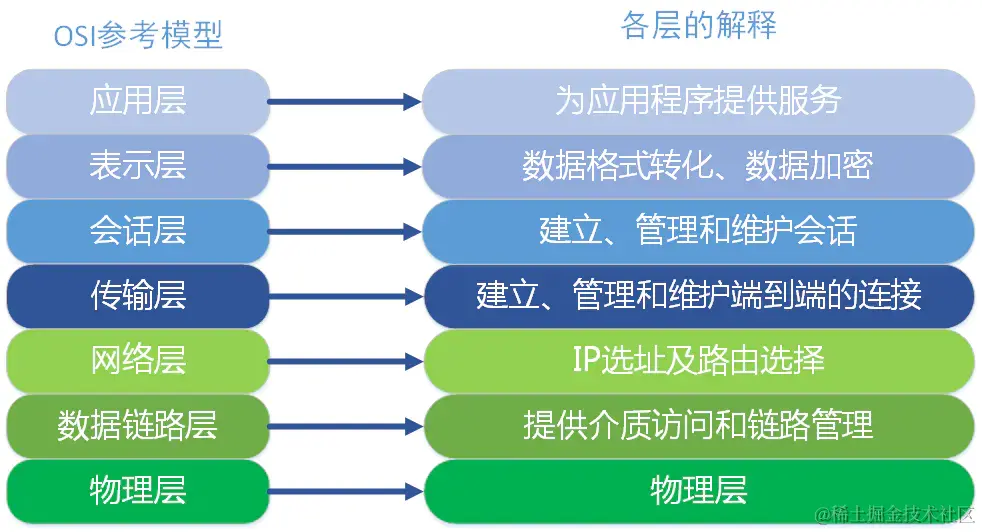
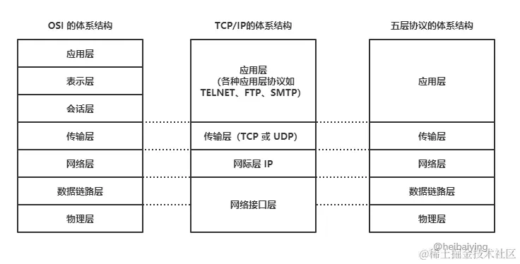
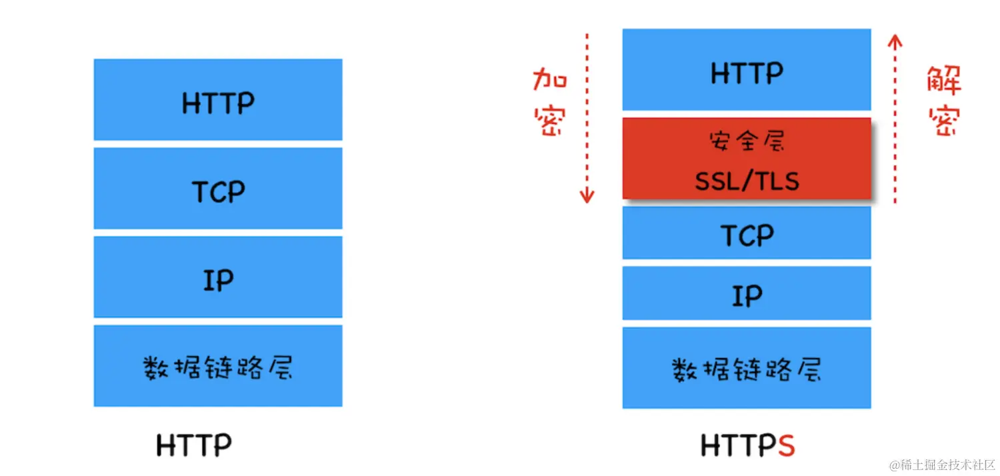

- https://juejin.cn/post/6940942549305524238
- https://juejin.cn/post/6908327746473033741
- https://juejin.cn/post/6844904021308735502
- https://juejin.cn/post/7269952188927017015
- https://juejin.cn/post/6908327746473033741


### http状态码
* 分类:
  * 1xx - 服务器收到请求。
  * 2xx - 请求成功，如 200。
  * 3xx - 重定向，如 302。
  * 4xx - 客户端错误，如 404。
  * 5xx - 服务端错误，如 500。

* 常见：
  * 200 OK - 成功。
  * 201 ： 请求成功并且服务器创建了新资源
  * 202 ：服务器已经接收请求，但尚未处理
  * 301 Moved Permanently - 永久重定向（配合 location，浏览器自动处理）。
  * 302 Found - 临时重定向（配合 location，浏览器自动处理）。
  * 304 Not Modified - 资源未被修改,使用协商缓存
  * 401: 请求未授权
  * 403 Forbidden - 没权限。
  * 404 Not Found - 资源未找到。
  * 500 Internal Server Error - 服务器错误。
  * 504 Gateway Timeout - 网关超时。

### get和post的区别
- 应用场景： GET 请求是一个幂等的请求，一般 Get 请求用于对服务器资源不会产生影响的场景，比如说请求一个网页的资源。而 Post 不是一个幂等的请求，一般用于对服务器资源会产生影响的情景，比如注册用户这一类的操作。
- 是否缓存： 因为两者应用场景不同，浏览器一般会对 Get 请求缓存，但很少对 Post 请求缓存。
- 发送的报文格式： Get 请求的报文中实体部分为空，Post 请求的报文中实体部分一般为向服务器发送的数据。
- 安全性： Get 请求可以将请求的参数放入 url 中向服务器发送，这样的做法相对于 Post 请求来说是不太安全的，因为请求的 url 会被保留在历史记录中。
- 请求长度： 浏览器由于对 url 长度的限制，所以会影响 get 请求发送数据时的长度。这个限制是浏览器规定的，并不是 RFC 规定的。(不同浏览器对URL长度限制不同，如chrome为8182个字符，Safari为80000个字符，Firefox为65536个字符等)
- 参数类型： post 的参数传递支持更多的数据类型。

### 简单请求
简单请求需要满足以下条件：

- 只使用以下HTTP方法之一：GET、HEAD或POST。
- 只使用以下HTTP头部：Accept、Accept-Language、Content-Language、Content-Type。
- Content-Type的值仅限于：application/x-www-form-urlencoded、multipart/form-data或text/plain。

如果一个跨域请求不满足以上所有条件，那么它被认为是非简单请求。对于非简单请求，浏览器会在实际请求（例如PUT、DELETE、PATCH或具有自定义头部和其他Content-Type的POST请求）之前发送OPTIONS请求（**预检请求**）。

### http缓存

##### 强缓存
强缓存不需要客户端向服务端发送请求，有两种响应头实现方案:
* Expires：值是一个绝时间，在这个时间前缓存有效，但是如果本地时间被修改，会导致缓存失效,**在http/1.0中使用**
* Cache-control：值是一个相对时间，单位为秒，资源在这个时间内有效，**在http/1.1中使用**
* expires和cache-control同时存在时，cache-control优先级高于expires

**Expires**
- 即为过期时间，用来指定资源到期的时间，是服务器端的具体的时间点，由服务器返回，用来告诉浏览器在这个时间点之前可以直接从缓存里面获取数据，而无需再次请求.
- 如下,表示资源在2019年11月22号8点41分过期，过期后需要想服务端发送请求
```js
Expires: Wed, 22 Nov 2019 08:41:00 GMT
```
- 如果本地时间被修改，会导致缓存失效。
- 或者浏览器的时间和服务器时间不一致，可能会导致过期时间不准确的问题，所以http1.1中使用Cache-Control代替

**Cache-Control**
- http1.1中使用Cache-Control代替Expires,本质不同在于Cache-Control采用的是相对时间来控制缓存，对应字段是max-age，如下，表示资源在3600秒后过期，过期后需要向服务端发送请求
```js
Cache-Control: max-age=3600
```
- Cache-Control的值可以是多个，多个值之间用逗号隔开，如下
  - private：表示资源只能被浏览器缓存，不能被代理服务器缓存
  - no-cache：跳过当前的强缓存，发送HTTP请求，即直接进入协商缓存阶段
  - no-store：禁止浏览器和代理服务器缓存当前的请求返回的结果，每次用户请求该资源，都会向服务器发送一个请求，每次都会下载完整的资源
  - s-maxage：覆盖max-age或者Expires头，但是仅适用于共享缓存（比如CDN缓存、代理服务器等），私有缓存（比如浏览器缓存）会忽略它
  - public：表明响应可以被任何对象（包括：发送请求的客户端，代理服务器，等等）缓存
> 注意：当Expires和Cache-Control同时存在的时候，Cache-Control会优先考虑，即Cache-Control的值会覆盖Expires的值


#### 协商缓存
强缓存过期之后会使用协商缓存，协商缓存需要客户端向服务端发送请求，资源未过期则服务端返回304否则返回新的资源。 协商缓存也有两种实现方案：
* Last-Modified 和 If-Modified-Since：
  * Last-Modified 表示最后修改日期，在浏览器第一次给服务器发送请求后，服务器会在响应头中加上这个字段.
  * If-Modified-Since 会将 Last-Modified 的值发送给服务器，询问服务器在该日期后资源是否有更新，有更新的话就会将新的资源发送回来。否则返回304，告诉浏览器使用缓存。但是如果本地文件被打开，会导致Last-Modified 被修改。
* ETag 和 If-None-Match：
  * ETag 类似于文件指纹，是服务器根据当前文件内容生成的唯一标识，只要内容有改动，Etag就会变化。服务器在响应头中加上这个字段，传给浏览器。
  * 浏览器在接收Etag的值后，在下一次请求时，会将该值作为If-None-Match字段的内容，放到请求头中发送给服务器，询问该资源 ETag 是否变动
  * 服务器在接收到If-None-Match后，会跟服务器上该资源的ETag进行比,有变动的话就将新的资源发送回来,没有变动则返回304告诉浏览器使用缓存。并且 **ETag 优先级比 Last-Modified 高**。

**对比：**
* 精准度：Etag > Last-Modified，因为ETag是根据文件内容生成的指纹，能准确感知资源的变化。而Last-Modified 在一些特殊的情况并不能准确感知资源变化:
  * 编辑了资源文件，但是文件内容并没有更改，这样也会造成缓存失效
  * Last-Modified 能够感知的单位时间是秒，如果文件在 1 秒内改变了多次，那么这时候的 Last-Modified 并没有体现出修改了。
* 性能：Last-Modified > Etag，因为Etag需要服务器通过算法来计算资源的指纹(hash)，而Last-Modified 只需要记录修改时间即可。

#### 缓存位置
浏览器中的缓存位置一共有四种，按优先级从高到低排列分别是:
* Service Worker
  * Service Worker 借鉴了 Web Worker的 思路，即让 JS 运行在主线程之外，由于它脱离了浏览器的窗体，因此无法直接访问DOM
  * 可以帮助完成离线缓存、消息推送和网络代理等功能
  * 其中离线缓存就是通过 Service Worker 实现的，它可以让我们的应用在离线状态下依然可用，这也是 (PWA)[https://developer.mozilla.org/zh-CN/docs/Web/Progressive_web_apps] 的核心功能之一
* Memory Cache
  * 即内存缓存，从效率上讲，内存缓存是最快的一种缓存，但是缓存持续的时间也是最短的，当渲染进程结束后，内存缓存也就不存在了
* Disk Cache
  * 即存储在硬盘中的缓存，相比内存缓存，它的优势在于存储容量和时效性，但是相对于内存缓存来说，它的读取速度就慢了很多
* Push Cache
  * 即推送缓存，这是浏览器缓存中最后一个环节，它只在 https 协议下存在，而且缓存时间也很短暂，只在会话(session)存在，一旦会话结束就被释放，所以它只能用来处理一些非关键性的资源，比如说页面的图标、样式等等

浏览器对于Memory Cache 和 Disk Cache缓存策略：
- 较大的JS、CSS文件会被缓存到硬盘中，而不是内存中
- 内存使用频率较高时，文件优先进入磁盘缓存

### 浏览器本地存储
> 浏览器本地存储主要分为cookie、web storage、indexDB，其中web storage又分为localStorage和sessionStorage

#### Cookie
产生的背景：
* HTTP协议是无状态的，每次请求都是独立的，服务器无法知道当前请求和上一次请求是否来自同一个浏览器，所以无法知道用户的状态
* 为了解决这个问题，服务器可以通过设置响应头的Set-Cookie字段，将用户的状态信息以Cookie的形式发送给浏览器，浏览器会将Cookie保存起来，当下次请求时，会将Cookie发送给服务器，服务器就能知道用户的状态了
* Cookie 是由服务器生成，发送给浏览器的一小段文本信息，浏览器会把 Cookie 保存起来，之后每次请求都会将 Cookie 发送给服务器。其本质就是浏览器存储的一个很小的文本文件，内部以键值对的方式来存储数据

作用： 存储会话状态（如用户登录状态、购物车、游戏分数或其它需要记录的信息）
缺陷:
  * 容量缺陷：每个域名下的 Cookie 数量和大小都是有限制的，不同浏览器的限制也不一样，一般来说不超过 50 个，单个域名下不超过 4KB
  * 性能缺陷：Cookie紧跟域名，不管该域名下的某个地址需不需要这个Cookie,请求都会携带该Cookie，这样随着请求数的增加，会带来性能上的损耗
  * 安全缺陷：Cookie 存储在浏览器中，容易被恶意获取，然后进行篡改，所以 Cookie 中存储的信息一般都是一些不敏感的信息，如用户的登录状态等。且Cookie是明文传输，容易被窃取。在httpOnly为false的情况下，Cookie 信息能直接通过 JS 脚本来读取,容易受到XSS攻击

#### localStorage
* localStorage 是 HTML5 标准中新加入的技术，它并不是什么划时代的新技术，早在 IE6 时代就已经存在了，只不过当时叫做 userData，是 IE 浏览器独有的技术，后来被 HTML5 标准化，改名为 localStorage
和cookie相同点：
* 都是针对某个域名进行存储的
和cookie不同点：
* cookie 是在浏览器和服务器之间来回传递的，而 localStorage 是完全位于浏览器端的，数据不会随着 HTTP 请求被发送出去
* localStorage 的容量比 cookie 大得多，可以达到 5MB 以上，cookie 只有 4KB
* localStorage暴露在全局，通过setItem和getItem方法来进行操作，非常方便，而cookie只能通过document.cookie来进行操作。

[API方法参考](https://developer.mozilla.org/zh-CN/docs/Web/API/Window/localStorage)
应用场景：利用localStorage的较大容量和持久特性，可以利用localStorage存储一些内容稳定的资源，比如官网的logo，存储Base64格式的图片资源

#### sessionStorage
和localStorage的区别：
* sessionStorage 也是 HTML5 标准中新加入的技术，它和 localStorage 的接口类似，但是保存数据的生命周期与 localStorage 不同，它只是将数据保存在当前会话中，当会话结束（通常是窗口关闭）时，数据也随之被清除

相同点：
* 都是针对某个域名进行存储的
* 容量都比较大，可以达到 5MB 以上
* 只存储在客户端，默认不会发送到服务器端
* 接口方法也类似，都是通过setItem和getItem方法来进行操作，[API方法参考](https://developer.mozilla.org/zh-CN/docs/Web/API/Window/sessionStorage)

#### IndexedDB
- IndexedDB 是 HTML5 标准中新加入的技术，它是一种本地（非关系型）数据库，可以在浏览器中存储结构化数据，提供比 localStorage 更强的查询功能，这些查询功能允许开发者使用索引来检索数据
- 其容量理论上没有上限，但是不同浏览器实现上有所差异，一般来说不少于 250MB
- [IndexedDB使用指南](https://developer.mozilla.org/zh-CN/docs/Web/API/IndexedDB_API)

注意：
* 键值对存储，内部采用对象仓库（object store）存放数据，在这个对象仓库中的数据采用键值对的方式进行存储
* 异步操作，IndexedDB 的 API 设计采用了异步架构，所有的操作都是异步执行的，这样可以避免大量数据的读写阻塞主线程，从而提升性能
* IndexedDB 也是遵循同源策略的，每一个数据库都是和创建它的域名绑定的，不同域名之间无法互相访问对方的数据库

#### 总结
- cookie并不适合存储，而且存在非常多的缺陷。
- Web Storage包括localStorage和sessionStorage, 默认不会参与和服务器的通信。
- IndexedDB为运行在浏览器上的非关系型数据库，为大型数据的存储提供了接口


### OSI七层模型和TCP/IP五层模型

#### 七层模型：
* 应用层：为用户提供应用服务，包括网络服务和应用程序之间的交互，例如电子邮件、文件传输、远程登录等
* 表示层: 处理数据的表示和编码，确保数据格式在不同系统之间的交换和解释
* 会话层:负责建立、管理和终止会话（会话是两个应用程序之间的通信会话），并提供会话恢复功能
* 传输层: 提供端到端的数据传输服务，包括数据的分段、重组和错误恢复，确保数据可靠地传输
* 网络层: 处理数据包的路由和转发，负责将数据从源主机发送到目标主机，包括寻找最佳路径和实现路由选择
* 数据链路层:在物理连接上传输数据帧，并处理帧的传输错误。它还负责物理地址（MAC地址）的寻址和数据帧的识别
* 物理层:负责传输原始的比特流（0和1），通过物理媒介（如光纤、电缆、无线等）将数据从一个节点传输到另一个节点


#### 五层模型：
* 应用层：应用层、表示层、会话层：HTTP协议、FTP协议、DNS查询
* 传输层：提供通讯：TCP/UDP
* 网络层：网络层：IP
* 数据链路层：
* 物理层：IP数据封装成帧 在两个相邻节点间传送



### http响应头和请求头
参考：
- https://juejin.cn/post/7124847588070653983
**HTTP Request Header 常见的请求头：**

Accept:浏览器能够处理的内容类型
Accept-Charset:浏览器能够显示的字符集
Accept-Encoding：浏览器能够处理的压缩编码
Accept-Language：浏览器当前设置的语言
Connection：浏览器与服务器之间连接的类型
Cookie：当前页面设置的任何Cookie
Host：发出请求的页面所在的域
Referer：发出请求的页面的URL
User-Agent：浏览器的用户代理字符串

**HTTP Responses Header 常见的响应头：**

Date：表示消息发送的时间，时间的描述格式由rfc822定义
server:服务器名称
Connection：浏览器与服务器之间连接的类型
Cache-Control：控制HTTP缓存
content-type:表示后面的文档属于什么MIME类型

**常见的 Content-Type 属性值有以下四种：**
（1）application/x-www-form-urlencoded：浏览器的原生 form 表单，如果不设置 enctype 属性，那么最终就会以 application/x-www-form-urlencoded 方式提交数据。该种方式提交的数据放在 body 里面，数据按照 key1=val1&key2=val2 的方式进行编码，key 和 val 都进行了 URL转码。
（2）multipart/form-data：该种方式也是一个常见的 POST 提交方式，通常表单上传文件时使用该种方式。
（3）application/json：服务器消息主体是序列化后的 JSON 字符串。
（4）text/xml：该种方式主要用来提交 XML 格式的数据。

### 常见攻击类型
* [XSS](https://juejin.cn/post/6844903685122703367)


### cookie


### HTTP 1.0 和 HTTP 1.1 之间有哪些区别
- 连接方面，http1.0 默认使用非持久连接，而 http1.1 默认使用持久连接。http1.1 通过使用持久连接来使多个 http 请求复用同一个 TCP 连接，以此来避免使用非持久连接时每次需要建立连接的时延。
- 资源请求方面，在 http1.0 中，存在一些浪费带宽的现象，例如客户端只是需要某个对象的一部分，而服务器却将整个对象送过来了，并且不支持断点续传功能，http1.1 则在请求头引入了 range 头域，它允许只请求资源的某个部分，即返回码是 206（Partial Content），这样就方便了开发者自由的选择以便于充分利用带宽和连接。
- 缓存方面，在 http1.0 中主要使用 header 里的 If-Modified-Since、Expires 来做为缓存判断的标准，http1.1 则引入了更多的缓存控制策略，例如 Etag、If-Unmodified-Since、If-Match、If-None-Match 等更多可供选择的缓存头来控制缓存策略。
- http1.1 中新增了 host 字段，用来指定服务器的域名。http1.0 中认为每台服务器都绑定一个唯一的 IP 地址，因此，请求消息中的 URL 并没有传递主机名（hostname）。但随着虚拟主机技术的发展，在一台物理服务器上可以存在多个虚拟主机，并且它们共享一个IP地址。因此有了 host 字段，这样就可以将请求发往到同一台服务器上的不同网站。
- http1.1 相对于 http1.0 还新增了很多请求方法，如 PUT、HEAD、OPTIONS 等。

### HTTP 1.1 和 HTTP 2.0 的区别

- 二进制协议：HTTP/2 是一个二进制协议。在 HTTP/1.1 版中，报文的头信息必须是文本（ASCII 编码），数据体可以是文本，也可以是二进制。HTTP/2 则是一个彻底的二进制协议，头信息和数据体都是二进制，并且统称为"帧"，可以分为头信息帧和数据帧。 帧的概念是它实现多路复用的基础。
- 多路复用： HTTP/2 实现了多路复用，HTTP/2 仍然复用 TCP 连接，但是在一个连接里，客户端和服务器都可以同时发送多个请求或回应，而且不用按照顺序一一发送，这样就避免了"**队头堵塞**"的问题。
- 数据流： HTTP/2 使用了数据流的概念，因为 HTTP/2 的数据包是不按顺序发送的，同一个连接里面连续的数据包，可能属于不同的请求。因此，必须要对数据包做标记，指出它属于哪个请求。HTTP/2 将每个请求或回应的所有数据包，称为一个数据流。每个数据流都有一个独一无二的编号。数据包发送时，都必须标记数据流 ID ，用来区分它属于哪个数据流。
- 头信息压缩： HTTP/2 实现了头信息压缩，由于 HTTP 1.1 协议不带状态，每次请求都必须附上所有信息。所以，请求的很多字段都是重复的，比如 Cookie 和 User Agent ，一模一样的内容，每次请求都必须附带，这会浪费很多带宽，也影响速度。HTTP/2 对这一点做了优化，引入了头信息压缩机制。一方面，头信息使用 gzip 或 compress 压缩后再发送；另一方面，客户端和服务器同时维护一张头信息表，所有字段都会存入这个表，生成一个索引号，以后就不发送同样字段了，只发送索引号，这样就能提高速度了。
- 服务器推送： HTTP/2 允许服务器未经请求，主动向客户端发送资源，这叫做服务器推送。使用服务器推送提前给客户端推送必要的资源，这样就可以相对减少一些延迟时间。这里需要注意的是 http2 下服务器主动推送的是静态资源，和 WebSocket 以及使用 SSE 等方式向客户端发送即时数据的推送是不同的。

**队头堵塞**：
> 队头阻塞是由 HTTP 基本的“请求 - 响应”模型所导致的。HTTP 规定报文必须是“一发一收”，这就形成了一个先进先出的“串行”队列。队列里的请求是没有优先级的，只有入队的先后顺序，排在最前面的请求会被最优先处理。如果队首的请求因为处理的太慢耽误了时间，那么队列里后面的所有请求也不得不跟着一起等待，结果就是其他的请求承担了不应有的时间成本，造成了队头堵塞的现象。


### HTTP和HTTPS协议的区别
HTTPS协议需要CA证书，费用较高；而HTTP协议不需要；
HTTP协议是超文本传输协议，信息是明文传输的，HTTPS则是具有安全性的SSL加密传输协议；
使用不同的连接方式，端口也不同，HTTP协议端口是80，HTTPS协议端口是443；
HTTP协议连接很简单，是无状态的；HTTPS协议是有SSL和HTTP协议构建的可进行加密传输、身份认证的网络协议，比HTTP更加安全。

### 对keep-alive的理解
HTTP1.0 中默认是在每次请求/应答，客户端和服务器都要新建一个连接，完成之后立即断开连接，这就是短连接。当使用Keep-Alive模式时，Keep-Alive功能使客户端到服务器端的连接持续有效，当出现对服务器的后继请求时，Keep-Alive功能避免了建立或者重新建立连接，这就是长连接。其使用方法如下：

-HTTP1.0版本是默认没有Keep-alive的（也就是默认会发送keep-alive），所以要想连接得到保持，必须手动配置发送Connection: keep-alive字段。若想断开keep-alive连接，需发送Connection:close字段；
- HTTP1.1规定了默认保持长连接，数据传输完成了保持TCP连接不断开，等待在同域名下继续用这个通道传输数据。如果需要关闭，需要客户端发送Connection：close首部字段。

**Keep-Alive的建立过程**：

- 客户端向服务器在发送请求报文同时在首部添加发送Connection字段
- 服务器收到请求并处理 Connection字段
- 服务器回送Connection:Keep-Alive字段给客户端
- 客户端接收到Connection字段
- Keep-Alive连接建立成功

**服务端自动断开过程（也就是没有keep-alive）**：

- 客户端向服务器只是发送内容报文（不包含Connection字段）
- 服务器收到请求并处理
- 服务器返回客户端请求的资源并关闭连接
- 客户端接收资源，发现没有Connection字段，断开连接

**客户端请求断开连接过程**：

- 客户端向服务器发送Connection:close字段
- 服务器收到请求并处理connection字段
- 服务器回送响应资源并断开连接
- 客户端接收资源并断开连接

**开启Keep-Alive的优点**：

- 较少的CPU和内存的使⽤（由于同时打开的连接的减少了）；
- 允许请求和应答的HTTP管线化；
- 降低拥塞控制 （TCP连接减少了）；
- 减少了后续请求的延迟（⽆需再进⾏握⼿）；
- 报告错误⽆需关闭TCP连；

**开启Keep-Alive的缺点**：

长时间的Tcp连接容易导致系统资源无效占用，浪费系统资源。


###  HTTP2的头部压缩算法是怎样的
HTTP2的头部压缩是HPACK算法。在客户端和服务器两端建立“字典”，用索引号表示重复的字符串，采用哈夫曼编码来压缩整数和字符串，可以达到50%~90%的高压缩率。
具体来说:

在客户端和服务器端使用“首部表”来跟踪和存储之前发送的键值对，对于相同的数据，不再通过每次请求和响应发送；
首部表在HTTP/2的连接存续期内始终存在，由客户端和服务器共同渐进地更新；
每个新的首部键值对要么被追加到当前表的末尾，要么替换表中之前的值。

例如下图中的两个请求， 请求一发送了所有的头部字段，第二个请求则只需要发送差异数据，这样可以减少冗余数据，降低开销。


### http请求报文和相应报文
#### 请求报文
请求报⽂有4部分组成:
- 请求⾏
- 请求头部
- 空⾏
- 请求体

其中：
（1）请求⾏包括：请求⽅法字段、URL字段、HTTP协议版本字段。它们⽤空格分隔。例如，GET /index.html HTTP/1.1。
（2）请求头部:请求头部由关键字/值对组成，每⾏⼀对，关键字和值⽤英⽂冒号“:”分隔
User-Agent：产⽣请求的浏览器类型。
Accept：客户端可识别的内容类型列表。
Host：请求的主机名，允许多个域名同处⼀个IP地址，即虚拟主机。
（3）请求体: post put等请求携带的数据


#### 响应报文
响应报⽂有4部分组成:
- 响应⾏：由网络协议版本，状态码和状态码的原因短语组成，例如 HTTP/1.1 200 OK 。
- 响应头：响应部⾸组成
- 空⾏
- 响应体：服务器响应的数据


### http协议优缺点
HTTP 是超文本传输协议，它定义了客户端和服务器之间交换报文的格式和方式，默认使用 80 端口。它使用 TCP 作为传输层协议，保证了数据传输的可靠性。
HTTP协议具有以下优点：

支持客户端/服务器模式
简单快速：客户向服务器请求服务时，只需传送请求方法和路径。由于 HTTP 协议简单，使得 HTTP 服务器的程序规模小，因而通信速度很快。
无连接：无连接就是限制每次连接只处理一个请求。服务器处理完客户的请求，并收到客户的应答后，即断开连接，采用这种方式可以节省传输时间。
无状态：HTTP 协议是无状态协议，这里的状态是指通信过程的上下文信息。缺少状态意味着如果后续处理需要前面的信息，则它必须重传，这样可能会导致每次连接传送的数据量增大。另一方面，在服务器不需要先前信息时它的应答就比较快。
灵活：HTTP 允许传输任意类型的数据对象。正在传输的类型由 Content-Type 加以标记。

HTTP协议具有以下缺点：

无状态： HTTP 是一个无状态的协议，HTTP 服务器不会保存关于客户的任何信息。
明文传输： 协议中的报文使用的是文本形式，这就直接暴露给外界，不安全。
不安全

（1）通信使用明文（不加密），内容可能会被窃听；
（2）不验证通信方的身份，因此有可能遭遇伪装；
（3）无法证明报文的完整性，所以有可能已遭篡改；

### TCP 三次握手和四次挥手
#### 三次握手
1. 第一次握手：客户端给服务器发送一个SYN报文。
2. 第二次握手：服务器收到SYN报文后，应答一个ACK报文，同时发出自己的SYN报文，即应答了一个SYN + ACK报文。
3. 第三握手：客户端收到SYN + ACK报文后，回应一个ACk报文。服务器收到ACK报文之后，三次握手完毕。

#### 四次挥手
1. 第一次挥手：客户端认为没有数据需要继续发送，于是向服务器发送一个FIN报文，申请断开客户端到服务器端的连接，报文中同时会指定一个序列号seq(等于已传送数据的最后一个字节的序号加1)。此时，客户端进入FIN_WAIT_1状态。
2. 第二次挥手：服务器接收到FIN报文后，向客户端发送一个确认报文ACK，表示已经接收到了客户端释放连接的请求，以后不会再接收客户端发送过来的数据。同时会把客户端报文中的序列号seq加1，作为ACK报文中的序列号值。此时，服务端处于CLOSE_WAIT状态。客户端接收到报文之后，进入FIN_WAIT_2状态，等待服务器发送连接释放报文（由于TCP连接是全双工的，此时客户端到服务区器的连接已释放，但是服务器仍可以发送数据给客户端）。
3. 第三次挥手：服务器端发送完所有的数据，会向客户端发送一个FIN报文，申请断开服务器端到客户端的连接。此时，服务器进入LAST_ACK 状态。
4. 第四次挥手：客户端接收到FIN报文之后，向服务器发送一个ACK报文作为应答，且把服务器报文中的序列号值加1作为ACK报文的序列号值。此时，客户端就进入TIME_WAIT状态。需要注意的是，该阶段会持续一段时间，以确保服务器收到了该ACK报文。这个时间是 2 * MSL（最长报文段时间），如果在这个时间内，没有收到服务器的重发请求，时间过后，客户端就进入CLOSED状态；如果收到了服务器的重发请求就需要重新发送确认报文。服务器只要一收到ACK报文，就会立即进入CLOSED状态。

#### 为什么不能改成两次握手
- 这个问题的本质是，信道不可靠，但是通信双方需要就某个问题达成一致。三次通信是理论上的最小值。
- 三次握手可以理解为了客户端和服务器互相确认对方的发送和接收能力。如果是两次握手，可以确定服务器的发送和接收能力，但只能确定客户端的发送能力，无法确认其接收能力。另外，如果是两次握手的话，可能会因为网络阻塞等原因会发送多个请求报文，延时到达的请求又会与服务器建立连接，浪费服务器的资源
- 参考：https://www.zhihu.com/question/24853633

### HTTP队头堵塞
- 在HTTP/1.1中，默认情况下，浏览器对同一域名下的并发连接数有限制（通常为6-8个），这意味着浏览器同一时间最多只能与服务器建立6-8个连接。同时，在同一连接中，请求和响应是按照顺序处理的，也就是说，一个请求需要等待前面的请求响应完成后才能开始处理。如果前面的请求处理时间较长，后续请求就必须等待，从而导致队头阻塞。
- 总结：HTTP队头堵塞是指在同一域名下浏览器的连接数有限制，并且请求要在连接内按顺序处理，这样就会导致某个请求的延迟或阻塞会影响后续请求的处理

### TCP队头阻塞
- 在一个TCP连接中，如果某个数据包在传输过程中失误或者丢失，那么在这个数据包后发送的所有数据都需要等待，直到该数据被重新传输。这种情况会导致接收方在TCP缓冲区中，后续的数据包被阻塞在错误数据包之后，无法继续处理，即被堵塞在队头
- 总结：TCP协议为了保证数据包的有序传输，如果一个数据包在丢失损坏后，TCP接受端会要求重新发送该数据包，直到被正确接收为止

### TCP 和UDP区别
- TCP 和 UDP都是传输层协议，他们都属于TCP/IP协议族
- TCP：
  - 面向连接
  - 一对一，不支持广播和多播
  - 面向字节流
  - 可靠传输
  - 提供拥塞控制
  - 提供全双工通信
- UDP：
  - 面向无连接，不需要建立三次握手
  - 支持一对一、一对多、多对多方式
  - 面向报文
  - 不可靠
#### UDP协议为什么不可靠
- 传输数据之前不需要先建立连接
- 不需要确认
- 不跟踪连接

### 网络请求可以取消吗
- 一般如axios和fetch，会提供取消请求的api，如 `cancletoken`、`abort`等
- 这种前端取消请求的情况，实际上请求已经达到后端服务器，但是前端并不会执行请求完成后的操作（请求完后的回调函数），所以从前端感知上是取消了这个请求，但从后端来说这个请求并未取消，只是前端单方面不执行后续操作了

### 什么是HTTPS？如何加密？
- 超文本传输安全协议（Hypertext Transfer Protocol Secure，简称：HTTPS） HTTPS在HTTP层和tcp层中间加了一个SSL/TLS安全层，进行加密，避免了HTTP协议存在的信息窃听，信息劫持等风险

- 由于HTTP协议采用明文传输信息，很容易被窃听、篡改、劫持。而HTTPS增加的TLS/SSL层可以对身份进行验证、信息加密解密功能，避免这种问题发生。安全层的主要职责就是对发起的HTTP的数据进行加密解密操作
- 安全层依赖于三个算法：
  1. 对称加密： 用一个密钥加密数据，加密后也可以对其解密。存在安全风险，容易被劫持
  2. 非对称加密：一个公钥一个私，用公钥加密的内容必须用私钥才能解开，同样，私钥加密的内容只有公钥能解开
  3. CA证书：向机构申请一份CA证书，里面包含网站信息和公钥A，服务端吧证书传给浏览器，浏览器验证证书，拿到公钥A

- 加密过程： 安全层采用混合加密（对称加密 + 非对称加密）
  1. 服务端传递CA证书给浏览器
  2. 客户端通过CA证书验证网站，拿到公钥`A`。
  3. 客户端对称加密生产密钥`X`，用公钥`A`加密后返回服务端
  4. 服务端用私钥`A`解密客户端发来的加密的公钥，拿到客户端的密钥`X`
  5. 后续通信就使用密钥`X`进行加密

#### TLS/SSL的工作原理
- TLS/SSL的功能实现主要依赖三类基本算法：散列函数hash、对称加密、非对称加密
- 客户端使用非对称加密与服务器进行通信，实现身份的验证并协商对称加密使用的秘钥


### 对Websocket的理解
- WebSocket 是一种在单个TCP 连接上实现全双工通信的网络协议，与传统的 HTTP 协议不同，HTTP是基于请求-响应模式，即客户端发送请求，服务器返回响应，然后连接关闭。而 WebSocket 允许客户端和服务器之间保持持久性的连接，双方可以随时互相发送数据，而不需要每次通信都建立新的连接
- 服务器可以向客户端主动推送消息，客户端也可以主动向服务器推送消息。

### TCP和UDP的应用
TCP应用层协议”
  - HTTP：用于在Web浏览器和Web服务器之间传输超文本数据。大多数网站使用TCP上的HTTP来传输网页内容，图像，视频等。
  - SMTP：用于电子邮件的发送。它确保电子邮件消息以可靠的方式传递到电子邮件服务器。
  - POP3 和 IMAP：这两种协议用于从电子邮件服务器接收邮件。它们使用TCP确保邮件的完整传递。
  - FTP：用于在客户端和服务器之间传输文件。TCP确保文件以可靠的方式传输。
  - SSH：用于远程登录和安全传输数据。SSH使用TCP来保证安全的数据传输。
  - HTTPS：是安全的HTTP，使用SSL/TLS进行加密。它在TCP上运行，用于安全的网页浏览

UPD应用层协议：
  - DNS：用于将域名映射到IP地址。DNS使用UDP进行快速的查询和响应，尽管它不提供数据可靠性。
  - DHCP：用于为设备分配IP地址和其他网络配置。DHCP使用UDP来请求和分配IP地址。
  - SNMP：用于网络设备的监控和管理。它使用UDP在网络设备之间传输监控信息。
  - TFTP：类似于FTP，但更简单，用于快速传输文件。TFTP使用UDP来传输数据。
  - VoIP：用于实时语音通话。VoIP应用程序使用UDP来传输音频数据，因为它对延迟比数据丢失更敏感。
  - NTP：用于同步计算机的时间。NTP使用UDP来获取时间信息