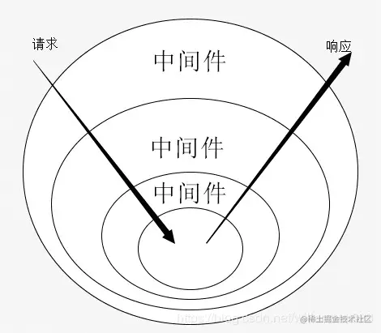

### axios是否可以取消请求
    - 官方文档指出有两种方法可以取消请求，分别是`cancelToken`和`AbortController`

### cookie 可以实现不同域共享吗
    - 默认情况下，Cookie 不能在不同的顶级域名之间共享数据
    - 但是，如果两个域名属于同一主域名下的子域名，并且您设置了正确的 Domain 属性，那么在这些子域名之间是可以共享 Cookie 的。例如，对于 `sub1.example.com `和 `sub2.example.com `这样的子域名，如果设置 Cookie 的 Domain 属性为 `.example.com` ，那么在这两个子域名之间，这个 Cookie 是可以共享和访问的。
    - 此外，还需要注意 Cookie 的 Path 属性、安全属性（Secure）、HttpOnly 属性等，这些属性也会影响 Cookie 的使用范围和方式。
### px 如何转为 rem
    - px（像素）转换为 rem（根元素字体大小的相对单位）需要先确定一个基准的根元素字体大小
    - 在实际开发中，可以使用预处理器（如 Sass、Less）或者 JavaScript 来实现自动转换
    - 在前端开发中，要实现输入 px 但自动转换为 rem ，可以通过以下几种方式：
        - 使用 CSS 预处理器（如 Sass、Less）
        - 使用构建工具（如 Webpack）的插件,例如 `postcss-pxtorem` 插件，它可以在构建过程中自动将 `px` 转换为 `rem` 。您需要在配置中设置根元素的字体大小等相关参数
        - 自己编写脚本进行转换.这种方式相对复杂，并且可能会影响开发效率

### 富文本里面， 是如何做到划词的（鼠标滑动选择一组字符， 对组字符进行操作）
> DOM getSelection 方法
    - https://developer.mozilla.org/zh-CN/docs/Web/API/Window/getSelection

### 如何做前端监控
参考：https://juejin.cn/post/7285608128040206391

### React useRef 是如何实现的
参考：https://juejin.cn/post/7341757372188065792

### React scheduler 调度机制原理
参考：https://juejin.cn/post/7331135154209308687

### BFF相关
- BFF(Backends For Frontends)，服务于前端的后端

#### 当后端服务于多端时
- 若服务端来判断请求从而区分不同端（浏览器、小程序、iOS等）的请求从而实现不同的接口需求，会导致后续服务端的代码难以维护
- 使用BFF来作为中间层，在BFF层做区分，从而不用改动服务端的代码和业务逻辑


#### 一个大屏页面，20多个图表，每个都有相应的请求要发送，在首屏展示时会出现图表内容请求过长的问题
- 由于浏览器的限制，前端的并发请求数量一般在6-8个，若超出这个数量则需要等待前面请求完成，可能会导致首屏请求时间过长
- 使用BFF层，前端将多个请求的参数合并到一个接口发送到BFF层 的服务，BFF层服务再把这些参数拆分来请求服务端数据，由于服务端之间没有并发请求的限制，可以多并发请求，然后BFF层接收到响应后，将得到的数据进行打包发送给客户端，客户端将数据拆分并展示到页面


### 前端截图功能
- 背景

- 方案：
    - canvas：html2canvas
    - puppeteer（一般用于服务端截图，node）

### H5移动端适配
- 常用：响应式，运行不同样式规则
- style预处理器

考虑问题：
1. 设置视窗，通过元信息配置 meta

2. 媒体查询

3. 弹性布局 flex

4. 图片媒体查询
```html
<picture>
    <source srcset="../00_images/Vue/vue2生命周期.png" media="(min-width: 800px)">
    <source srcset="../00_images/react-lifecycle.png" media="(min-width: 600px)">
    
</picture>
```

5. rem


### 如何修改第三方npm包
1. fork package，自己维护


### 实现同一个连接，PC端打开时web应用，手机端打开时H5应用

1. 识别端
    - js识别， navigator.userAgent

2. 响应式

### QPS达到峰值如何处理
1. 请求限流
后端限流，达到上限，
2. 请求合并
短时间请求合并，降低服务端压力。防抖节流


3. 请求缓存
如， react使用vercel/swr(https://github.com/vercel/swr)库，当请求参数、方法、依赖内容未变化时直接命中缓存，无需请求后端

4. 任务队列

### 网页加载进度条
- 页面切换页面加载
    - react使用nprogress库
- 网络请求进度，使用xhr的onprogress,axios的onUploadProgress


### 什么是洋葱模型
- 洋葱模型(Onion Architecture)在构建后端服务(BFF, Backend for Frontend)时是一种常用的架构模式
- 最典型的就是node框架中的koa。如下demo：
```js
const Koa = require('koa');
const app = new Koa();

// 中间件1
app.use((ctx, next) => {
    console.log(1);
    next();
    console.log(2);
});

// 中间件 2 
app.use((ctx, next) => {
    console.log(3);
    next();
    console.log(4);
});

app.listen(8000, '0.0.0.0', () => {
    console.log(`Server is starting`);
});
// 打印顺序： Server is starting => 1 => 3 => 4 => 2
```
- 在 koa 中，中间件被 next() 方法分成了两部分。next() 方法上面部分会先执行，下面部门会在后续中间件执行全部结束之后再执行。可以通过下图直观看出：

- 在洋葱模型中，每一层相当于一个中间件，用来处理特定的功能，比如错误处理、Session 处理等等。其处理顺序先是 next() 前请求（Request，从外层到内层）然后执行 next() 函数，最后是 next() 后响应（Response，从内层到外层），也就是说每一个中间件都有两次处理时机。

### Echarts 和 AntV 
- **原理：**
    1. 合理的数据协议（数据结构、setOptions）
    2. 针对不同的场景，提供不同的渲染引擎
        - canvas：位图
            - 优点：性能更强（大数据量） webGL => skia（chrome）
            - 缺点：事件交互需要自己实现（点阵计算），没有真实dom节点
        - svg：矢量图
            - 优点：可任意缩放，有真实 dom，真实 dom 事件交互简单
            - 缺点：性能较弱，渲染大数据量（>1k）图表可能存在卡顿
        - Echarts 中依赖于底层库 Zrender 来实现透明支持两种可互换的渲染引擎 
- 不同场景下如何选择渲染引擎：
    - 结合各自优缺点进行取舍
    - 如流程图（flow），节点数不多，选择 svg 进行渲染
    - 大屏情况下，一般渲染节点数并不会很多，也是用 svg 引擎
    - 在需要创建很多 ECharts 实例且浏览器易崩溃的情况下（可能是因为 Canvas 数量多导致内存占用超出手机承受能力），可以使用 SVG 渲染器来进行改善。大略的说，如果图表运行在低端安卓机，或者我们在使用一些特定图表如 水球图 等，SVG 渲染器可能效果更好。

- **两者有什么区别：**
    1. 设计与案例和出发点：
        - Echarts 设计出发点是图表。基于每个图表类型，提供图表中数据相关的图形映射配置以及一些图表间通用的组件配置（axis、legend、tooltip 等）
        - AntV 的设计出发点是图形。供图形基本元素不同特征到数据的映射方法。G2对可视化的理解是微观的、拆解的。这使得G2在数据对图形的控制上要更自由，更抽象通用。你会关心颜色要怎么映射到数据大小上，但是你不需要关心这种类型的图表是否允许你这样去做，这意味着你可能会写出各种非常见的图表类型


### 什么事虚拟列表，实现原理是什么
- 一个列表类的视图，可分为可视区和内容区
- 虚拟列表解决的问题就是内容区内容过多时，渲染时间会随之加长，可能就会导致卡顿的现象。实际上，可视区域是固定的，在理想状态下我们只需要渲染可视区域附近的元素即可。由此，虚拟列表的解决方案应运而生。


### 死循环会导致什么后果？无限递归会导致什么后果？
- 死循环，浏览器渲染主线程长期被占用，页面无响应
```js
while(true) {}
```
- 无限递归：栈溢出
```js
function f() {
    f()
}
f() // 函数每次执行都回生成新的执行栈
```


